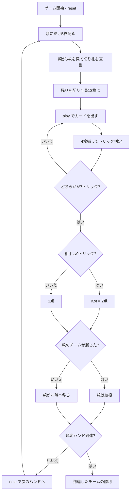

# ホクム（CUI版）遊び方

## ゲーム概要

イランで最も広く遊ばれている切り札トリックテイキング。52枚を4人に13枚ずつ配る**2対2のパートナー戦**で、向かい合う席が味方。**13トリックを打ち切りません**——どちらかのチームが**7トリック**取った時点でハンドが即座に終わり、残りの札は打たれません。親（**ハケム**）は**最初の5枚だけ**を見て切り札を決めます。

## 起動方法

```sh
go run ./cmd/trumpcards hokm
go run ./cmd/trumpcards --lang en hokm  # 英語モード
```

## ルール

### 配りと切り札

1. **親にだけ5枚**配る
2. 親はその**5枚だけ**を見て切り札スートを宣言する
3. 残りを配って全員13枚にそろえる

13枚揃ってから決めるのではないのが、このゲームの賭けどころです。

### 7トリック先取

**どちらかのチームが7トリック取った時点でハンドは終わります。** 13トリックは消化しません。7 + 7 = 14 > 13 なので、ハンドは必ずどちらかが7に達して決着します。

### 勝ち点と Kot

| 結果 | ハンド勝ち点 |
|------|-------------|
| ハンドを制する | **1** |
| **Kot**（相手を1トリックも取らせずに制する） | **2** |

先に規定ハンド勝ち点（既定7）を取ったチームの勝ちです。

### 親は勝っているあいだ交代しない

**親は負けたときだけ左隣へ移ります。** 切り札を選べる立場が勝っているあいだ続くので、Kot を重ねるのが最短の勝ち筋になります。

ハンド終了時には `親が次の席に移ります` / `親は交代しません` のどちらかが必ず出るので、次に切り札を選ぶのが誰かは次ハンドを待たずに分かります。

### 札の強さ

切り札 > リードのスート > その他。同じスートなら A > K > Q > J > 10 > … > 2。**フォロー義務があります**。

## ゲームの流れ



## コマンド一覧

| コマンド | 短縮形 | 説明 |
|----------|--------|------|
| `trump <suit>` | `t` | 切り札スートを宣言する（1:♠ 2:♣ 3:♥ 4:♦、親のみ） |
| `play <idx>` | `p` | 手札の `<idx>` 番目のカードを出す |
| `next` | `n` | 次のハンドを開始する |
| `hint` | `h` | 宣言すべきスート、または打つべき札を提示する |
| `giveup` | `g` | 投了する |
| `log` | `l` | 棋譜（アクションログ）を表示する |
| `reset` | `r` | 最初からやり直す |
| `quit` | `q` | 終了する |
| `help` | `?` | コマンド一覧を表示 |

## 画面の見方

```
==========
Hokm (ホクム)
==========
ハンド: 2  (7ハンド先取)
トリック: あなたのチーム=4  相手=2（先に7取ったチームがこのハンドを制します）
ハンド勝ち点: あなたのチーム=1  相手=2
切り札: ハート
あなた[T0][親]: 獲得4 手札7枚
  [0]♠2 [1]♠7 [2]♠K [3]♣4 [4]♥A [5]♥K [6]♦10
CPU1[T1]: 獲得1 手札7枚
CPU2[T0]: 獲得0 手札7枚
CPU3[T1]: 獲得1 手札7枚
----------
手番: あなた
play <idx>・・・カードを出す
```

- **トリック行**: 7先取の競り合い。**13まで打たない**ので、進捗はここに出ます
- **`[T0]` / `[T1]`**: チーム番号。**T0 があなたの味方**（向かい合う席）
- **`[親]`**: ハケム。切り札を決めた人で、勝っているあいだ交代しません
- **`[n]`**: `play <n>` で指定する手札の番号

## 遊び方のコツ

- **親になったら長いスートを切り札にする。** 5枚しか見えないので、枚数がいちばん確かな情報です
- **7取れば終わり。** 8枚目以降は取っても勝ち点が増えないので、7に届いたら他は捨てて構いません
- **Kot は2倍。** 相手が0トリックのまま6-0まで来たら、最後の1つも取りにいく価値があります
- **逆に、1トリックだけでも取れば Kot を防げます。** 劣勢のときは「1つ取る」を最優先に
- **味方が勝っているトリックでは強い札を温存する。** 7に届くまでの札数がそのまま勝敗になります
- **親を続けさせない。** 相手の親が続くかぎり切り札を選ばれ続けるので、1ハンド取り返す価値は勝ち点以上です
