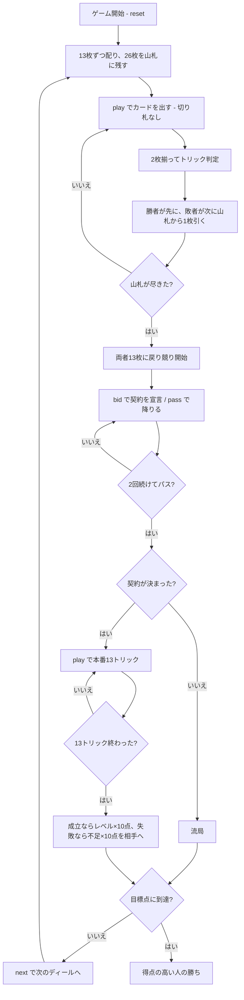

# ハネムーンブリッジ（CUI版）遊び方

## ゲーム概要

**2人専用**のブリッジ。前半の**13トリックは得点になりません**——切り札なしで打ち、1トリックごとに**勝った人が先に、負けた人が次に**山札から1枚引きます。26枚の山札を使い切ると両者また13枚に戻り、そこで競りを行って後半13トリックの本番に入ります。先に目標点（既定100点）に届いた人の勝ちです。

## 起動方法

```sh
go run ./cmd/trumpcards honeymoonbridge
go run ./cmd/trumpcards --lang en honeymoonbridge  # 英語モード
```

## ルール

### 配りと山札

**2人 × 13枚 = 26枚**を配ると、残りもちょうど**26枚**です。前半は13トリック打ち、各トリックのあと**2人が1枚ずつ引く**ので 13 × 2 = 26 で山札を使い切ります。

### 前半（引き合い）—— 得点になりません

1. **切り札なし**で13トリック打つ
2. 各トリックのあと、**勝者が山札の1枚目、敗者が2枚目**を引く
3. 勝者が次のリードを取る

**取ったトリックは数えません。** 山札から強い札を引き込むための13トリックです。山札が尽きた時点で両者13枚に戻り、競りに入ります。

### 競り

| レベル | 必要トリック |
|--------|-------------|
| 1 | 7 |
| 2 | 8 |
| … | … |
| 7 | 13 |

契約は「**6 + レベル**」トリックです。宣言は**レベル1〜7 × 5種**（♠ ♣ ♥ ♦ NT）から選び、**現在の契約を上回らないと通りません**。

**序列は ♠ < ♣ < ♥ < ♦ < NT で、ノートランプがいちばん強い**ので、同じレベルでも♦の上に置けます。**2回続けてパスすると競りが締まり**、落札者の相手からリードします。最初に両者ともパスした場合、そのディールは流れます。

### 得点

| 結果 | 得点 |
|------|------|
| 成立 | 落札者に **レベル × 10点**（＋オーバートリック1つ **5点**） |
| 失敗 | 相手に **不足トリック × 10点** |

ディール終了時のメッセージには、この計算の結果が `（宣言者に +40点）` のように出ます。累計との差を引く必要はありません。

### 札の強さ

切り札 > リードのスート > その他。同じスートなら A > K > Q > J > 10 > … > 2。**フォロー義務があります**。前半は切り札が無いので、別スートの A ではリードの札に勝てません。

### 勝敗

どちらかの累計が**目標点（既定100、範囲50〜500）に届いた時点**で終了し、得点の高い人の勝ちです。

## ゲームの流れ



## コマンド一覧

| コマンド | 短縮形 | 説明 |
|----------|--------|------|
| `bid <level> <suit>` | `b` | 契約を宣言する（level は 1〜7、suit は **0:NT** 1:♠ 2:♣ 3:♥ 4:♦） |
| `pass` | | 競りを降りる |
| `play <idx>` | `p` | 手札の `<idx>` 番目のカードを出す |
| `next` | `n` | 次のディールを開始する |
| `hint` | `h` | 宣言すべき契約、打つべき札を提示する |
| `giveup` | `g` | 投了する |
| `log` | `l` | 棋譜（アクションログ）を表示する |
| `reset` | `r` | 最初からやり直す |
| `quit` | `q` | 終了する |
| `help` | `?` | コマンド一覧を表示 |

**`suit` の 0 は「省略」ではなくノートランプです。** 省略すると `Suit is required.` で弾かれます——既定値で埋めると、選んでいない契約を落札してしまうためです。

**前半の引き合いに専用コマンドはありません。** `play` で進みます。

## 画面の見方

```
==========
Honeymoon Bridge (ハネムーンブリッジ)
==========
ディール: 1  目標: 100点  トリック: 4/13
2人用のブリッジです。前半13トリックは切り札なしの引き合いで、勝っても得点にならず、1トリックごとに勝者・敗者の順で山札から1枚ずつ引きます。26枚の山札を使い切ると両者13枚に戻り、そこから競りに入ります。契約は「6＋レベル」トリック。
山札: 残り20枚（前半のトリックは得点になりません）
契約: 未決定
>あなた: 獲得0 累計0 手札13枚
  [0]♠2 [1]♠7 [2]♠K [3]♣4 [4]♥A [5]♥K [6]♦10 [7]♦3 [8]♣9 [9]♣A [10]♥2 [11]♦Q [12]♣6
 CPU1: 獲得0 累計0 手札13枚
----------
手番: あなた
play <idx>・・・カードを出す
```

- **山札行**: 前半のあいだだけ出ます。**このトリックは得点にならない**ことを毎回書きます
- **契約行**: 落札されると `契約: 4♥（あなた）／必要 10トリック` になります。**「4♥」だけでは何トリック要るか分からない**ので必要数を併記します
- **競り中の案内**: `いま通る最小の契約は 2♦ です` のように、**上回れる最小の宣言**を出します。上限（7NT）に張り付くと「パスしか選べません」に変わります
- **獲得**: 本番で取ったトリック数。前半のトリックは数えません
- **累計**: 目標点に向けた合計。**勝敗はこれで決まります**
- **`[n]`**: `play <n>` で指定する手札の番号

## 遊び方のコツ

- **前半は安く出す。** 取っても得点にならないので、A や K は本番まで温存します
- **ただし取れば先に引ける。** 山札の上を引く権利には価値があります——強い札が欲しい局面では取りにいきます
- **契約は「6 + レベル」。** レベル1でも7トリック、つまり過半数が要ります。3トリック取れる手で3を宣言すると9トリック必要になり、まず落ちます
- **NT は同レベルで♦の上。** ♦で止められたときも、同じレベルの NT で上回れます
- **失敗の失点は不足 × 10点。** 3トリック足りないと相手に30点、つまりレベル3の成立ぶんが丸ごと入ります。届かない契約は競り上げないほうが得です
- **オーバートリックは1つ5点。** 取れる手なら高いレベルで宣言したほうが伸びますが、落ちたときの失点はレベルではなく不足数で決まります
