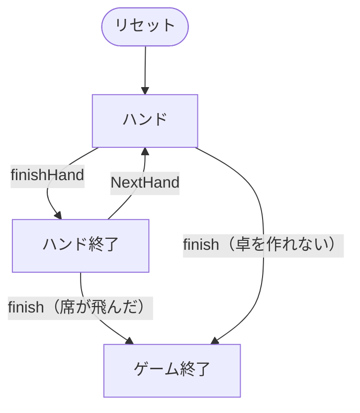

# H.O.R.S.E.（CUI版）遊び方

## ゲーム概要

H.O.R.S.E. は**5つのポーカーを1つの卓で順に回すミックスゲーム**です（4/6/9人：あなた + CPU）。頭文字がそのまま種目の並びで、Hold'em → Omaha Hi-Lo → Razz → Stud → Stud Hi-Lo と一定ハンドごとに切り替わります。**チップは種目をまたいで持ち越され**、規則だけが入れ替わります。得意な1種目だけでは勝てない、というのがこの形式の眼目です。

## 起動方法

```sh
go run ./cmd/trumpcards horse
go run ./cmd/trumpcards --lang en horse  # 英語モード
```

## ルール

### 種目の並び

| 文字 | 種目 | 形 | 共有札 |
|------|------|----|--------|
| H | テキサスホールデム | 伏せ2枚 + 共有5枚 | あり |
| O | オマハ ハイロー | 伏せ4枚 + 共有5枚（手札からちょうど2枚） | あり |
| R | ラズ | スタッド7枚（**最も低い手が勝ち**） | なし |
| S | セブンカードスタッド | スタッド7枚 | なし |
| E | スタッド ハイロー | スタッド7枚（ハイとローで分ける） | なし |

- **1種目あたりのハンド数は 1〜10（既定2）**です。規定ハンドを打ち切ると次の文字へ進み、E の次は H に戻ります。
- 各種目の役の判定・ベッティングの規則は、その種目の実装がそのまま使われます。単体で遊ぶときと同じです。

### チップと決着

- 席数は **4 / 6 / 9** のいずれかです。ポーカーの卓がこの3つしか作れないためで、他の数を指定しても受け付けません。
- 初期チップは全席同じで、**ハンドごとに正本へ回収**されます。種目が変わっても残高はそのまま引き継がれます。
- **1席でも飛んだ時点でマッチ終了**です。リバイ・アドオンは行いません（補充するとチップが湧きます）。最も多く持っている席の勝ちです。

### 見えるもの

- あなたの手札はすべて見えます。
- スタッド系（R / S / E）では**各席の表向きの札（ドアカード）も見えます**。伏せ札は最後まで見えません。
- ホールデム系（H / O）では、CPU の札は1枚も見えません。

## ゲームの流れ

ゲームの進行は `internal/domain/Horse.go` のフェーズ機械そのものです。各ノードは同ファイルの `HorsePhase` 定数、矢印ラベルはその遷移を行うメソッド名です。



## コマンド一覧

| コマンド | 短縮形 | 説明 |
|----------|--------|------|
| `fold` | `f` | フォールドする |
| `check` | `x` | チェックする |
| `call` | `c` | コールする |
| `bet <n>` | `b` | n チップをベットする |
| `raise <n>` | - | n チップへレイズする |
| `allin` | - | 残り全部を賭ける |
| `next` | `n` | 次のハンドへ（種目が変わることがあります） |
| `setseats <4\|6\|9>` | `ss` | 席数設定 |
| `sethands <1-10>` | `sh` | 1種目あたりのハンド数設定 |
| `hint` | `h` | ヒントを表示 |
| `log` | `l` | 棋譜を表示 |
| `reset` | `r` | ゲームをリセット |
| `quit` | `q` | 終了 |
| `help` | `?` | コマンド一覧を表示 |

## 画面の見方

```
==========
H.O.R.S.E.（ミックスポーカー）
==========
R — ラズ  (1/2 ハンド目、通算 5)
場: ♦10 ♠5 ♣12
YOU: 980 チップ  ♥3 ♠7 ♦2  ← 手番
CPU1: 1010 チップ  ♠9
CPU2: 1000 チップ  ♦J
CPU3: 1010 チップ  ♣4
----------
ポット: 60
f=フォールド x=チェック c=コール b <n>=ベット raise <n>=レイズ allin=オールイン
```

- 先頭行が**いまの種目**です。文字（H/O/R/S/E）と種目名、そして「この種目で何ハンド目か／通算何ハンド目か」が出ます。
- 席の行に並ぶのは**見えている札だけ**です。スタッド系では CPU のドアカードが並び、ホールデム系では何も並びません。
- `場:` はコミュニティカードで、スタッド系では出ません。

## 遊び方のコツ

- **種目が変わった最初のハンドで手を止める。** 同じ操作で規則だけが変わるので、H の感覚のまま R を打つと最も高い手を作りにいってしまいます。ラズは**最も低い手が勝ち**です。
- **オマハは手札からちょうど2枚。** 4枚あっても3枚は使えません。ホールデムの読み方をそのまま持ち込むと手を過大評価します。
- **短期の勝敗より残高。** 1種目で大きく勝っても、次の種目で同じだけ失えば元に戻ります。飛ばないことが第一で、飛んだ席が出た時点でマッチが終わります。
- 苦手な種目は素直に降りる。得意な種目のハンド数だけを厚く打つのが、この形式での勝ち方です。
