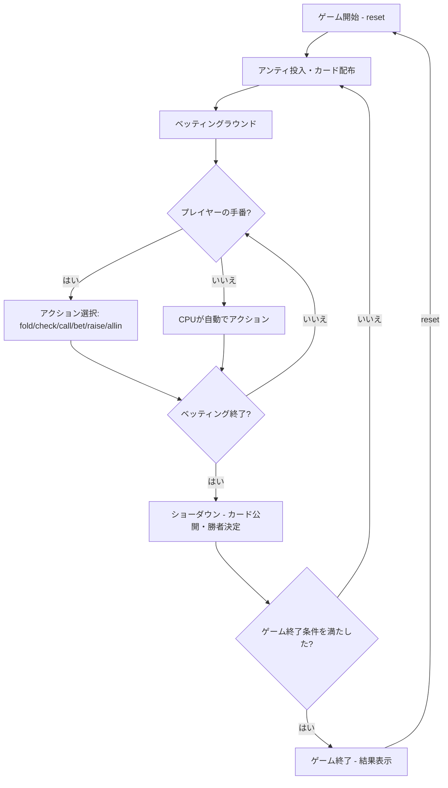

# インディアンポーカー（CUI版）遊び方

## ゲーム概要

4人（プレイヤー1人 + CPU 3人）で遊ぶベッティング型カードゲームです。各プレイヤーに1枚ずつカードが配られ、自分のカードは見えず相手のカードだけが見える状態でベッティングを行います。カードのランクが最も高いプレイヤーがポットを獲得します。

## 起動方法

```sh
go run ./cmd/trumpcards indianpoker
go run ./cmd/trumpcards --lang en indianpoker  # 英語モード
```

## ルール

### 基本ルール

- 52枚のカードから各プレイヤーに1枚ずつ配布
- 自分のカードは見えない（額に貼り付けるイメージ）
- 他のプレイヤーのカードは見える
- カードのランクで勝敗を決定（2が最弱、Ace=14が最強）
- 各ラウンド開始時にアンティ（参加費）を投入

### ベッティング

- **フォールド**: 降りる（投入済みチップは失う）
- **チェック**: パスする（未ベット時のみ）
- **コール**: 現在のベット額に合わせる
- **ベット**: 最初の賭け金を出す
- **レイズ**: 現在のベット額を引き上げる
- **オールイン**: 全チップを賭ける

### ベッティングリミット

- **Fixed**: 固定額ベット
- **Pot Limit**: ポット額まで
- **No Limit**: 上限なし（デフォルト）

### ゲーム終了

- いずれかのプレイヤーのチップが0になった場合にゲーム終了

## ゲームの流れ



## コマンド一覧

| コマンド | 短縮形 | 説明 |
|----------|--------|------|
| `reset` | `r` | ゲームリセット |
| `fold` | `f` | フォールド（降りる） |
| `check` | `ck` | チェック（パス） |
| `call` | `c` | コール（ベット額に合わせる） |
| `bet <amount>` | `b <amount>` | ベット（金額指定） |
| `raise <amount>` | `ra <amount>` | レイズ（金額指定） |
| `allin` | `a` | オールイン |
| `log` | `l` | 棋譜表示 |
| `quit` | `q` | ゲーム終了 |
| `help` | `?` | コマンド一覧を表示 |

### コマンド例

- `b 50` → 50チップをベット
- `ra 100` → 100チップにレイズ
- `c` → 現在のベットにコール
- `f` → フォールド

## 画面の見方

```
==========
Indian Poker
==========
ディーラー: あなた
ポット: 40
リミット: No Limit
アンティ: 10
----------
あなた チップ:990 ベット:10
  カード: ??
  推定勝率: 59%
  チェック可能 / 上限: 0
CPU 1 (TAG) チップ:990 ベット:10
  カード: ♣2
CPU 2 (LAP) チップ:990 ベット:10
  カード: ♥7
CPU 3 (TAP) チップ:990 ベット:10
  カード: ♥3
----------
[CPU行動]
  Player 1: チェック
  Player 2: チェック
  Player 3: チェック
==========
```

- `ディーラー:` / `ポット:` / `リミット:` / `アンティ:`: **それぞれ独立した行**
  で出ます（1 行にまとめては出ません）
- プレイヤー行: `名前 チップ:N ベット:M`。CPU には
  `(TAG)` `(LAP)` `(TAP)` のような**打ち筋のラベル**が付きます
- `  カード: ??`: 自分の札は見えません。他プレイヤーの札は `♣2` のように
  スート記号で見えます
- `  推定勝率: 59%`: **自分の席から見える情報だけで計算した勝率の目安**。
  自分の札が見えないこのゲームでは、これが唯一の判断材料になります
- `  チェック可能 / 上限: N`: いま取れる行動と、賭けられる上限
- `[CPU行動]` の並び: 直前に CPU が何をしたか

## 遊び方のコツ

- 他のプレイヤーのカードを観察し、自分のカードの強さを推測しましょう
- 相手のカードが弱い場合、自分のカードが強い可能性が高いのでベットしましょう
- CPUのベッティングパターンから自分のカードの強さを推測できます
- オールインは慎重に。チップが0になるとゲーム終了です
- メタAIが有効な場合、CPUはあなたのプレイパターンを学習して戦略を調整します
