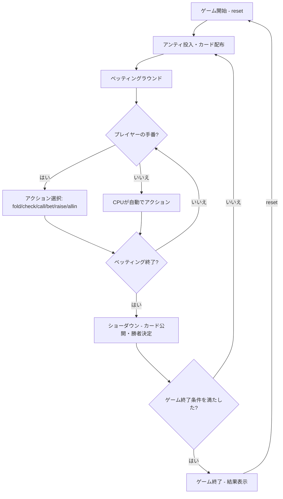

# インディアンポーカー（CUI版）遊び方

## ゲーム概要

4人（プレイヤー1人 + CPU 3人）で遊ぶベッティング型カードゲームです。各プレイヤーに1枚ずつカードが配られ、自分のカードは見えず相手のカードだけが見える状態でベッティングを行います。カードのランクが最も高いプレイヤーがポットを獲得します。

## 起動方法

```sh
go run ./cmd/trumpcards indianpoker
go run ./cmd/trumpcards --lang en indianpoker  # 英語モード
```

## ルール

### 基本ルール

- 52枚のカードから各プレイヤーに1枚ずつ配布
- 自分のカードは見えない（額に貼り付けるイメージ）
- 他のプレイヤーのカードは見える
- カードのランクで勝敗を決定（2が最弱、Ace=14が最強）
- 各ラウンド開始時にアンティ（参加費）を投入

### ベッティング

- **フォールド**: 降りる（投入済みチップは失う）
- **チェック**: パスする（未ベット時のみ）
- **コール**: 現在のベット額に合わせる
- **ベット**: 最初の賭け金を出す
- **レイズ**: 現在のベット額を引き上げる
- **オールイン**: 全チップを賭ける

### ベッティングリミット

- **Fixed**: 固定額ベット
- **Pot Limit**: ポット額まで
- **No Limit**: 上限なし（デフォルト）

### ゲーム終了

- いずれかのプレイヤーのチップが0になった場合にゲーム終了

## ゲームの流れ



## コマンド一覧

| コマンド | 短縮形 | 説明 |
|----------|--------|------|
| `reset` | `r` | ゲームリセット |
| `fold` | `f` | フォールド（降りる） |
| `check` | `ck` | チェック（パス） |
| `call` | `c` | コール（ベット額に合わせる） |
| `bet <amount>` | `b <amount>` | ベット（金額指定） |
| `raise <amount>` | `ra <amount>` | レイズ（金額指定） |
| `allin` | `a` | オールイン |
| `log` | `l` | 棋譜表示 |
| `quit` | `q` | ゲーム終了 |
| `help` | `?` | コマンド一覧を表示 |

### コマンド例

- `b 50` → 50チップをベット
- `ra 100` → 100チップにレイズ
- `c` → 現在のベットにコール
- `f` → フォールド

## 画面の見方

```
==========
Indian Poker (インディアンポーカー)
==========
ハンド #5 | ディーラー: CPU 1
ポット: 120 | アンティ: 10
----------
[You]: 850チップ (ベット: 30) [カード: ???]
CPU 1: 920チップ (ベット: 30) [カード: HEART K]
CPU 2: 680チップ (フォールド)  [カード: SPADE 5]
CPU 3: 550チップ (ベット: 30) [カード: DIAMOND 10]
----------
手番: あなた
f・・・フォールド  ck・・・チェック  c・・・コール
b <amount>・・・ベット  ra <amount>・・・レイズ  a・・・オールイン
==========
```

- `ハンド #N`: 現在のハンド番号
- `ディーラー`: 現在のディーラー
- `ポット`: ポットの合計チップ
- `[カード: ???]`: 自分のカードは見えない
- `[カード: HEART K]`: 他プレイヤーのカードは見える
- `(ベット: N)`: 現在のベット額
- `(フォールド)`: フォールド済み

## 遊び方のコツ

- 他のプレイヤーのカードを観察し、自分のカードの強さを推測しましょう
- 相手のカードが弱い場合、自分のカードが強い可能性が高いのでベットしましょう
- CPUのベッティングパターンから自分のカードの強さを推測できます
- オールインは慎重に。チップが0になるとゲーム終了です
- メタAIが有効な場合、CPUはあなたのプレイパターンを学習して戦略を調整します
