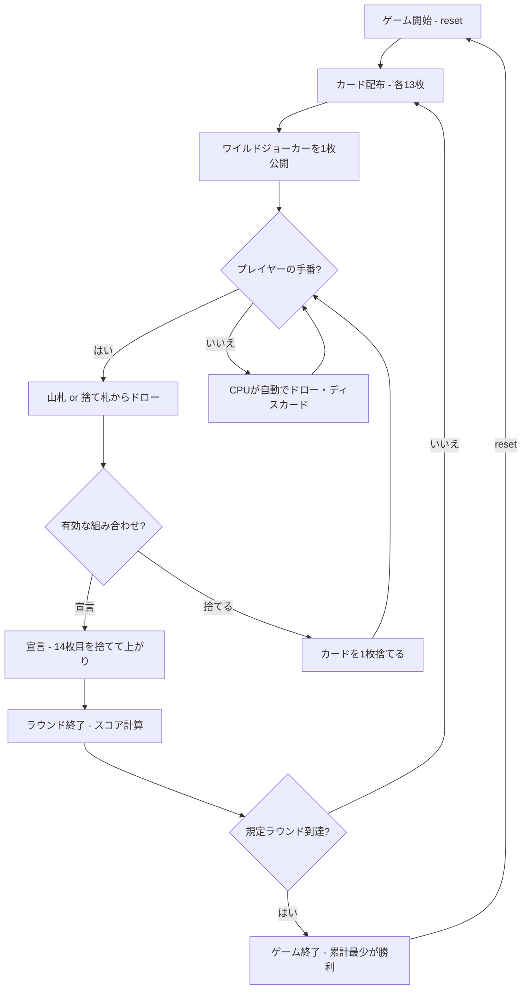

# インドラミー（CUI版）遊び方

## ゲーム概要

2〜4人（プレイヤー1人 + CPU 1〜3人）で遊ぶインド発祥の13枚ラミーです。2デッキ + ジョーカー（計108枚）を使い、13枚の手札で有効な組み合わせ（2つ以上のシーケンス、うち少なくとも1つは純シーケンス）を作って宣言（上がり）を目指します。各ラウンドでデッドウッド（有効な組み合わせに含まれないカードの点）を減らし、規定ラウンド消化時点で累計点が最も少ないプレイヤーが勝利します。

## 起動方法

```sh
go run ./cmd/trumpcards indianrummy
go run ./cmd/trumpcards --lang en indianrummy  # 英語モード
```

## ルール

### 基本ルール

- 2デッキ + ジョーカー（108枚）を使用、2〜4人プレイ
- 各プレイヤーに13枚ずつ配り、1枚を表向きにして捨て札の山を開始、残りは山札（ストック）
- 手番ではまず山札または捨て札の山からカードを1枚ドローする（手札14枚になる）
- その後、手札からカードを1枚捨てる。手札が有効な組み合わせなら「宣言」して上がる

### シーケンスとセット

- **シーケンス（連番）**: 同スート3枚以上の連続したカード
  - **純シーケンス**: ジョーカーを含まないシーケンス（上がりに最低1つ必須）
  - **不純シーケンス**: ワイルド／ジョーカーを含むシーケンス
- **セット**: 同ランク3〜4枚（異なるスート）

### ワイルドジョーカー

- 配り終えた後に1枚が表向きにされ、そのランクがワイルド（万能札）になる
- ワイルドランクのカードと印刷ジョーカーは、シーケンスやセットの穴埋めに使える
- 表向きが印刷ジョーカーの場合、追加のワイルドランクはなし（印刷ジョーカーのみ）

### デッドウッドと得点

- 有効な組み合わせに入らないカードの点（J/Q/K=10点、A=1点、その他=額面）の合計がデッドウッド
- デッドウッドは1ラウンド最大80点に制限される
- 誰かが正しく宣言するとラウンド終了。宣言が無効なら宣言者にペナルティ

### ゲーム終了

- 規定ラウンド数（デフォルト3）を消化した時点で、累計点が最も少ないプレイヤーが勝利

### CPU難易度

- **Easy** (0): ランダムに近いプレイ
- **Normal** (1): 基本的なメルド戦略（デフォルト）
- **Hard** (2): 戦略的なプレイ

## ゲームの流れ



## コマンド一覧

| コマンド | 短縮形 | 説明 |
|----------|--------|------|
| `reset` | `r` | ゲームリセット（設定保持） |
| `drawstock` | `ds` | 山札から1枚ドロー |
| `drawdiscard` | `dd` | 捨て札の山から1枚ドロー |
| `discard <idx>` | `d <idx>` | カードを捨てる（インデックス指定） |
| `declare <idx>` | `de <idx>` | 宣言（14枚目を捨てて上がり） |
| `nextround` | `nr` | ラウンドをスコアリングして次のラウンドへ |
| `setplayers <2-4>` | `pc <2-4>` | プレイヤー数設定 |
| `setdifficulty <0-2>` | `sd <0-2>` | CPU難易度設定（0=Easy, 1=Normal, 2=Hard） |
| `setrounds <n>` | `sr <n>` | ラウンド数設定 |
| `log` | `l` | 棋譜表示 |
| `quit` | `q` | ゲーム終了 |
| `help` | `?` | ヘルプ表示 |

### コマンド例

- `ds` → 山札から1枚ドロー
- `dd` → 捨て札の山からトップカードをドロー
- `d 3` → インデックス3のカードを捨てる
- `de 13` → インデックス13のカードを捨てて宣言（上がり）

## 画面の見方

```
==========
Indian Rummy (インドラミー)
==========
ラウンド: 2/3  山札: 40枚
ワイルドジョーカー: CLOVER 5
捨て札: HEART 7
----------
[You]: 累積0点 ラウンド0点 14枚
[0]SPADE 3  [1]SPADE 4  [2]SPADE 5  [3]HEART 9  ...
CPU 1: 累積10点 ラウンド0点 13枚
----------
手番: あなた (ディスカードフェーズ)
d <idx>・・・カードを捨てる
de <idx>・・・宣言 (14枚目を捨てて上がり)
==========
```

- `ラウンド: N/M`: 現在のラウンド / 規定ラウンド数
- `ワイルドジョーカー`: 今ラウンドのワイルドランクを示すカード
- `捨て札`: 捨て札の山の一番上のカード
- `[0]SPADE 3`...: インデックス付きの手札カード

## 遊び方のコツ

- まず純シーケンス（ジョーカーなしの連番）を1つ確保しましょう。上がりの必須条件です
- ワイルドジョーカーはセットや不純シーケンスの穴埋めに温存すると効率的です
- デッドウッドの高いカード（J/Q/K=10点）は早めに処理しましょう
- 宣言は手札が確実に有効なときだけ。無効宣言はペナルティになります
- 相手の捨て札を見て、どのシーケンス／セットを狙っているか推測しましょう
