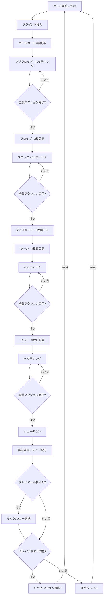

# アイリッシュポーカー（CUI版）遊び方

## ゲーム概要

アイリッシュポーカー（Irish Poker）は、テキサスホールデムのバリアントです。各プレイヤーに4枚のホールカードが配られ、フロップ**ベッティング終了後**に2枚をディスカードします。残り2枚とコミュニティカード5枚から最強の5枚で役を作ります。オマハ（4枚スタート）とホールデム（2枚で勝負）の中間に位置するゲームです。テーブルサイズは4-max（デフォルト）、6-max、9-max から選択可能です。

## 起動方法

```sh
go run ./cmd/trumpcards irishpoker
go run ./cmd/trumpcards --lang en irishpoker  # 英語モード
```

## ルール

### 基本ルール

- 52枚のトランプを使用
- 各プレイヤーに4枚のホールカード（手札）が配られる
- 場にコミュニティカード（共有カード）が最大5枚公開される
- **フロップベッティング終了後**、各プレイヤーは2枚をディスカード（捨てる）
- 残り2枚のホールカード + コミュニティカード5枚の計7枚から、最強の5枚の組み合わせで役を作る
- 最も強い役を持つプレイヤーがポットを獲得する

### ゲームの進行

1. **ブラインド**: ディーラーの左隣がスモールブラインド（デフォルト5）、その左隣がビッグブラインド（デフォルト10）を強制ベット
2. **プリフロップ**: ホールカード4枚配布後、最初のベッティングラウンド
3. **フロップ**: コミュニティカード3枚公開後、ベッティングラウンド
4. **ディスカード**: **フロップベッティング終了後**、各プレイヤーが手札から2枚を捨てる
5. **ターン**: コミュニティカード4枚目公開後、ベッティングラウンド
6. **リバー**: コミュニティカード5枚目公開後、最後のベッティングラウンド
7. **ショーダウン**: 残っているプレイヤーの手札を公開し、勝者を決定
8. **マック/ショー**: ショーダウンで負けた場合、手札をマック（伏せる）またはショー（公開）を選択
9. **リバイ/アドオン**: リバイ・アドオンが有効な場合、該当条件を満たすとチップの再購入・追加購入が可能

### ベッティングアクション

| アクション | 説明 |
|-----------|------|
| フォールド | 手札を捨ててラウンドから降りる |
| チェック | ベットせずにパスする（未ベット時のみ） |
| コール | 現在のベット額に合わせる |
| ベット | 新たにベットする（未ベット時のみ） |
| レイズ | 現在のベット額を上げる |
| オールイン | 全チップを賭ける |

### 役一覧（強い順）

| 役 | 説明 |
|----|------|
| Royal Flush | 同じスートの10・J・Q・K・A |
| Straight Flush | 同じスートの5枚連番 |
| Four of a Kind | 同じ数字4枚 |
| Full House | 同じ数字3枚 + 同じ数字2枚 |
| Flush | 同じスート5枚 |
| Straight | 5枚連番 |
| Three of a Kind | 同じ数字3枚 |
| Two Pair | ペア2組 |
| One Pair | ペア1組 |
| High Card | 上記に該当しない最も高いカード |

### CPUプレイスタイル

| スタイル | 略称 | 特徴 |
|---------|------|------|
| Tight-Aggressive | TAG | 強い手のみ参加し、積極的にレイズ。ブラフ率15% |
| Loose-Passive | LAP | 多くの手に参加するが、主にコール。ブラフ率5% |
| Tight-Passive | TAP | 厳選した手のみ参加し、主にコール。ブラフ率5% |
| Loose-Aggressive | LAG | 多くの手に参加し、頻繁にレイズ。ブラフ率30% |
| Game Theory Optimal | GTO | ハンド強度とボードテクスチャに基づく確率的混合戦略 |

## ゲームの流れ



## コマンド一覧

| コマンド | 短縮形 | 説明 |
|----------|--------|------|
| `reset` | `r` | 新しいゲームを開始 |
| `fold` | `f` | フォールド（降りる） |
| `check` | `ck` | チェック（パス） |
| `call` | `c` | コール（ベット額に合わせる） |
| `bet <額>` | `b <額>` | ベットする |
| `raise <額>` | `ra <額>` | レイズする |
| `allin` | `a` | オールイン |
| `discard <idx>` | `d <idx>` | ディスカード（手札のインデックス0-3を指定して1枚ずつ捨てる。計2回実行） |
| `bl [0-2]` | | ベッティングリミット変更（0=Fixed, 1=PotLimit, 2=NoLimit） |
| `ts [4\|6\|9]` | `tablesize` | テーブルサイズ変更（4-max, 6-max, 9-max） |
| `rebuy` | `rb` | リバイ（チップを再購入） |
| `skiprebuy` | `sr` | リバイをスキップ |
| `addon` | `ad` | アドオン（チップを追加購入） |
| `skipaddon` | `sa` | アドオンをスキップ |
| `muck` | `m` | マック（手札を伏せる） |
| `show` | `sh` | ショー（手札を公開する） |
| `metaai` | `mai` | メタAIの ON/OFF を切り替え |
| `log` | `l` | アクションログを表示 |
| `quit` | `q` | ゲーム終了 |
| `help` | `?` | コマンド一覧を表示 |

例:
- `b 40` → 40チップをベット
- `d 2` → 手札のインデックス2のカードをディスカード（2回繰り返して計2枚捨てる）
- `c` → コール

## 画面の見方

```
==========
Irish Poker (アイリッシュポーカー)
==========
ディーラー: Player 0
コミュニティ: ♠7  ♣10  ♥3
ポット: 60
----------
[You] チップ:970 ベット:20
  手札: ♠1  ♥13  ♦5  ♣8
CPU 1 (TAG) チップ:980 ベット:20
CPU 2 (LAP) チップ:990 ベット:10 [フォールド]
CPU 3 (GTO) チップ:960 ベット:10
----------
フロップベッティング終了。ディスカードするカードを選んでください (d 0/1/2/3)
==========
```

- `[You]`: プレイヤーのチップ残高とベット額
- `手札`: あなたのホールカード（4枚。ディスカード後は2枚）
- `CPU N (スタイル)`: CPUのチップ残高、ベット額、状態
- `コミュニティ`: 場に公開されたコミュニティカード
- `ポット`: 現在のポット額

## 遊び方のコツ

- 4枚のホールカードから2枚残すため、オマハのようにハンドの選択肢が豊富です
- フロップベッティングで相手のアクションを観察し、コミュニティカードとの相性を確認してから弱いカード2枚を捨てましょう
- フラッシュドロー・ストレートドローが完成している場合、ドロー維持に必要な2枚を残します
- 相手も4枚から2枚を選ぶため、平均的なハンド強度はホールデムやPineappleより高くなりやすいです
- ディスカード後はホールデムと同じ2枚なので、ターン以降の戦略はホールデムと共通です
