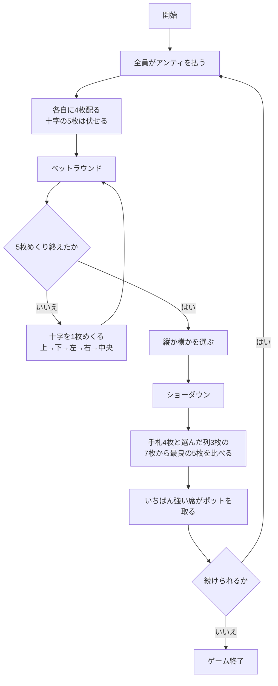

# アイアンクロス（CUI版）遊び方

## ゲーム概要

アイアンクロス（クリスクロス）は、アメリカのホームポーカーで遊ばれるバリアントです。

**手札は 4 枚**、場のコミュニティは **5 枚**。ただし場の 5 枚は十字に並べられ、**使えるのは縦の 3 枚か横の 3 枚のどちらか一方だけ**です。

```
    [1]
[3] [0] [4]
    [2]
```

- **縦の列**: 上 `[1]` → 中央 `[0]` → 下 `[2]`
- **横の列**: 左 `[3]` → 中央 `[0]` → 右 `[4]`

**中央の 1 枚だけが両方の列に入ります。** つまりどちらを選んでも半分は同じで、違うのは残りの 2 枚。これがこのゲームの唯一にして最大の判断です。

「5 枚の共有ボードから自由に選ぶ」ホールデムやオマハとは、ここが決定的に違います。

## 起動方法

```sh
go run ./cmd/trumpcards ironcross
```

英語で起動する場合:

```sh
go run ./cmd/trumpcards --lang en ironcross
```

## ルール

- 標準 52 枚。3〜7 席（既定 4 席）で、席 0 があなた、残りは CPU です。
- 開始時に全員がアンティ（既定 10）を払います。
- 各自に **4 枚**を伏せて配ります。十字の 5 枚も伏せて置かれます。
- **十字を 1 枚めくるたびにベットラウンド**が入ります（計 5 回）。
  - 誰も賭けていなければ **チェック** または **ベット**
  - 誰かが賭けていれば **コール** / **レイズ** / **フォールド**
  - **レイズは 1 ラウンド 3 回まで**です。
- **めくる順番は、上 → 下 → 左 → 右 → 中央**です。両方の列に入る中央が最後に開くので、選択は最後の 1 枚まで決まりません。
- 5 枚すべてが公開され、最後のベットラウンドが終わったら、**縦か横かを選びます**。
- **手札 4 枚 + 選んだ列の 3 枚の 7 枚から、最良の 5 枚**で役を比べます。選ばなかった列の札は、見えていても使えません。
- いちばん強い役の席がポットを取ります。同じ役なら山分けし、端数は若い席から配ります。
- チップが尽きた席は脱落し、あなたが賭けられなくなるか、残り 1 席になったら終了です。

## ゲームの流れ



## コマンド一覧

| コマンド | 短縮形 | 説明 |
|----------|--------|------|
| `fold` | `f` | 降りる |
| `check` | `k` | 賭けずに次へ（誰も賭けていないとき） |
| `call` | `c` | 現在の賭け額に合わせる |
| `bet <額>` | `b` | 賭ける（誰も賭けていないとき） |
| `raise <額>` | - | 上乗せする（1ラウンド3回まで） |
| `vertical` | `v` | 縦の3枚を使う |
| `horizontal` | `h` | 横の3枚を使う |
| `next` | - | 次のハンドへ |
| `hint` | - | 助言を表示する |
| `log` | - | 棋譜を表示する |
| `reset` | `r` | ゲームをやり直す |
| `quit` | `q` | ゲームを終了する |
| `help` | - | ヘルプを表示する |

## 画面の見方

```
フェーズ: CHOOSE LINE
ハンド: 2（ポット: 120）
----------
    ♥Q
♦7  ♠10 ♣3
    ♥4
十字: 5 / 5 枚公開
*YOU チップ 940 / 賭け 0 : ♠A ♠K ♥7 ♣4
 CPU1 チップ 980 / 賭け 0 : (伏せ)
 CPU2（降り） チップ 980 / 賭け 0 : (伏せ)
 CPU3 チップ 980 / 賭け 0 : (伏せ)
縦(vertical)か横(horizontal)を選んでください
```

- **フェーズ**: `BETTING`（ベット）→ `CHOOSE LINE`（列を選ぶ）→ `SHOWDOWN`（ショーダウン）→ `GAME END`（終了）
- **十字**: 実際の十字の形で表示されます。真ん中の行の中央が `[0]`、その上下が縦の残り、左右が横の残りです。伏せている位置は `[??]` です
- **席の行**: `*` が付いているのがあなたの手番。**CPU の手札も、CPU が選んだ列も、ショーダウンまで伏せたまま**です
- **最後の行**: チェックできるか、コールにいくら要るか、列を選ぶ場面か

ショーダウンでは全員の手札と使った列が開き、獲得額が表示されます。

## 遊び方のコツ

- **中央の札は必ず使えます。** 中央が自分の手札と噛み合っているなら、どちらの列を選んでもその分は残ります。逆に中央が無関係なら、実質「2 枚だけ選ぶ」ゲームになります。
- **中央は最後にめくれます。** 上下左右が出そろっても、まだ勝負は決まりません。中央待ちで残っている手と、中央が来ても伸びない手を区別してください。
- **列は自分で選びます。助言は強いほうを名指ししますが、押すのはあなたです。** `hint` はどちらが強い役になるかを教えてくれます。
- **弱いほうの列を選んでも修正されません。** 選んだ列がそのまま勝負に使われます。ここだけは取り返しがつきません。
- **降りどころが 5 回あります。** 十字が 1 枚しか出ていない時点でも、手札 4 枚の形はもう決まっています。噛み合わない手を 5 回ぶんのベットに付き合わせるのがいちばん高くつきます。
- **レイズの上限（3 回）を覚えておいてください。** 上限に達すると押し切れないので、その前に降ろすつもりで賭けるかどうかを決めます。
