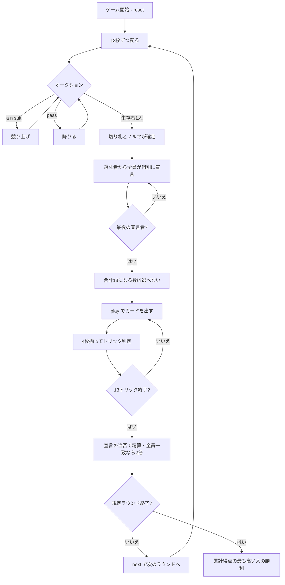

# イスラエリホイスト（CUI版）遊び方

## ゲーム概要

イスラエル発祥の競り型トリックテイキング。52枚を4人に13枚ずつ配る**個人戦**です。**入札が2段階あるのがこのゲームの形**——まずオークションで切り札と最低ノルマを競り落とし、そのあと落札者を含む**全員が改めて自分の目標トリック数を宣言**します。落札者が買うのは「契約」ではなく「切り札を選ぶ権利」です。

## 起動方法

```sh
go run ./cmd/trumpcards israeliwhist
go run ./cmd/trumpcards --lang en israeliwhist  # 英語モード
```

## ルール

### 1段階目：オークション

親の左隣から順に、「**n トリック + 切り札スート**」で競り上げます。

- 最低入札は **5**
- 競り上げは「**数が上**」または「**同数でスートが上**」
- スートの序列は **♣ < ♦ < ♥ < ♠**
- 一度降りたら戻れません
- **誰も入札しないまま最後の1人になったら、その人は降りられません**（切り札が決まらないため）

生存者が1人になった時点で決着。そのスートがそのラウンドの切り札になり、その数が落札者の**最低ノルマ**として残ります。

### 2段階目：宣言

落札者から順に、**全員が改めて**目標トリック数（0〜13）を宣言します。

- **落札者はノルマ以上を宣言しなければなりません**
- **最後に宣言する人は、合計がちょうど13になる数を選べません**（13だと全員が同時に達成できてしまうため）

### 得点

| 宣言 | 的中 | 外し |
|------|------|------|
| n ≥ 1 | **+(n² + 10)** | **-(10 × 過不足)** |
| 0 | **+25** | **-(10 × 過不足)** |

**的中は2乗で跳ねます。** 大きく宣言して当てるほど見返りが大きく、Risk と釣り合います。

さらに、**全員が的中したラウンド**と**全員が外したラウンド**は、どちらも**得点・減点が2倍**になります。

### 札の強さ

切り札 > リードのスート > その他。同じスートなら A > K > Q > J > 10 > … > 2。**フォロー義務があります**。

## ゲームの流れ



## コマンド一覧

| コマンド | 短縮形 | 説明 |
|----------|--------|------|
| `auction <n> <suit>` | `a` | オークションで入札する（n は5以上、suit は 1:♠ 2:♣ 3:♥ 4:♦） |
| `pass` |  | オークションを降りる |
| `bid <n>` | `b` | 目標トリック数を宣言する（0..13） |
| `play <idx>` | `p` | 手札の `<idx>` 番目のカードを出す |
| `next` | `n` | 次のラウンドを開始する |
| `hint` | `h` | 入札・宣言、または打つべき札を提示する |
| `giveup` | `g` | 投了する |
| `log` | `l` | 棋譜（アクションログ）を表示する |
| `reset` | `r` | 最初からやり直す |
| `quit` | `q` | 終了する |
| `help` | `?` | コマンド一覧を表示 |

## 画面の見方

```
==========
Israeli Whist (イスラエリホイスト)
==========
ラウンド: 1/4  トリック: 1/13
得点: 的中 +(宣言^2 + 10)、0宣言の的中は +25、外しは -(10 × 過不足)。全員的中／全員外しはどちらも2倍。
切り札: ハート（落札 7 トリック）
あなた[落札 7]: 宣言7 獲得0 累計0 手札13枚
  [0]♠2 [1]♠7 [2]♠K [3]♣4 [4]♥A [5]♥K ...
CPU1[降り]: 宣言3 獲得0 累計0 手札13枚
CPU2[入札中]: 未宣言 獲得0 累計0 手札13枚
CPU3[降り]: 宣言2 獲得0 累計0 手札13枚
----------
手番: あなた
play <idx>・・・カードを出す
```

- **得点行**: 的中が2乗で跳ねること、全員一致で2倍になること。盤面からは読めません
- **`[落札 n]` / `[降り]` / `[入札中]`**: 1段階目の立場
- **宣言欄**: 2段階目の目標トリック数
- **`[n]`**: `play <n>` で指定する手札の番号

## 遊び方のコツ

- **競り落とすのは切り札を選ぶ権利。** 長いスートがあるなら、ノルマを背負ってでも取る価値があります
- **ノルマは下限であって目標ではありません。** 落札後に、それ以上の数を改めて宣言できます
- **降りるのは早いほうが安全。** 一度降りたら戻れないので、勝てない競りに付き合わないこと
- **宣言は2乗で効きます。** 7を当てれば59点、3なら19点。ただし外したときの減点は過不足に比例するだけなので、**確信があるなら大きく**
- **全員的中・全員外しの2倍は、他人の宣言を見てから狙えます**。3人が達成しそうなら、自分も合わせにいく価値があります
- **自分が最後の宣言者なら、禁止値が出ます。** 避けて1つずらすだけで構いません
