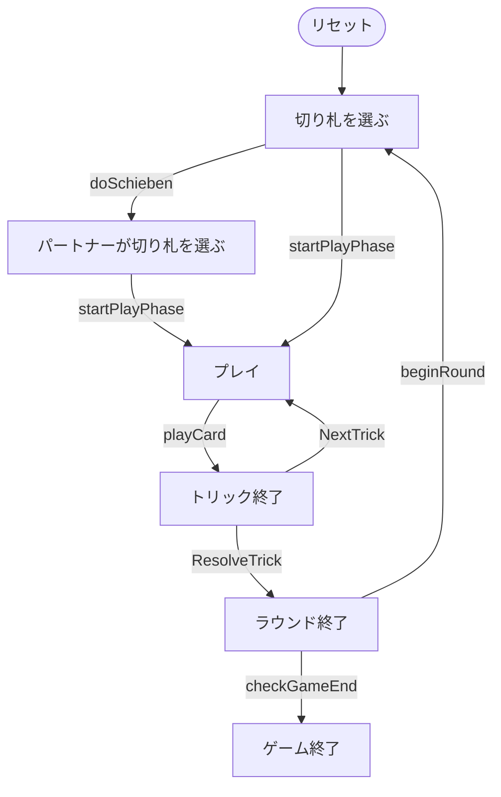

# ヤス（シーバー）（CUI版）遊び方

## ゲーム概要

Jass（ヤス、Schieber＝シーバー）はスイスの国民的トリックテイキングゲームです。36枚デッキ（6〜A × 4スート）を使って4人2チームで対戦し、切り札のJ（Bauer＝20点）と9（Nell＝14点）を最強とする独自の得点体系で、先に1000点を取ったチームが勝利します。

## 起動方法

```sh
go run ./cmd/trumpcards jass
go run ./cmd/trumpcards --lang en jass  # 英語モード
```

## ルール

### 基本ルール

- プレイヤーは4人（人間1 + CPU3）。プレイヤー0と2、プレイヤー1と3が同チーム。
- 36枚デッキ（6,7,8,9,10,J,Q,K,A × 4スート）を使用。各プレイヤーに9枚配る。
- 各ラウンドは9トリック。

### ビッド（Schieber）

1. フォアハンド（ディーラーの左隣）が切り札スートを1つ選ぶ。
2. または「シーベン（schieben）」してパートナーに選択を委ねる。委ねられたパートナーは必ず切り札を選ぶ。

### トリックの強さ

- 切り札スート: J > 9 > A > K > Q > 10 > 8 > 7 > 6
- 非切り札スート: A > K > Q > J > 10 > 9 > 8 > 7 > 6
- リードスートに従う義務がある（手札の切り札がJ1枚のみの場合は切り札リードに従う義務を免除）。フォローできない場合は任意のカード（切り札含む）を出せる。

### 得点

- 切り札: J=20, 9=14, A=11, 10=10, K=4, Q=3, 8/7/6=0
- 非切り札: A=11, 10=10, K=4, Q=3, J=2, 9/8/7/6=0
- 最終トリック +5（合計157点）

### Weis（メルド）と Stöck

- 同一スートの連続（3枚=20, 4枚=50, 5枚以上=100）。
- 同位4枚（J×4=200, 9×4=150, {A,K,Q,10}×4=100）。
- 全員の中で最良の Weis を持つチームが、両メンバーの全 Weis を獲得（引き分けはフォアハンド順で先着が勝ち）。
- Stöck（切り札の K+Q を1人が所持）= そのチームに +20。

### 勝敗

各ラウンドのカード点＋最終トリック＋獲得 Weis＋Stöck を累計し、先に1000点（変更可）に達したチームが勝利。

## ゲームの流れ

ゲームの進行は `internal/domain/Jass.go` のフェーズ機械そのものです。各ノードは同ファイルの `JassPhase` 定数、矢印ラベルはその遷移を行うメソッド名です。



## コマンド一覧


| コマンド | 短縮形 | 説明 |
|----------|--------|------|
| `call <suit>` | `c` | 切り札を選ぶ (1=S,2=C,3=H,4=D) |
| `schieben` | `sc` | シーベン (パートナーへ委譲) |
| `play <idx>` | `p` | カードをプレイ |
| `next` | `n` | 次のトリックへ |
| `nextround` | `nr` | 次のラウンドへ |
| `log` | `l` | action log |
| `setdifficulty [0-2]` | `sd` | CPU難易度 (0=Easy, 1=Normal, 2=Hard) |
| `settarget <n>` | `st` | 目標スコア (デフォルト1000) |
| `hint` | `h` | ヒントを表示 |
| `reset` | `r` | 新しいゲームを開始 |
| `quit` | `q` | ゲーム終了（`exit` も同じ） |
| `help` | `?` | コマンド一覧を表示 |

## 画面の見方

実際の出力例です。配りは毎回シャッフルされるので、カードの並びは実行ごとに変わります。

```
==========
Jass (Schieber) (ヤス/シーバー)
==========
ラウンド: 1  トリック: 1
ディーラー: あなた
切り札: SPADE (メイカー: チーム1)
チーム0: 0点  チーム1: 0点
当ラウンドの Weis: チーム0 50点  チーム1 0点（最も強い Weis を宣言したチームだけが自陣の Weis を総取りします）
あなた: チーム0 獲得0トリック 9枚
[0]CLOVER 1  [1]CLOVER 9  [2]HEART 13  [3]HEART 9  [4]HEART 8  [5]DIAMOND 10  [6]DIAMOND 9  [7]DIAMOND 8  [8]DIAMOND 7
CPU 1: チーム1 獲得0トリック 8枚
CPU 2: チーム0 獲得0トリック 8枚
CPU 3: チーム1 獲得0トリック 8枚
----------
トリック: CPU 1=SPADE 9, CPU 2=SPADE 11, CPU 3=SPADE 13
手番: あなた
p <i> (play)
==========
```

- **1〜3行目**: ゲーム名の見出し
- **ラウンド / トリック**: 進行状況
- **ディーラー**: 配り手
- **切り札**: 切り札スートと、それを選んだチーム（メイカー）
- **チーム0 / チーム1**: 累積得点
- **当ラウンドの Weis**: 各チームの Weis（役）得点。**最も強い Weis を宣言したチームだけ**が自陣の Weis を総取りする
- **プレイヤー行**: 所属チーム、獲得トリック数、残り手札枚数
- **`[i]` 付きの行**: あなたの手札。`p <i>` の `<i>` はこの番号
- **`----------` の下**: 現在のトリックに出ているカードと手番
