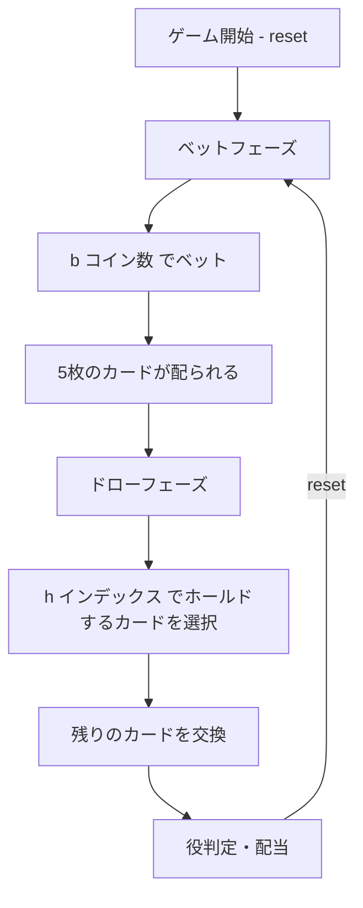

# ジョーカーポーカー（CUI版）遊び方

## ゲーム概要

1人用カジノカードゲームです。53枚のトランプ（52枚+ジョーカー1枚）を使い、5枚のカードでポーカーの役を作ります。ジョーカーがワイルドカードとして扱われ、他の任意のカードの代わりになります。Joker Poker専用のペイテーブルに基づいて配当が支払われます。

## 起動方法

```sh
go run ./cmd/trumpcards jokerpoker
go run ./cmd/trumpcards --lang en jokerpoker  # 英語モード
```

## ルール

### 基本ルール

- 53枚のトランプ（52枚+ジョーカー1枚）を使用
- ジョーカーがワイルドカード
- 1〜5コインをベットしてゲーム開始
- 5枚のカードが配られる
- 残したいカード（ホールド）を選び、残りを交換
- 最終的な5枚の手札で役を判定し、配当を支払い

### 配当表（Joker Poker）

| 役 | 1コイン | 2コイン | 3コイン | 4コイン | 5コイン |
|----|---------|---------|---------|---------|---------|
| ナチュラルロイヤルフラッシュ | 250 | 500 | 750 | 1000 | 4000 |
| ファイブカード | 200 | 400 | 600 | 800 | 1000 |
| ワイルドロイヤルフラッシュ | 100 | 200 | 300 | 400 | 500 |
| ストレートフラッシュ | 50 | 100 | 150 | 200 | 250 |
| フォーカード | 20 | 40 | 60 | 80 | 100 |
| フルハウス | 7 | 14 | 21 | 28 | 35 |
| フラッシュ | 5 | 10 | 15 | 20 | 25 |
| ストレート | 3 | 6 | 9 | 12 | 15 |
| スリーカード | 2 | 4 | 6 | 8 | 10 |
| ツーペア | 1 | 2 | 3 | 4 | 5 |
| キングスオアベター | 1 | 2 | 3 | 4 | 5 |

### ワイルドカード

- ジョーカーは任意のカードとして扱える
- ナチュラルロイヤルフラッシュ: ワイルドなしのロイヤルフラッシュ（最高配当）
- ワイルドロイヤルフラッシュ: ジョーカーを含むロイヤルフラッシュ
- ファイブカード: ジョーカーを使って同じランク5枚

### キングスオアベター

- K、Aのワンペア以上が配当の最低条件
- Q以下のワンペアは配当なし（ツーペアは配当あり）

## ゲームの流れ



## コマンド一覧

| コマンド | 短縮形 | 説明 |
|----------|--------|------|
| `reset` | `r` | 新しいゲームを開始 |
| `bet <amount>` | `b <amount>` | ベットする（1〜5コイン） |
| `hold <indices>` | `h <indices>` | カードをホールドして交換（インデックス0〜4） |
| `log` | `l` | アクションログ（棋譜）を表示 |
| `quit` | `q` | ゲーム終了 |
| `help` | `?` | コマンド一覧を表示 |

### コマンド例

- `r` → ゲームリセット
- `b 5` → 5コインベット
- `h 0 2 4` → 0番目、2番目、4番目のカードをホールドし、残りを交換
- `h` → 全カード交換（ホールドなし）
- `l` → 棋譜を表示

## 画面の見方

```
==========
ジョーカーポーカー
==========
チップ: 100
----------
ベットフェーズ
b・・・ベット  l・・・棋譜
==========

> b 3

==========
ジョーカーポーカー
==========
チップ: 97
----------
[0]♠A  [1]★JK  [2]♦K  [3]♣3  [4]♠J
----------
ドローフェーズ
h・・・ホールド  l・・・棋譜
==========

> h 0 1 2

==========
ジョーカーポーカー
==========
チップ: 103
----------
[0]♠A  [1]★JK  [2]♦K  [3]♥A  [4]♦9
----------
スリーカード  配当: 6
----------
r・・・リセット  l・・・棋譜
==========
```

- `チップ: N`: 所持チップ数
- `[N]♠A`: カードのインデックスとカード表示
- `★JK`: ジョーカー
- `配当: N`: 獲得配当

## 遊び方のコツ

- 5コインベットでナチュラルロイヤルフラッシュの配当が大幅に増える（250→4000）ため、可能なら最大ベットがお得
- ジョーカーは常にホールドする
- ジョーカーを持っている場合、スリーカード以上を狙いやすい
- ジョーカーなしの場合はキングスオアベター（K以上のペア）が最低配当条件なので注意
- ツーペアも配当があるため、ペアが2つある場合はホールドする
