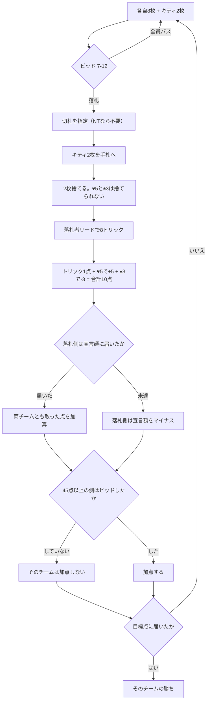

# カイザー（CUI版）遊び方

## ゲーム概要

カナダ・サスカチュワン州のビッド式パートナーシップ・トリックゲーム。**34 枚**の専用構成を使い、4 人 2 対 2 で戦います。**♥5 が +5 点、♠3 が −3 点**という得点札が game の名前の由来です。

出典: [pagat.com: Kaiser](https://www.pagat.com/pointtrk/kaiser.html)

> **出典との相違**: pagat は ♠7 を ♠3 に、♥7 を ♥5 に**置換**した 32 枚として説明していますが、本実装は 32 枚に ♥5・♠3 を**追加**した 34 枚です。キティ 2 枚を使う構成のため（4 人 × 8 枚 + キティ 2 枚 = 34）で、置換式の 32 枚では配り切りになりキティが取れません。

## 起動方法

```sh
go run ./cmd/trumpcards kaiser
go run ./cmd/trumpcards --lang en kaiser   # 英語表示
```

## ルール

### デッキ（**32 枚ではなく 34 枚**）

各スート **A-K-Q-J-10-9-8-7**（32 枚）に、**♥5 と ♠3 を加えた 34 枚**です。

**「ランク 2〜6 を除外した 32 枚」ではありません。**それだと ♥5 も ♠3 も消えてしまい、このゲームの得点そのものが成立しません。

枚数は算術でも確かめられます。**4 人 × 8 枚 = 32 枚**、これに**キティ 2 枚**を足して **34 枚**。32 枚デッキでは配り切りになってキティが作れません。

### 配り方

各自 **8 枚**。残り **2 枚**を伏せて**キティ**とします。

### ビッド

**宣言するのはトリック数ではなく「点数」です。**トリックは 8 つしかないのに ♥5 が 5 点あるためです。

- 範囲は **7〜12**
- **最低が 6 ではなく 7** なのは、落札者がキティを見られる利が大きいからです
- パスできます。前より高い宣言でなければ通りません

契約は 3 種類あり、**同じ数字なら下ほど強い**です。

| 契約 | 内容 |
|---|---|
| 切札あり | 落札後に切札スートを指定します |
| **ノートランプ (NT)** | 切札なし |
| **ロー・ノートランプ (Low NT)** | 切札なし、かつ**ランクが逆転して 7 が最強**（7-8-9-10-J-Q-K-A） |

全員パスなら配り直しです。

### キティの入れ替え

落札者はキティ 2 枚を**見せずに手札へ加え**（10 枚になります）、**2 枚を伏せて捨てます**。

**♥5 と ♠3 は捨てられません。**これを許すと落札者が ♠3 を無条件で処分できてしまいます。

### プレイ

**追随は強制**です。出されたスートを持っていれば必ず出します。**切札を出す義務はありません。**

リードは**落札者**から。8 トリック行います。

### 得点

| | 点 |
|---|---|
| トリック 1 つ | **1 点** ×8 |
| **♥5 を取った側** | **+5 点** |
| **♠3 を取った側** | **−3 点** |
| **1 局の合計** | **10 点** |

- **達成**（宣言額以上を取った）: 両チームとも取った点をそのまま加算します
- **未達（ベート）**: 落札側は**宣言額をそのままマイナス**。取った点は入りません

**45 点以上に達したチームは、自分がビッドしない限りそれ以上加点できません。**

先に **52 点**に届いたチームの勝ち。ノートランプのビッドが成功した局があった場合は **62 点**に上がります。



## コマンド一覧

| コマンド | 短縮形 | 説明 |
|----------|--------|------|
| `bid <7-12> [0-2]` | `b` | 点数を宣言する（0=切札 1=NT 2=ロー NT、省略時は切札） |
| `pass` | `ps` | ビッドを見送る |
| `trump <1-4>` | `t` | 切札を指定する（1=♠ 2=♣ 3=♥ 4=♦） |
| `discard <i> <j>` | `d` | キティを取り込んだあと 2 枚捨てる |
| `play <i>` | `p` | 手札 `i` を出す |
| `next` | `n` | 次の局へ進む |
| `log` | `l` | 棋譜を表示する |
| `reset` | `r` | ゲームごとリセットする |
| `quit` | `q` | 終了する |
| `help` | `?` | コマンド一覧を表示 |

## 画面の見方

```
局: 1  目標: 52点  チーム0: 0  チーム1: 0
契約: 8 切札あり 切札: ♥
あなた(T0)[親]: [0]♠1 [1]♠13 [2]♥5 ...
CPU 1(T1)[宣言]: 非公開 8枚
場: ♠1
この局: チーム0 2点 / チーム1 1点
----------
手番: あなた
出せる札: 0 1
p <i> ・・・手札 i を出す（追随は強制です）
```

- **`(T0)` `(T1)`** がチームです。**席 0 と 2、席 1 と 3 が味方**です
- **`出せる札`** を必ず確認してください。追随が強制なので出せない札があります
- **`[宣言]`** の側が落札者です。この側が未達ならベートになります
- 相手の手札は精算まで伏せられます

## 遊び方のコツ

- **♥5 と ♠3 で 8 点分が動きます。**トリック 8 点と同じ重みなので、この 2 枚の行方が勝敗を決めます
- **♠3 は押しつける札です。**自分が取らされないよう、相手が取る流れで落とします
- **宣言は 7 から。**キティで 2 枚入れ替えられる前提の下限なので、キティ込みで読みます
- **♥5 を持っているなら宣言を検討する価値があります。**それだけで 5 点が見込めます
- **45 点を超えたら自分でビッドしないと勝てません。**逃げ切りは効きません
- **ロー・ノートランプでは 7 が最強です。**普段の感覚のまま A を抱えると全部負けます
