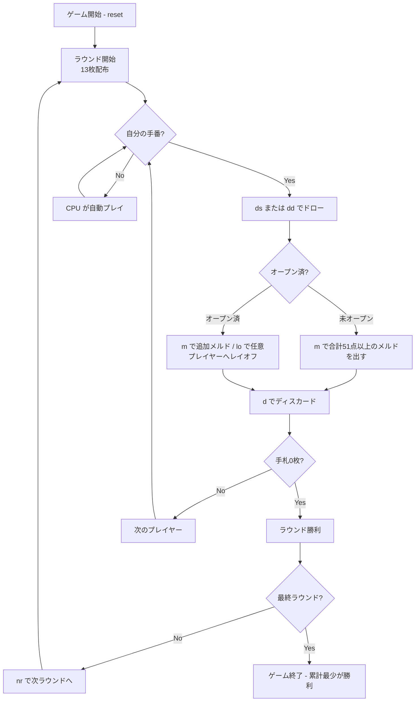

# カルーキ（CUI版）遊び方

## ゲーム概要

人間1人＋CPU1〜3人（合計2〜4人）で進行するコントラクトラミー系の場メルドゲーム。山札からドローし、手札をメルド（セット／ラン）として場に出していき、手札を最も早く出し切る（上がる）とそのラウンドに勝利する。各ラウンドで他プレイヤーの手札残り（デッドウッド）がペナルティとして累計に加算され、全ラウンド終了時に累計スコアが最も少ないプレイヤーが勝利する。

## 起動方法

```sh
go run ./cmd/trumpcards kalooki
go run ./cmd/trumpcards --lang en kalooki  # 英語モード
```

## ルール

### 基本ルール

- 2デッキ（52枚 × 2 = 104枚）にジョーカー2枚を加えた106枚を使用。
- 初期配布: 各プレイヤーに13枚ずつ。残りは山札、最初の1枚を捨て札に。
- 各ターン: 山札 or 捨て札トップから1枚引く → 任意でメルド / レイオフ → 1枚捨ててターン終了。
- **オープン（初メルド）**: そのプレイヤーが最初に場へ出すメルドは、合計が**オープン点数（既定51点）以上**である必要がある。条件を満たさない場合はメルドできない。
- オープン後は、自分・他プレイヤーを問わず**任意のプレイヤーのメルドにレイオフ**（カード追加）できる。
- ジョーカーはワイルドカードとして任意のカードの代わりに使える。ジョーカーを含むメルドは得点が1.5倍になる（ジョーカー入りメルドは価値が高い）。
- 手札を全て出し切るとそのラウンドの勝利（上がり）。

### オープン点数とジョーカーの扱い

- 場に出す最初のメルド（群）の合計点が**オープン点数（既定51点）以上**でなければオープンできない。一度に複数のメルドをまとめて出して合計を満たしてもよい。
- 得点計算の基準: A=15点、2〜9=額面、10/J/Q/K=10点。
- ジョーカーを含むメルドは合計点が**1.5倍**で評価されるため、オープン条件を満たしやすく、得点面でも有利。

### 得点

- 上がったプレイヤー: 0点。
- 他プレイヤー: 手札に残ったカード（デッドウッド）のペナルティが累計に加算される（A=15点、2〜9=額面、10/J/Q/K=10点、ジョーカー=高ペナルティ）。
- 累計スコアが少ないほど良い。

### ゲーム終了

規定ラウンド数の終了時点で、累計ペナルティが最少のプレイヤーが勝利する。

## ゲームの流れ



## コマンド一覧

| コマンド | 短縮形 | 説明 |
|----------|--------|------|
| `reset` | `r` | 新しいゲームを開始 |
| `quit` | `q` | ゲーム終了 |
| `drawstock` | `ds` | 山札からカードを引く |
| `drawdiscard` | `dd` | 捨て札トップを取得 |
| `meld <a,b,c ...>` | `m` | メルド群を1つ場に出す（手札インデックスをカンマ区切り） |
| `layoff <pIdx> <mIdx> <cIdx>` | `lo` | 任意プレイヤー（pIdx）のメルド（mIdx）に手札（cIdx）を追加 |
| `discard <idx>` | `d` | 手札からカードを捨ててターン終了 |
| `nextround` | `nr` | 次のラウンドへ進む |
| `log` | `log` | 棋譜を表示 |

## 画面の見方

```
==========
Kalooki (カルーキ)
==========
山札: 50枚
捨て札: ♥7
オープン点数: 51点以上
You: 累積0点 ラウンド0点 13枚 [未オープン]
  [0]♠5 [1]♥5 [2]♦5 [3]♣K [4]♥K ...
CPU 1: 累積0点 13枚 [未オープン]
CPU 2: 累積0点 13枚 [未オープン]
----------
手番: You (ドローフェーズ)
ds・・・山札から引く
dd・・・捨て札トップを取る
```

## 遊び方のコツ

- オープンには51点以上が必要なため、高得点のカード（A・絵札）やジョーカー入りメルドを意識して組むとオープンしやすい。
- ジョーカー入りメルドは1.5倍評価なので、ジョーカーは無理に温存せず、オープン達成や高得点メルドに活用する。
- オープン後はどのプレイヤーのメルドにもレイオフできるため、手札を一気に減らして早上がりを狙う。
- 上がれそうにない場合は、A や絵札などペナルティの高いカードを優先的に捨ててデッドウッドを軽くしておく。
