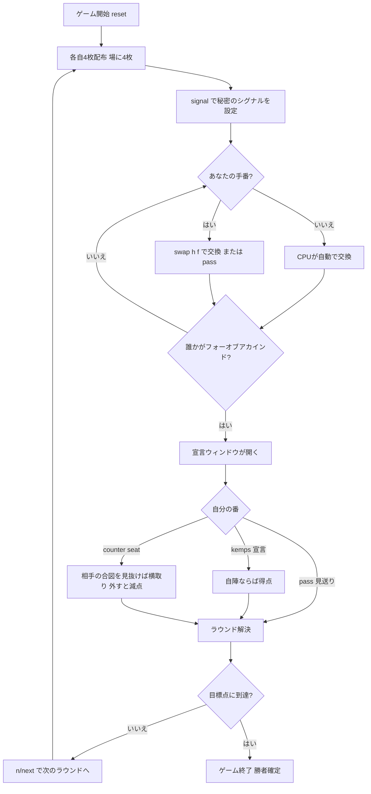

# ケムプス（CUI版）遊び方

## ゲーム概要

Kemps（ケムプス）は4人を2チームに分けて遊ぶ**マッチングゲーム**です。各プレイヤーは手札4枚を持ち、毎ターン手札1枚を全員共有の**場のカード**1枚と交換しながら、同じランク4枚（**フォーオブアカインド**）を目指します。フォーオブアカインドが揃ったら、パートナーに事前に決めた**秘密のシグナル**を送り、チームで「**ケムプス！**」と宣言すると1点。相手チームがシグナルを見抜けば「**カウンター・ケムプス！**」で横取り（成功で+1点、外すと-1点）。先に5点（目標点）に達したチームの勝利です。

## 起動方法

```sh
go run ./cmd/trumpcards kemps
go run ./cmd/trumpcards --lang en kemps  # 英語モード
```

## ルール

### デッキと配布

- **デッキ**: 52枚（標準デッキ）
- **プレイヤー**: 4人（あなた + CPU3人）
- **チーム**: 2チーム。偶数席（あなた=0席, 2席）がチームA、奇数席（1席, 3席）がチームB。あなたのパートナーは2席のCPUです。
- **配布**: 各プレイヤー4枚。場に4枚を表向きで置きます。

### 交換（スワップ）

- 自分の手番では手札4枚のうち1枚を選び、**場のカード1枚と交換**します（`swap <h> <f>`）。
- 交換したくない場合は**パス**（`pass`）できます。
- 目標は手札4枚すべてを同じランクで揃える**フォーオブアカインド**です。

### シグナル

- ゲーム前（およびいつでも）に、あなたの**秘密のシグナル種別**を設定します（`signal <0-1>`、0=音/咳払い、1=瞬き）。
- パートナーがフォーオブアカインドを揃えたとき、このシグナルでそれを知らせる想定です。

### 宣言（Kemps / Counter-Kemps）

- 誰かがフォーオブアカインドを揃えると、**宣言ウィンドウ**が開きます。
- 自分かパートナーがフォーオブアカインドなら「**ケムプス！**」（`kemps`）と宣言して1点を狙います。
- 相手チームがシグナルを見抜いたと思ったら「**カウンター・ケムプス！**」（`counter <seat>`）で対象席を指定し、横取りを狙います（成功で+1点、外すと-1点）。
- 宣言したくないときは`pass`で見送ります。

### 勝利条件

- 先に**目標点（デフォルト5点）**に達したチームの勝利です。

### CPU難易度

- **Easy（0）**: 反応が鈍く、相手のシグナルを見抜きにくい。
- **Normal（1）**: 標準的な反応。
- **Hard（2）**: 反応が速く、相手のシグナルを見抜きやすい。

## ゲームの流れ



## コマンド一覧

| コマンド | 短縮形 | 説明 |
|----------|--------|------|
| `swap <h> <f>` | `s` | 手札のh番目（0始まり）を場のf番目と交換する |
| `pass` | `p` | 交換しない（宣言ウィンドウでは宣言を見送る） |
| `signal <0-1>` | `sig` | 秘密のシグナル種別を設定（0=音, 1=瞬き） |
| `kemps` | `k` | 「ケムプス！」と宣言する |
| `counter <seat>` | `c` | 指定席に「カウンター・ケムプス！」を宣言する |
| `next` | `n` | 次のラウンドへ進む |
| `log` | `l` | アクションログを表示 |
| `reset` | `r` | 新しいゲームを開始（設定保持） |
| `quit` | `q` | ゲーム終了 |
| `help` | `?` | コマンド一覧を表示 |

## 画面の見方

```
==========
Kemps (ケムプス)
==========
ラウンド 1  チームA: 0  チームB: 0
あなたのシグナル: 音
----------
場のカード: [0][5♠] [1][6♥] [2][7♣] [3][8♦]
----------
あなた [チームA]
  [0][A♠] [1][2♥] [2][3♣] [3][4♦]
CPU1: 4枚 [チームB]
CPU2: 4枚 [チームA]
CPU3: 4枚 [チームB]
----------
あなたの番です — swap <h> <f> で交換、p でパスできます。
```

- **ラウンド行**: 現在のラウンド数と両チームの得点。
- **シグナル行**: 現在設定している秘密のシグナル種別。
- **場のカード**: 全員共有の4枚。`[i]` の番号で `swap` の交換先を指定します。**あなたの手札と同ランクの札には `@` が付きます**（4枚同ランクを狙う交換候補）。
- **手札表示**: あなたの4枚のみ公開され、`[i]` の番号で `swap` の対象を指定します。
- **チーム表示**: 各プレイヤーの所属チーム（A / B）。

## 遊び方のコツ

- **ランクを集める**: フォーオブアカインドを狙うなら、揃いかけているランクを残し、不要なカードから場に出しましょう。
- **パートナーを観察する**: パートナーがフォーオブアカインドを揃えた合図を逃さないように。揃った瞬間に素早く「ケムプス！」を宣言します。
- **相手の合図を読む**: 相手チームの動きに不審な点があれば、カウンター・ケムプスで横取りを狙えます。ただし外すと減点なので慎重に。
- **難易度調整**: Hard のCPUは合図を見抜くのが得意です。慣れないうちは Easy から始めましょう。
