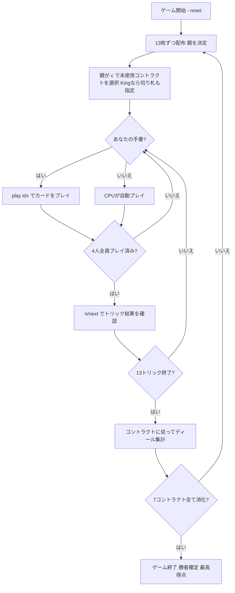

# キング（CUI版）遊び方

## ゲーム概要

King（キング）はギリシャやブラジルで親しまれている**トリック回避系のコンペンディウム（複合契約）ゲーム**です。標準52枚デッキを4人（あなた＋CPU3人、個人戦）でプレイします。1マッチはちょうど**7ディール**。各ディールで**親（ディーラー）**がまだ使っていない**7つのコントラクト**の1つを選び、13トリックを**マストフォロー**で戦い、選ばれたコントラクトのルールで得点します。7つのコントラクトを1回ずつ消化した時点で、**合計点が最も高い（＝失点が最も少ない）**プレイヤーがマッチ勝利です。

## 起動方法

```sh
go run ./cmd/trumpcards king
go run ./cmd/trumpcards --lang en king  # 英語モード
```

## ルール

### デッキと配布

- **デッキ**: 標準52枚（2〜10, J, Q, K, A × 4スート）
- **プレイヤー**: 4人（プレイヤー0 = あなた、プレイヤー1〜3 = CPU）
- **配布**: 各プレイヤー13枚（合計52枚）。ウィドウ（伏せ札）はありません。

### 親とコントラクト選択

- 各ディールの開始時、**親**はまだこのマッチで選ばれていない**7つのコントラクトから1つ**を選びます。
- コントラクト6（King）を選んだ場合のみ、**親が切り札スートも指定**します。
- 7ディールで7つのコントラクトを1回ずつすべて消化します。

### コントラクト一覧

| No. | コントラクト | 得点 |
|-----|--------------|------|
| 0 | No Tricks（トリックなし） | 取ったトリック1つにつき **−2** |
| 1 | No Hearts（ハートなし） | 取ったハート1枚につき **−2** |
| 2 | No Queens（クイーンなし） | 取ったQ1枚につき **−6** |
| 3 | No King of Hearts（ハートのK） | K♥を取ると **−20** |
| 4 | No Last Two Tricks（最後の2トリック） | 最後の2トリックそれぞれを取ると **−10** |
| 5 | No Men（男札なし） | 取ったJまたはK1枚につき **−3** |
| 6 | King（切り札） | 取ったトリック1つにつき **+5**（唯一のプラス契約。親が切り札を指定） |

- コントラクト0〜5（6つの**マイナス契約**）はすべて**切り札なし（ノートランプ）**でプレイします。
- コントラクト6（King）だけが**プラス契約**で、切り札があります。

### カードの強さ

**強い順**: A > K > Q > J > 10 > 9 > … > 2。King契約では**切り札が非切り札に勝ちます**（マイナス契約は切り札なし）。

### フォロー義務

1. リードスートを持っていれば必ず出す
2. ボイド（リードスートを持たない）時は任意の札を出せる（**オーバートランプ義務なし**）

### 得点計算と勝利条件

- 各ディール終了時、選ばれたコントラクトのルールに従って4人それぞれの**ディール得点**を計算し、累積点に加算します。
- マイナス契約では失点（負の値）、King契約では加点（正の値）になります。
- **マッチ勝利**: 7ディール（＝7コントラクト）すべてが終わった時点で、**累積点が最も高い**プレイヤーが勝利します。

## ゲームの流れ



## コマンド一覧

| コマンド | 短縮形 | 説明 |
|----------|--------|------|
| `contract <0-6> [trump 1-4]` | `c` | 親が未使用コントラクトを選択（King=6のときは切り札1-4も指定） |
| `play <idx>` | `p` | 手札のidx番目のカードを出す |
| `next` | `n` | 次のディールへ進む |
| `setdifficulty <0-2>` | `sd` | CPU難易度設定（0=Easy, 1=Normal, 2=Hard） |
| `hint` | `h` | 推奨アクションを表示 |
| `log` | `l` | アクションログを表示 |
| `reset` | `r` | 新しいゲームを開始（設定保持） |
| `quit` | `q` | ゲーム終了 |
| `help` | `?` | コマンド一覧を表示 |

## 画面の見方

```
==========
King (キング) - Deal 3/7
==========
Contract: No Queens (Q1枚につき -2 ... 実際は -6)   Trump: none
Dealer: CPU1 (親)

Scores: You 0  CPU1 -6  CPU2 -12  CPU3 0

Trick 5/13   Lead: CPU2
  CPU2: 7♠   CPU3: K♠   You: ?
Your hand: [0]A♠ [1]10♥ [2]Q♦ [3]4♣ ...
Playable: 0 (♠をフォロー)
> play 0
```

- **ヘッダー**: ゲーム名・ディール番号（例 `Deal 3/7`）
- **Contract / Trump**: 現在のコントラクトと切り札（マイナス契約は none）
- **Dealer**: 親（このディールのコントラクトを選んだプレイヤー）
- **Scores**: 各プレイヤーの累積点（負の値は失点）
- **Trick**: 現在のトリック番号・リードプレイヤー・場に出た札
- **Your hand / Playable**: 手札とフォロー義務で出せるインデックス

## 遊び方のコツ

- **親のときのコントラクト選びが要**: 自分の手札で失点を抑えやすい契約を選びましょう。ハートやQ、K♥が少ない手ならそれらのマイナス契約を、強い手札で切り札を握れそうなら King（プラス契約）を選ぶのが有効です。
- **危険札は早めに処理**: No Queens や No King of Hearts では、Qや K♥ を安全に押し付けるか、ボイドを作って捨てられるように立ち回ります。
- **No Tricks / No Last Two Tricks は負け抜け**: できるだけ低い札でトリックを取らないよう、序盤に高い札を安全に消化しておくと終盤で楽になります。
- **King契約だけ発想が逆**: プラス契約なので、切り札と高ランク札を活かして**積極的にトリックを取り**にいきます。
- **ヒントを活用**: `hint` はコントラクト選択・プレイの各局面で推奨手を提示します。
