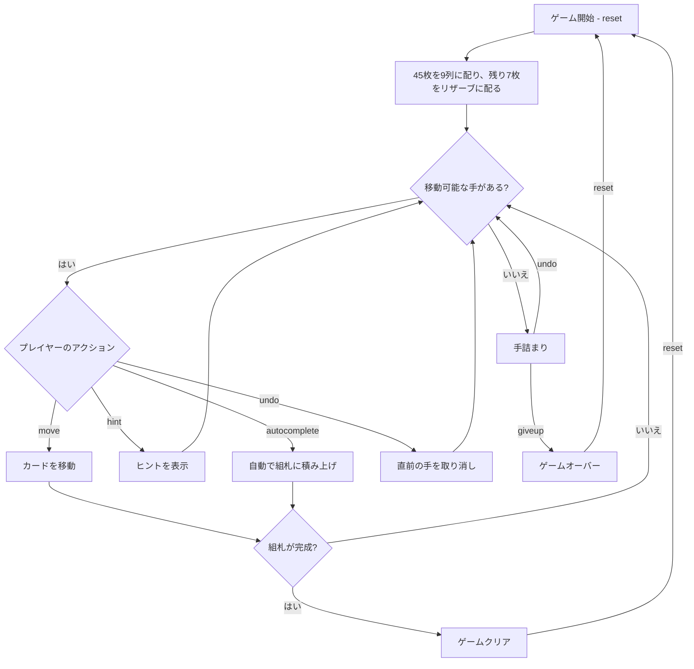

# キング・アルバート（CUI版）遊び方

## ゲーム概要

1人用のソリティアカードゲームです。1デッキ（52枚）を使用し、開始時にすべてのカードを表向きで配ります。9列のオープンなタブロー（列0は1枚、列1は2枚……列8は9枚＝計45枚）に加え、**「ローレンス」と呼ばれる7枚のリザーブ**が1枚ずつ表向きで並びます。組札（ファンデーション）は最初は空です。リザーブのカードはタブローや組札へ出せますが、**一度出すと二度とリザーブには戻せません（一方通行）**。4つの組札へA→Kの順にすべて積み上げきればクリアです。

## 起動方法

```sh
go run ./cmd/trumpcards kingalbert
go run ./cmd/trumpcards --lang en kingalbert  # 英語モード
```

## ルール

### 基本ルール

- 1デッキ（52枚、ジョーカーなし）を使用
- **組札（ファンデーション）は開始時は空**（プレイヤー自身がAを組札へ動かす）
- 45枚を9列のタブローへ表向きで配る（列Nは N+1 枚＝1,2,3,…,9）
- 残りの7枚をリザーブ（ローレンス）へ1枚ずつ表向きで配る
- 4つの組札（ファンデーション）はスート別にA→Kの順に積み上げる
- タブローでは**赤黒交互**に、ランクが1つ下のカードに重ねる（例: 黒の♠5の上に赤の♥4または♦4）
- 移動できるのは1枚ずつのみ（複数枚の同時移動は不可）
- **空の列には任意のカードを置ける**
- **リザーブは一方通行**: リザーブのカードはタブローや組札へ出せるが、リザーブへは何も戻せない

### ゲームクリア

- 4つの組札すべてにA→Kまで13枚ずつ積み上げるとゲームクリア

### ゲームオーバー

- これ以上移動可能な手がない場合は手詰まり（アンドゥやオートコンプリートで打開可能）

## ゲームの流れ



## コマンド一覧

| コマンド | 短縮形 | 説明 |
|----------|--------|------|
| `reset` | `r` | 新しいゲームを開始 |
| `move` | `m` | カードを移動する（サブ引数で移動元・移動先を指定） |
| `undo` | `u` | 直前の操作を元に戻す |
| `giveup` | `g` | ギブアップしてゲームを終了 |
| `hint` | `h` | 次の一手のヒントを表示 |
| `autocomplete` | `ac` | 自動的に組札へ積み上げ可能なカードを移動 |
| `log` | `l` | アクションログ（棋譜）を表示 |
| `quit` | `q` | ゲーム終了 |
| `help` | `?` | コマンド一覧を表示 |

### コマンド例

- `m t0 t1` → タブロー列0の最上段カードを列1へ移動
- `m t3 f` → タブロー列3の最上段カードを組札（ファンデーション）へ移動
- `m r0 t1` → リザーブ0番のカードをタブロー列1へ移動
- `m r0 f` → リザーブ0番のカードを組札へ移動
- `u` → 直前の操作を元に戻す
- `h` → ヒントを表示
- `ac` → オートコンプリート

## 画面の見方

```
==========
King Albert (キング・アルバート)
==========
foundation: [  ] | [  ] | [  ] | [  ]
reserve: ♦7 | ♣9 | ♥2 | [  ] | ♠Q | [  ] | ♦4
----------
t0: [0]♠K
t1: [0]♣K [1]♥3
...
t8: [0]♥J [1]♦9 [2]♥6 [3]♣4 [4]♠7 [5]♦Q [6]♣2 [7]♥10 [8]♠3
----------
moves: 0  undo:no
==========
```

- `foundation`: 4つのスート別の組札の状態（開始時は空）
- `reserve`: 7枚のリザーブ（一方通行）。消化済みのセルは `[  ]` 表示
- `tN`: タブロー列（左がベース、右が最上段、列Nは N+1 枚）
- `[0]♠K`: 列内の位置インデックスとカード
- `moves: N`: 現在の手数

## 遊び方のコツ

- まずはタブローやリザーブからAを探し出して組札へ上げ、続けてスート別の2を狙いましょう
- リザーブは戻せないので、空きタブロー列や赤黒交互の連結を活かして計画的に消化しましょう
- 空列は任意のカードを置けるため、戦略的に列を空けると非常に強い手になります
- ヒント機能で詰まった時のアドバイスを得られます
- 手詰まりになったらアンドゥで戻ってリトライしましょう
