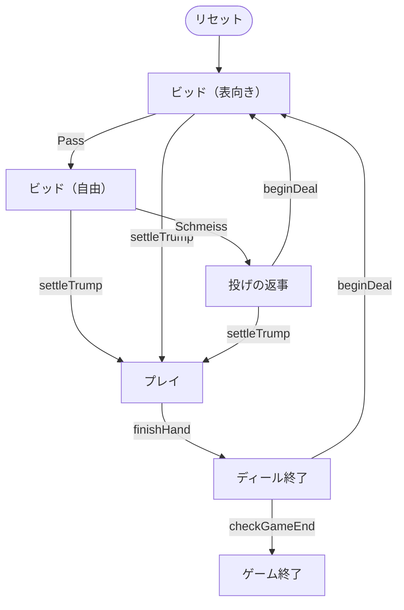
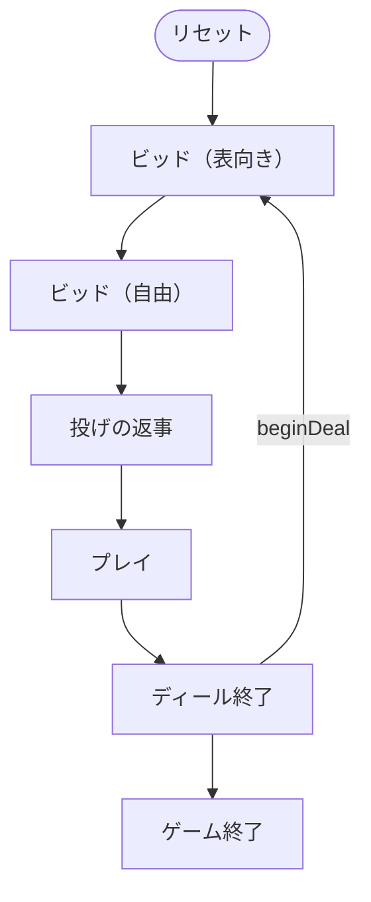

# クラバーヤス（CUI版）遊び方

## ゲーム概要

**2 人用**のトリックゲーム。32 枚（7〜A）を使い、各自 **9 枚**だけ配ります。ベロート／クラベルヤス／ピノクルといったジャス系の**祖型**にあたります。

出典: [pagat.com: Clobyosh / Bela](https://www.pagat.com/jass/bela.html) ／ [Wikipedia: Klaberjass](https://en.wikipedia.org/wiki/Klaberjass)

## 起動方法

```sh
go run ./cmd/trumpcards klaberjass
go run ./cmd/trumpcards --lang en klaberjass   # 英語表示
```

## ルール

### 配り方とビッド

1. 各自 **6 枚**（3 枚ずつ 2 回）配り、1 枚を**表向き**にします
2. **非ディーラー**が、そのスートを切札にするか決めます。断ればディーラーが決めます
3. 両者が断ったら、**表向き以外の**好きなスートを指名できます（非ディーラーから）
4. 両者がここも断ったら**配り直し**です
5. 切札が決まったら、あと **3 枚ずつ**配って **9 枚**になります

**表向きのカードは配られません。**山札の残りとあわせて、そのディールでは使いません。だから **32 枚のうち 18 枚しか場に出ません。**

### dix（切札の 7 の交換）

切札が**表向きカードのスートに決まったとき**だけ、切札の **7** を持っている側はそれを**表向きカードと交換**できます。第 2 ラウンドで別のスートが切札になった場合は交換できません。

### schmeiss（投げ）

ビッドのとき「この配りを流そう」と提案できます。

- 相手が**同意**すれば配り直し
- 相手が**拒否**すれば、**提案した側が**表向きのスートで宣言側にされます

投げ得にはなりません。

### カードの強さと点数

**切札だけ順序が違います。**J と 9 が A の上に割り込みます。

| | 切札 | 平のスート |
|---|---|---|
| J | **20 点（Jass、最強）** | 2 点 |
| 9 | **14 点（Menel、2 番目）** | 0 点 |
| A | 11 点 | 11 点（最強） |
| 10 | 10 点 | 10 点 |
| K | 4 点 | 4 点 |
| Q | 3 点 | 3 点 |
| 8 / 7 | 0 点 | 0 点 |

32 枚の総点は **152 点**、最終トリックの 10 点を足して **162 点**です。ただし前述のとおり**半分ほどしか配られない**ので、1 ディールで争う点数は配りごとに変わります。

### シーケンス役

同じスートの**連続 3 枚以上**。

| 長さ | 点数 |
|---|---|
| 3 枚 | 20 点 |
| 4 枚以上 | **50 点**（5 枚でも 50 点のまま） |

**良い方だけが得点します。**長い方が強く、同じ長さなら最上位札が高い方が強い。**勝った側は自分の役を全部数えます**（1 つだけではありません）。完全に引き分けたときは**どちらも得点しません**。

**並びは素のランク順（7-8-9-10-J-Q-K-A）です。**点数順ではありません。切札の J が 20 点でも、並びの上では 10 と Q の間にあります。A は最上位で、A-7-8 は並びになりません。

### ベラ

切札の **K と Q** を両方持っていれば **20 点**。それぞれを出すときに宣言します。**連続して出す必要はありません。**

### プレイ

**追随・切札・上乗せはすべて強制です。**

- 出されたスートを持っていれば必ず出す
- 持っていなければ**切札を出さねばならない**
- 切札がリードされたら、**勝てる切札があるかぎり上乗せ**する

最終トリックを取った側に **10 点**。

### 精算とベート

**宣言側は相手より「多く」取らねばなりません。**

| 結果 | 精算 |
|---|---|
| 宣言側 > 相手 | 両者とも自分の点を得る |
| 宣言側 ≦ 相手 | **ベート。**宣言側は 0 点、相手が**両者の合計**を得る |

**同点はベートです。**

先に **501 点**に届いた方の勝ちです。



## ゲームの流れ

ゲームの進行は `internal/domain/Klaberjass.go` のフェーズ機械そのものです。各ノードは同ファイルの `KlaberjassPhase` 定数、矢印ラベルはその遷移を行うメソッド名です。



## コマンド一覧

| コマンド | 短縮形 | 説明 |
|----------|--------|------|
| `accept` | `a` | 表向きカードのスートを切札にする |
| `call <1-4>` | `c` | 切札を指名する（1=♠ 2=♣ 3=♥ 4=♦） |
| `pass` | `ps` | ビッドを見送る |
| `schmeiss` | `sm` | この配りを流すことを提案する |
| `yes` | `y` | シュマイスの提案を受ける（この配りを流す） |
| `no` | | シュマイスの提案を断る |
| `play <i>` | `p` | 手札 `i` を出す |
| `next` | `n` | 次のディールへ進む |
| `settarget <n>` | `st` | 目標点を変える（100〜1000） |
| `log` | `l` | 棋譜を表示する |
| `reset` | `r` | ゲームごとリセットする |
| `quit` | `q` | 終了する |
| `help` | `?` | コマンド一覧を表示 |

## 画面の見方

```
ディール: 1  目標: 501点  切札: ♠
あなた[親]: 通算 0  今回 20  手札: [0]♠7 [1]♠8 [2]♠9 [3]♥1 ...
CPU 1[宣言]: 通算 0  今回 0  手札: 非公開 9枚
場: ♥1
----------
手番: あなた
出せる札: 3
p <i> ・・・手札 i を出す（追随・切札・上乗せは強制です）
```

- **`出せる札`** は必ず確認してください。追随・切札・上乗せが強制なので、出せない札のほうが多い局面がよくあります
- **`[宣言]`** が付いた側が切札を決めた人です。この人が負ければベートになります
- 相手の手札は精算まで伏せられます

## 遊び方のコツ

- **切札の J と 9 で 34 点**あります。この 2 枚をどちらが持つかで勝敗がひっくり返ります
- **宣言するなら切札を 4 枚以上**欲しいところです。同点でも負けなので、五分では足りません
- **シーケンスは「勝った側が全部」です。**弱い役しか無いときは、相手に良い役があると 1 点も入りません
- **並びは点数順ではありません。**切札の J が 20 点でも、9 と Q の間を埋めるのは 10 です
- **上乗せ強制**なので、切札のリードで相手の高い切札を引きずり出せます
