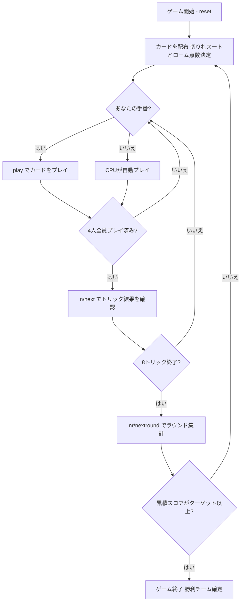

# クラヴァヤス（CUI版）遊び方

## ゲーム概要

Klaverjas（クラヴァヤス）はオランダで広く親しまれているJassファミリーのトリックテイキングゲームです。32枚のデッキを4人（2チーム制、席0&2 対 席1&3）でプレイします。切り札スートは配布時に決まり、マスト・フォロー＋強制オーバートランプ義務（クラヴァヤス義務）の下で8トリックを争います。カード点数に加えてローム（メルド）と最終トリックボーナスが加算され、先にターゲット（デフォルト1501点）に達したチームが勝ちます。

## 起動方法

```sh
go run ./cmd/trumpcards klaverjas
go run ./cmd/trumpcards --lang en klaverjas  # 英語モード
```

## ルール

### デッキと配布

- **デッキ**: 32枚（7,8,9,10,J,Q,K,A × 4スート）
- **プレイヤー**: 4人（プレイヤー0 = あなた、プレイヤー1〜3 = CPU）
- **チーム**: 席0&2（あなたのチーム）対 席1&3
- **配布**: 各プレイヤー8枚
- **切り札**: 最後に配られたカードのスートが切り札スートとなる

### カードの強さ（Jassランキング）

**切り札スート**（強い順）:

| 強さ順 | カード | 別名 |
|--------|--------|------|
| 1 | J | Jas（ヤス） |
| 2 | 9 | Nel（ネル） |
| 3 | A | エース |
| 4 | 10 | テン |
| 5 | K | キング |
| 6 | Q | クイーン |
| 7 | 8 | エイト |
| 8 | 7 | セブン |

**非切り札スート**（強い順）:

| 強さ順 | カード |
|--------|--------|
| 1 | A（エース） |
| 2 | 10 |
| 3 | K（キング） |
| 4 | Q（クイーン） |
| 5 | J（ジャック） |
| 6 | 9 |
| 7 | 8 |
| 8 | 7 |

### カード点数

**切り札スートのカード点数**:

| カード | 点数 |
|--------|------|
| J（Jas） | 20点 |
| 9（Nel） | 14点 |
| A | 11点 |
| 10 | 10点 |
| K | 4点 |
| Q | 3点 |
| 8 | 0点 |
| 7 | 0点 |

**非切り札スートのカード点数**:

| カード | 点数 |
|--------|------|
| A | 11点 |
| 10 | 10点 |
| K | 4点 |
| Q | 3点 |
| J | 2点 |
| 9 | 0点 |
| 8 | 0点 |
| 7 | 0点 |

4スート合計 = **152点**（カード点）＋最終トリック **+10点**

### マスト・フォロー＋クラヴァヤス義務

Klaverjasには通常のマスト・フォローに加え、強制オーバートランプ義務（クラヴァヤス義務）があります:

1. **リードスートあり**: リードされたスートのカードを持っている場合は必ず出さなければならない
2. **リードスートなし（ボイド）**: 手札に切り札があれば必ず切り札を出さなければならない
3. **切り札リード or 場に切り札あり**: 切り札を持っていてかつより強い切り札を持っている場合は必ずオーバートランプ（より強い切り札で上書き）しなければならない
4. **切り札がない場合のみ**: 任意のカードを捨て札として出せる

### ローム（メルド / Roem）

ゲーム開始時に各プレイヤーの初期手札が自動判定され、チームに加算されます:

| メルド | 点数 |
|--------|------|
| 同スート3枚連番（3枚ラン） | 20点 |
| 同スート4枚連番（4枚ラン） | 50点 |
| 同ランク4枚（7・8を除く） | 100点 |

メルドはゲーム開始時に自動検出され、宣言フェーズはありません。

### 得点計算と勝利条件

各ラウンド終了時に計算:

- **チームスコア** = カード点数 + ローム点数 + 最終トリックボーナス（+10点）
- スコアはラウンドをまたいで累積される
- 先にターゲット（デフォルト **1501点**）に達したチームがマッチ勝利

## ゲームの流れ



## コマンド一覧

| コマンド | 短縮形 | 説明 |
|----------|--------|------|
| `play <idx>` | — | 手札のidx番目のカードを出す |
| `next` | `n` | 次のトリックへ進む（トリック終了後） |
| `nextround` | `nr` | 次のラウンドへ進む（8トリック終了後） |
| `setdifficulty <0-2>` | `sd <0-2>` | CPU難易度設定（0=Easy, 1=Normal, 2=Hard） |
| `log` | `l` | アクションログを表示 |
| `reset` | `r` | 新しいゲームを開始（設定保持） |
| `quit` | `q` | ゲーム終了 |
| `help` | `?` | コマンド一覧を表示 |

## 画面の見方

```
==========
Klaverjas (クラヴァヤス)
==========
ラウンド: 1  トリック: 1
チームスコア: あなた=0 相手=0
切り札: ♥
You: 8枚 0トリック [チームA]
[0]A♠ [1]10♠ [2]K♥ [3]J♠ [4]Q♣ [5]9♦ [6]8♦ [7]7♣
CPU 1: 8枚  CPU 2: 8枚  CPU 3: 8枚
----------
フェーズ: PLAY
あなたの手番です。カードを出してください。
play <idx>
```

- **切り札行**: 現在の切り札スート
- **チームスコア行**: 各チームの累積スコア（カード点 + ローム + 最終トリックボーナスの合算）
- **`[n]`付き行**: あなたの手札（インデックス付き）
- **トリック表示**: 現在場に出ているカードと出したプレイヤー
- **フェーズ表示**: 現在のフェーズ（PLAY）

## 遊び方のコツ

- **Jas（J切り札=20点）とNel（9切り札=14点）が最強**: 切り札のJとQは通常とは別のランクになります。特にJasは34点分の価値があるため、いつ使うかが最重要の判断です。
- **クラヴァヤス義務を理解する**: オーバートランプ義務があるため、切り札を温存しても場に切り札が出ると強制的に上書きさせられます。状況によっては弱い切り札は捨て捨て作戦より先に使った方が得です。
- **ローム（メルド）の活用**: 初期手札のメルドはゲーム開始時に自動加算されます。メルドが多い手札はそれだけ有利なスタートとなります。
- **最終トリック（+10点）を狙う**: 8トリック目を取ったチームに+10点が加算されます。拮抗した局面では最終トリックが勝敗を分けることがあります。
- **チームプレイ**: 席0&2が同じチームです。パートナーが高得点のトリックを取りそうな場合は、弱いカードでサポートしましょう。
- **切り札Aと10の価値**: 切り札のA=11点・10=10点は、Jas（20点）・Nel（14点）の次に高い点数を持ちます。これらを守るか使うかの判断がゲームの鍵です。
- **ボイドスートを作る**: 特定のスートを早めに使い切ることで、そのスートがリードされた時に切り札を出せるようになります。チームで協力してボイドを作りましょう。
- **1501点目標の長期戦**: Klaverjasは複数ラウンド続く長期戦です。序盤からスコアの累積を意識し、ラウンドごとに獲得点数を最大化する戦略を立てましょう。
