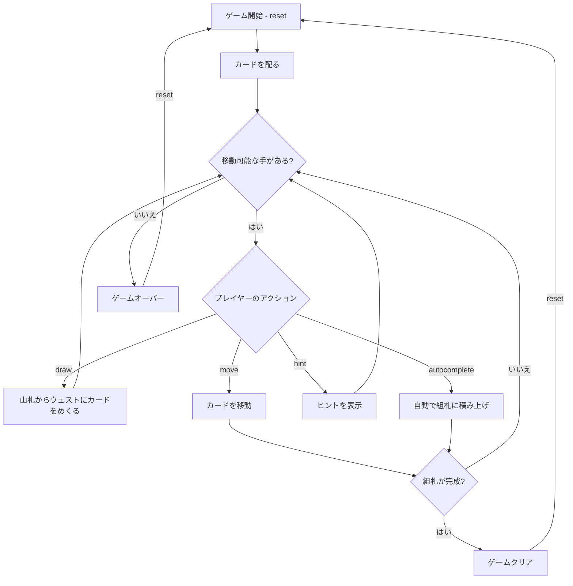

# クロンダイク（CUI版）遊び方

## ゲーム概要

1人用のソリティアカードゲームです。52枚のカードを使い、7列のタブロー、山札、ウェスト、4つの組札で構成されます。組札にA→Kまでスート別に積み上げればクリアです。

## 起動方法

```sh
go run ./cmd/trumpcards klondike
go run ./cmd/trumpcards --lang en klondike  # 英語モード
```

## ルール

### 基本ルール

- 52枚のトランプ（ジョーカーなし）を使用
- 7列のタブローに左から1枚、2枚、...、7枚ずつカードを配る（各列の一番上のカードのみ表向き）
- 残りの24枚は山札（ストック）に裏向きで置く
- 4つの組札（ファンデーション）はスート別にA→Kの順に積み上げる
- タブローでは降順かつ交互の色で重ねる（例: 黒のKの上に赤のQ）

### ゲームクリア

- 4つの組札すべてにA→Kまで13枚ずつ積み上げるとゲームクリア

### ゲームオーバー

- これ以上移動可能な手がない場合はゲームオーバー

### 手詰まり検出

- ヒントが存在せず、かつ山札とウェストが空の場合、または山札を一巡しても進展がなかった場合に「手詰まりです」と表示します
- 手詰まり状態では「元に戻す」またはギブアップを選択できます

## ゲームの流れ



## コマンド一覧

| コマンド | 短縮形 | 説明 |
|----------|--------|------|
| `reset` | `r` | 新しいゲームを開始 |
| `reset 3` | | 3枚引きモードで新しいゲームを開始 |
| `reset 1` | | 1枚引きモードで新しいゲームを開始 |
| `draw` | `d` | 山札からウェストにカードをめくる（1枚または3枚） |
| `move` | `m` | カードを移動する（サブ引数で移動元・移動先を指定） |
| `undo` | `u` | 直前の操作を元に戻す |
| `giveup` | `g` | ギブアップしてゲームを終了 |
| `hint` | `h` | 次の一手のヒントを表示 |
| `autocomplete` | `ac` | 自動的に組札へ積み上げ可能なカードを移動 |
| `log` | `l` | アクションログ（棋譜）を表示 |
| `quit` | `q` | ゲーム終了 |
| `help` | `?` | コマンド一覧を表示 |

### コマンド例

- `d` → 山札からカードをめくる
- `m` → 移動コマンド（移動元・移動先の入力を求められる）
- `u` → 直前の操作を元に戻す
- `h` → ヒントを表示
- `ac` → オートコンプリート
- `reset 3` → 3枚引きモードでリスタート

## 画面の見方

```
==========
Klondike (ソリティア)
==========
ドロー: 1枚 / スコアリング: なし / スコア: -52
Foundation: [空] | [空] | [空] | [空]
Stock: 24枚 | Waste: [空]
----------
列0: [0]DIAMOND 6
列1: [0]??  [1]HEART 2
列2: [0]??  [1]??  [2]SPADE 2
列3: [0]??  [1]??  [2]??  [3]DIAMOND 3
...
列6: [0]??  [1]??  [2]??  [3]??  [4]??  [5]??  [6]CLOVER 4
----------
手数: 1
==========
```

- `ドロー: 1枚 / スコアリング: なし / スコア: -52`: めくる枚数・採点方式・
  現在のスコア
- `Foundation: [空] | [空] | [空] | [空]`: 4 つの組札（空は `[空]`）
- `Stock: N枚 | Waste: X`: 山札の残り枚数とウェイストの一番上
- `列0:`〜`列6:`: タブロー 7 列。**番号は 0 始まり**で、`列` の番号と
  `[i]` の添字がそのまま `m t <列> <行き先>` の引数になります
- `??`: 裏向きのカード。表向きの札は `DIAMOND 6` のように出ます
- `手数: N`: 現在の手数

## 遊び方のコツ

- まずタブローの裏向きカードをめくることを優先しましょう
- Aが出たらすぐに組札へ移動しましょう
- 空いた列にはKのみ置くことができます
- 山札を何度もめくり直して使えるカードを探しましょう
- ヒントコマンドで詰まった時のアドバイスを得られます
- オートコンプリートは組札に安全に移動できるカードがある場合に便利です
