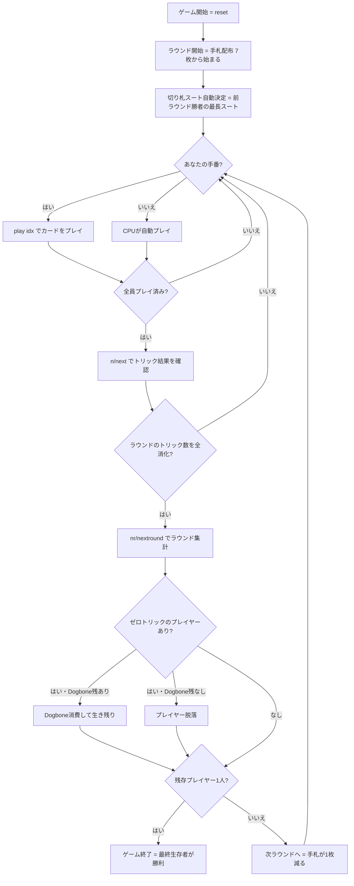

# ノックアウト・ホイスト（CUI版）遊び方

## ゲーム概要

Knockout Whist（ノックアウト・ホイスト）はイギリスで古くから親しまれているサバイバル型トリックテイキングゲームです。52枚のデッキを4人でプレイし、ラウンドごとに手札が1枚ずつ減っていきます。各ラウンドでトリックを1つも取れなかったプレイヤーは **Dogbone トークン** を消費して生き残りますが、トークンが尽きた状態でゼロトリックになると **脱落（ノックアウト）** します。最後まで残ったプレイヤーが勝利します。

## 起動方法

```sh
go run ./cmd/trumpcards knockoutwhist
go run ./cmd/trumpcards --lang en knockoutwhist  # 英語モード
```

## ルール

### デッキと配布

- **デッキ**: 52枚（標準デッキ、A高、A>K>Q>J>10>…>2）
- **プレイヤー**: 4人（プレイヤー0 = あなた、プレイヤー1〜3 = CPU）
- **手札枚数**: ラウンドごとに減少 — ラウンド1は7枚、ラウンド2は6枚、…、ラウンド7は1枚（handSize = 8 − ラウンド番号）

### 切り札

- **ラウンド1**: ディーラーの左隣のプレイヤーが最初にリードし、その際に切り札スートは**前ラウンドの勝者の最長スートが自動選択**されます
- ラウンド1では前ラウンドがないため、実装上の初期リーダーが切り札を決定します
- 切り札スートが宣言されるとそのスートが最強になります

### トリックプレイ

- リードプレイヤーが任意のカードを1枚出します
- 続くプレイヤーは **マスト・フォロー**: リードスートを持っていれば必ずそのスートを出さなければなりません
- リードスートがなければ任意のカードを出せます（切り札を含む）
- **勝者の決定**: 切り札が出た場合は最高位の切り札が勝ち、切り札がなければリードスートの最高カードが勝ち
- トリックの勝者が次のトリックをリードします

### Dogbone ルール（脱落条件）

各ラウンド終了時、トリックを **1つも取れなかった** プレイヤーは：

1. **Dogbone トークンを1つ消費** して次のラウンドへ進む（生き残り）
2. **トークンが残っていない場合は脱落（ノックアウト）** — 以降のラウンドには参加しない

各プレイヤーの初期 Dogbone 枚数は **1枚** です。

### 勝利条件

- **最後まで生き残った1人** のプレイヤーが勝利
- 最終ラウンド（1枚ずつのラウンド）まで複数人が残った場合、**そのラウンドの勝者** が勝利

## ゲームの流れ



## コマンド一覧

| コマンド | 短縮形 | 説明 |
|----------|--------|------|
| `play <idx>` | — | 手札の idx 番目のカードを出す |
| `next` | `n` | 次のトリックへ進む（トリック終了後） |
| `nextround` | `nr` | 次のラウンドへ進む（全トリック終了後） |
| `setdifficulty <0-2>` | `sd <0-2>` | CPU難易度設定（0=Easy, 1=Normal, 2=Hard） |
| `log` | `l` | アクションログを表示 |
| `reset` | `r` | 新しいゲームを開始（設定保持） |
| `quit` | `q` | ゲーム終了 |
| `help` | `?` | コマンド一覧を表示 |

## 画面の見方

```
==========
Knockout Whist (ノックアウト・ホイスト)
==========
ラウンド: 1  トリック: 1/7  切り札: ♠
アクティブプレイヤー: 4人
You: 7枚  Dogbone: 1  今ラウンドトリック: 0
[0]A♠ [1]K♥ [2]Q♦ [3]J♣ [4]10♠ [5]9♥ [6]8♦
CPU 1: 7枚  Dogbone: 1  CPU 2: 7枚  Dogbone: 1  CPU 3: 7枚  Dogbone: 1
----------
フェーズ: PLAY
あなたの手番です。カードを出してください。
play <idx>
```

- **ラウンド / トリック表示**: 現在のラウンド番号とトリック番号（例: 1/7 = ラウンド1の7トリック中）
- **切り札**: 現在の切り札スート（♠/♣/♥/♦）
- **Dogbone**: 各プレイヤーの残 Dogbone 枚数（0になったプレイヤーが次にゼロトリックになると脱落）
- **今ラウンドトリック**: 今ラウンドで取得済みのトリック数
- **`[n]`付き行**: あなたの手札（インデックス付き）
- **フェーズ表示**: PLAY（カード出し）、TRICK_END（トリック確認待ち）、ROUND_END（ラウンド集計待ち）、GAME_END（ゲーム終了）
- **脱落メッセージ**: ラウンド終了時にゼロトリック＆Dogboneなしのプレイヤーが表示されます

## 遊び方のコツ

- **切り札を温存する**: 切り札は最も強力な切り崩しカードです。序盤は切り札を使わず温存し、重要なトリックで差し込みましょう。ただし手持ちの切り札が多すぎる場合は早めに処理することも重要です。
- **ゼロトリックを絶対に避ける**: ゼロトリックは Dogbone を消費します。各自の初期 Dogbone は1枚だけなので、2度ゼロトリックになると脱落します。トリックを1つでも取ることが最優先事項です。
- **弱いカードのラウンドで生き残る**: 手札が少なくなるほど選択の余地がなくなります。強いカードを後のラウンドに残すか、今のラウンドで確実に1トリック取る計算が必要です。
- **リードを活用する**: トリックに勝てばリード権を得ます。リードすると切り札を要求でき、相手の手を崩しやすくなります。特に終盤（1〜2枚ラウンド）では先手が大きなアドバンテージになります。
- **Dogbone の消費を読む**: 対戦相手の Dogbone 残数を把握しましょう。Dogbone が0のプレイヤーを意図的にゼロトリックに追い込むと脱落させられます。切り札やAで相手のリードを奪うことが脱落狙いの鍵です。
- **最終1枚ラウンドは運も絡む**: 最終ラウンドはカード1枚のみの一本勝負です。切り札を持っているかどうかが決定的になります。それ以前のラウンドで切り札を手元に残しておくことが勝利への近道です。
- **難易度を上げて腕を磨く**: Easy（ランダム）、Normal（基本戦略）、Hard（高度なヒューリスティクス）と難易度を調整できます。`sd 2` でハードモードに挑戦してみましょう。
