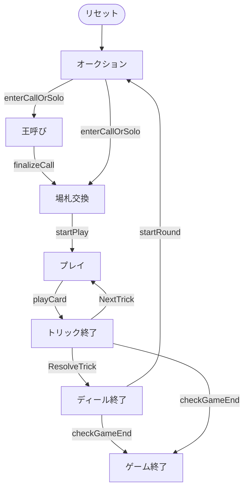

# ケーニッヒルーフェン（CUI版）遊び方

## ゲーム概要

Königrufen（ケーニッヒルーフェン）はオーストリアの4人用**タロックゲーム（トリックテイキング）**です。54枚のタロックデッキ（4スート × 8枚、切り札21枚、スキュース）を使い、あなた（プレイヤー0）はオークションに参加します。デクレアラーが**王呼び**で呼んだ王を持つプレイヤーが**秘密のパートナー**となり、2対2で対戦します。

## 起動方法

```sh
go run ./cmd/trumpcards koenigrufen
go run ./cmd/trumpcards --lang en koenigrufen  # 英語モード
```

## ルール

### デッキと配布

- **デッキ**: 54枚。
  - **スート札**: ♠♥♦♣ の4スート × 各8枚（1〜4、J/C/Q/K）。
  - **切り札**: 番号1〜21の21枚。数字が大きいほど強い。
  - **スキュース**: 特殊札1枚。
- **プレイヤー**: 4人（プレイヤー0 = あなた、CPU1〜3）。各12枚。
- **場札（タロン）**: 場に伏せた6枚。

### トゥルル（Trull）

**切り札1・切り札21・スキュース**の3枚がトゥルル（名誉札）。これらと**王（K）**は場札交換で捨てられません。

### オークション（入札）

パスするか、**ルーファー（Rufer, 王呼び）**を宣言します。最高入札者がデクレアラー。全員パスなら再配札です。

### 王呼び（King-calling）

デクレアラーは自分が持たない王のスート（1〜4）を呼びます。その王を持つプレイヤーが秘密のパートナーとなり、呼ばれた王が最初に場に出るまで正体は秘匿されます。

### 場札交換

デクレアラーは公開された場札6枚を手札に加え、6枚を伏せて捨てます。**王とトゥルル（切り札1・21・スキュース）は捨てられません。**

### プレイ

リードスートにマストフォロー。フォローできなければ切り札を出し、それも無ければ任意の札。最も高い切り札（無ければリードスートの最高札）がトリックを取ります。スキュースはトリックを取れません。

### 得点

デクレアラー側（デクレアラー＋パートナー）が必要点に達すれば成功、届かなければ失敗。得点をデクレアラー側と防御側でやり取りします。規定ディール後に累計得点が最多のプレイヤーが勝者です（同点は引き分け）。

## ゲームの流れ

ゲームの進行は `internal/domain/Koenigrufen.go` のフェーズ機械そのものです。各ノードは同ファイルの `KoenigrufenPhase` 定数、矢印ラベルはその遷移を行うメソッド名です。



## コマンド一覧

| コマンド | 短縮形 | 説明 |
|----------|--------|------|
| `bid rufer` |  | ルーファー（王呼び）を宣言 |
| `pass` |  | オークションでパス |
| `callking <1-4>` | `ck` | 呼ぶ王のスートを指名（1=♠ 2=♣ 3=♥ 4=♦） |
| `discard <i1> <i2> <i3> <i4> <i5> <i6>` |  | 場札交換で6枚を捨てる |
| `play <idx>` |  | カードをプレイ |
| `next` | `n` | 次のトリックへ |
| `nextround` | `nr` | 次のディールへ |
| `hint` | `h` | ヒントを表示 |
| `reset` | `r` | ゲームをリセット |
| `quit` | `q` | 終了 |
| `help` | `?` | コマンド一覧を表示 |

## 画面の見方

実際の出力例です。配りは毎回シャッフルされるので、カードの並びは実行ごとに変わります。

```
==========
ケーニッヒルーフェン
==========
ディール: 1  トリック: 0  コントラクト: -
あなた (対戦側): 12 枚  得点: 0  トリック: 0
[0]♠C  [1]♠Q  [2]♣3  [3]♣4  [4]♣K  [5]♥3  [6]♦C  [7]T2  [8]T5  [9]T7  [10]T11  [11]T18
CPU 1 (対戦側): 12 枚  得点: 0  トリック: 0
CPU 2 (対戦側): 12 枚  得点: 0  トリック: 0
CPU 3 (対戦側): 12 枚  得点: 0  トリック: 0
----------
オークション — 手番: あなた  (最高: ルーファー)
bid rufer ... 入札  |  pass ... パス
==========
```

- **1〜3行目**: ゲーム名の見出し
- **ディール / トリック**: 進行状況
- **プレイヤー行**: 各席の陣営、残り手札枚数、獲得状況
- **`[i]` 付きの行**: あなたの手札。`T1`〜`T22` がタロック（切り札）
- **`----------` の下**: 現在のフェーズ・手番と打てるコマンド
- **`あなたが呼ばれたパートナーです`**: 呼びスートの王を自分が持っているとき、プレイフェーズに出ます。自分の手札と公開済みの呼びスートだけから分かる情報なので、正体が公開される前でも表示します（公開後はプレイヤー行の陣営表示に切り替わります）
