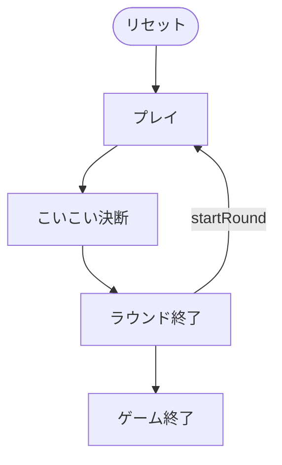

# こいこい（CUI版）遊び方

## ゲーム概要

こいこい（Koi-Koi）は、日本の**花札（48枚）**を使う 2 人用の**合わせ（キャプチャ）ゲーム**です。手札の札と山札からめくった札で、場に出ている**同じ月（花）の札**を捕獲し、集めた札で「**役（やく）**」を作ります。役が成立するたびに、続けて役を伸ばす「**こいこい**」か、その場で得点を確定する「**勝負（しょうぶ）**」かを選びます。目標点に先に到達したプレイヤーが勝ちです。

## 起動方法

```sh
go run ./cmd/trumpcards koikoi
go run ./cmd/trumpcards --lang en koikoi  # 英語モード
```

## ルール

### デッキと配布

- **デッキ**: 花札48枚（12か月 × 各4枚：光・タネ・短冊・カス）。
- **プレイヤー**: 2人（プレイヤー0 = あなた、プレイヤー1 = CPU）。
- **配布**: 各プレイヤーに **8枚**、場に **8枚**を表向きに置きます。

### 手番と捕獲

1. 手札から1枚を出し、場にある**同じ月**の札を捕獲します。同じ月の札が場に**2枚**あるときは、捕獲する場札のインデックスを指定します。
2. 続けて山札から1枚めくり、同じ月の札があれば捕獲します。
3. 一致しなければ場に残ります。

### 主な役

- 五光(10) / 四光(8) / 雨四光(7) / 三光(5)
- 猪鹿蝶(5) / 赤短(5) / 青短(5)
- 短冊(5枚で1、超過1枚ごと+1) / タネ(5枚で1、超過+1) / カス(10枚で1、超過+1)
- 花見酒(5) / 月見酒(5)

### こいこい / 勝負

- 役が成立するとこいこい決断になります。
  - **こいこい**: 続行。勝負宣言時の得点が2倍になりますが、相手に先を越されると失点します。
  - **勝負**: その時点の役の得点を確定します。
- 双方役なしで手札が尽きると引き分け（0点）です。

### 勝敗

- ラウンド得点を累計し、**目標点**（30 / 50 / 100）に先に到達したプレイヤーが勝ちです。

## ゲームの流れ

ゲームの進行は `internal/domain/KoiKoi.go` のフェーズ機械そのものです。各ノードは同ファイルの `KoiKoiPhase` 定数、矢印ラベルはその遷移を行うメソッド名です。



## コマンド一覧

| コマンド | 短縮形 | 説明 |
|----------|--------|------|
| `play <h> [f]` | `p` | 手札 h を出す。場札 f を指定（2枚一致時のみ必要） |
| `koikoi` | `kk` | こいこい（続行） |
| `shobu` | `sb` | 勝負（確定） |
| `nextround` | `n` | 次のラウンドを配る |
| `hint` | `h` | ヒントを表示 |
| `reset` | `r` | ゲームをリセット |
| `quit` | `q` | 終了 |
| `help` | `?` | コマンド一覧を表示 |

## 画面の見方

```
=== Koi-Koi ===
round: 1  deck: 24  koikoi: 0  phase: Play
field: [0]🌸 [1]🌕 ...
P0(You): 8 cards  captured=0  score=0
  [0]🌸 [1]🎋 [2]🐦 ...
```
