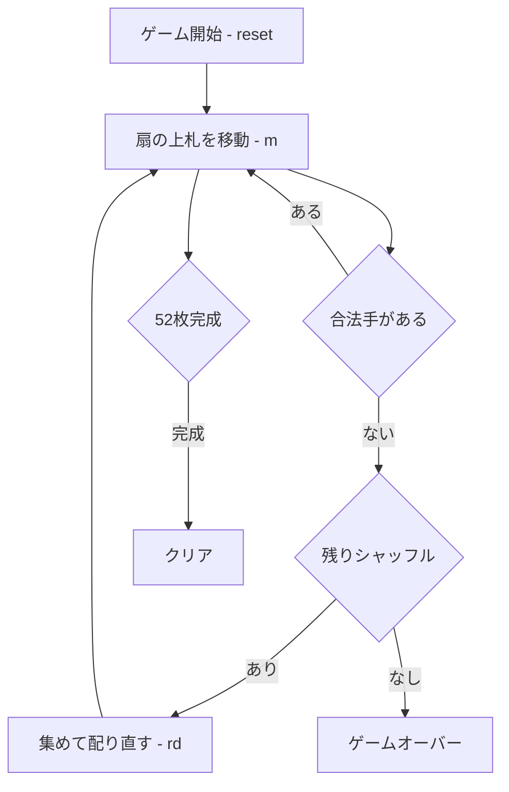

# ラ・ベル・ルーシー（CUI版）遊び方

## ゲーム概要

ラ・ベル・ルーシー（La Belle Lucie）は、フランス由来の古典的な **ファン・ソリティア** です。標準52枚デッキを **17 の 3 枚扇（fan）と 1 枚の孤立カード** に配り、各扇の **最上位カードだけ** を操作して、4 つの **ファウンデーション** に A から K まで積み上げます。詰まったら残り札を集めてシャッフルし配り直せますが、**最大 3 回** までです。

## 起動方法

```sh
go run ./cmd/trumpcards labellelucie
go run ./cmd/trumpcards --lang en labellelucie  # 英語モード
```

## ルール

1. **扇**: 各扇の最上位カードのみ操作可能。同スートで 1 つ下のランクの扇の最上位カードへ重ねられます。
2. **ファウンデーション**: A を最上位に出したらファウンデーションへ移し、以降は同スート昇順（A→K）で積み上げます。
3. **再シャッフル**: 合法手がなくなったら `rd` でファウンデーション以外のカードを集めてシャッフルし配り直します（最大 3 回）。
4. **勝敗**: 52 枚すべてファウンデーションに揃えればクリア、3 回使い切って詰んだら失敗です。

## ゲームの流れ



## コマンド一覧

| コマンド | 短縮形 | 説明 |
|----------|--------|------|
| `m <from> <to>` | | 扇 from の上札を扇 to へ |
| `m <from> f` | | 扇 from の上札をファウンデーションへ |
| `redeal` | `rd` | 集めてシャッフルし配り直す（最大3回） |
| `autocomplete` | `ac` | 出せる札を自動で出し切る |
| `undo` | `u` | 直近の手を取り消す |
| `giveup` | `g` | 投了する |
| `hint` | `h` | ヒントを表示 |
| `log` | `l` | 棋譜を表示 |
| `reset` | `r` | 新しいゲームを開始 |
| `quit` | `q` | ゲーム終了 |
| `help` | `?` | コマンド一覧を表示 |

## 画面の見方

```
==========
ラ・ベル・ルーシー (La Belle Lucie)
==========
ファウンデーション0: [空]
...
扇0: ♠K ♥4 ♣7
扇1: ♦2 ♠9 ...
残りシャッフル: 3
手数: 0 （戻せる手はありません）
==========
```

- `ファウンデーション0〜3` … 各組札の状態
- `扇0〜` … 各扇のカード（右端が最上位）
- `残りシャッフル` … 残りの再配り回数

## 遊び方のコツ

- A・2 を早めに掘り出してファウンデーションを伸ばしましょう。
- 再シャッフルは 3 回まで。配り直す前に扇間の移動で詰みを解消できないか確認しましょう。
