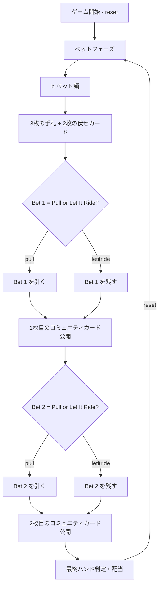

# レットイットライド（CUI版）遊び方

## ゲーム概要

3つの同額ベットを置き、3枚の手札と2枚のコミュニティカードで最終的な5枚のポーカーハンドを作るカジノポーカーです。コミュニティカードが公開される前に、ベットを引く（Pull）か残す（Let It Ride）かを選択します。10のペア以上で配当が発生します。

## 起動方法

```sh
go run ./cmd/trumpcards letitride
go run ./cmd/trumpcards --lang en letitride   # 英語モード
```

## ルール

### 基本ルール

- 52枚のトランプ（ジョーカーなし）を使用
- プレイヤーは3つの同額ベット（Bet 1, Bet 2, Bet 3）を置く
- 3枚の手札と2枚の伏せコミュニティカードが配られる
- 1枚目のコミュニティカード公開前に、Bet 1をPull（引く）またはLet It Ride（残す）を選択
- 2枚目のコミュニティカード公開前に、Bet 2をPull（引く）またはLet It Ride（残す）を選択
- Bet 3は常に残る（引けない）
- 最終的な5枚のハンド（手札3枚+コミュニティ2枚）で配当を判定

### 手札ランキング（強い順）

| ランク | 説明 |
|--------|------|
| ロイヤルフラッシュ | 同じスートのA-K-Q-J-10 |
| ストレートフラッシュ | 同じスートの連続5枚 |
| フォーカード | 同じランク4枚 |
| フルハウス | スリーカード+ペア |
| フラッシュ | 同じスートの5枚 |
| ストレート | 連続する5枚 |
| スリーカード | 同じランク3枚 |
| ツーペア | ペア2組 |
| 10のペア以上 | 10, J, Q, K, A のペア |

### 配当表

| 役 | 配当 |
|----|------|
| ロイヤルフラッシュ | 1000:1 |
| ストレートフラッシュ | 200:1 |
| フォーカード | 50:1 |
| フルハウス | 11:1 |
| フラッシュ | 8:1 |
| ストレート | 5:1 |
| スリーカード | 3:1 |
| ツーペア | 2:1 |
| 10のペア以上 | 1:1 |

配当は残っている各ベットに対して個別に支払われます。例えば3つ全てのベットが残っている場合、配当は3倍になります。

## ゲームの流れ



## コマンド一覧

| コマンド | 短縮形 | 説明 |
|----------|--------|------|
| `reset` | `r` | 新しいゲームを開始 |
| `bet <amount>` | `b <amount>` | 3つの同額ベットを置く（金額を指定） |
| `pull` | `p` | 現在のベットを引く（Pull） |
| `letitride` | `l` | 現在のベットを残す（Let It Ride） |
| `log` |  | アクションログ（棋譜）を表示 |
| `quit` | `q` | ゲーム終了 |
| `help` | `?` | コマンド一覧を表示 |

### コマンド例

- `r` → ゲームリセット
- `b 100` → 各スポットに100チップをベット（合計300チップ）
- `p` → 現在のベットを引く
- `l` → 現在のベットを残す
- `lg` → 棋譜を表示

## 画面の見方

```
===============================
Let It Ride
===============================
Chips: 1000
Phase: DECISION1
Bet: 100 x 3

Player: [♠A] [♥K] [♦Q]

Community: [??] [??]

Bet 1: Active   Bet 2: Active   Bet 3: Active
```

- **Chips**: 現在の所持チップ数
- **Phase**: 現在のフェーズ（BET / DECISION1 / DECISION2 / RESULT）
- **Bet**: 1スポットあたりのベット額
- **Player**: プレイヤーの手札（3枚）
- **Community**: コミュニティカード（フェーズに応じて公開）
- **Bet 1/2/3**: 各ベットの状態（Active = 残っている, Pulled = 引いた）

## 遊び方のコツ

- 手札に10以上のペアがあれば、基本的にLet It Rideが有利
- スリーカード以上の手札は迷わずLet It Ride
- ストレートやフラッシュの4枚揃いは、1枚目の判断でLet It Rideを検討
- 弱い手札は早めにPullしてリスクを抑える
