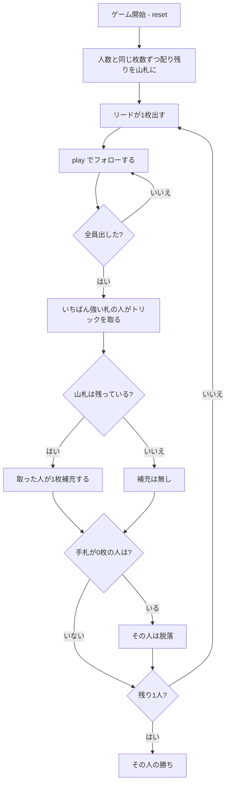

# リンガーロンガー（CUI版）遊び方

## ゲーム概要

アメリカ発祥の**脱落制トリックゲーム**。**トリックを取っても得点にはなりません。** 取れるのは「**山札から1枚補充する権利**」だけです。裏を返せば、勝ち続けているかぎり手札は減りません。手札が尽きた人から脱落し、**最後まで手札を持ち続けた1人**が勝ちです。4〜6人で遊べます。

## 起動方法

```sh
go run ./cmd/trumpcards lingerlonger
go run ./cmd/trumpcards --lang en lingerlonger  # 英語モード
```

## ルール

### 配りと山札

標準52枚を使い、**配る枚数は人数と同じ**です。残りがそのまま山札になります。

| 人数 | 1人の手札 | 配る合計 | 山札 |
|------|-----------|----------|------|
| 4人 | 4枚 | 16枚 | 36枚 |
| 5人 | 5枚 | 25枚 | 27枚 |
| 6人 | 6枚 | 36枚 | 16枚 |

**人数が増えるほど手札は厚く、山札は薄くなります。** 6人戦は補充の回数が限られるぶん、序盤から決着に向かいます。

### プレイ

リードの人が1枚出し、以降は**フォロースート**で続けます。切り札はありません。全員が出したら、リードのスートでいちばん強い札を出した人がトリックを取ります。

### トリックを取ると

**山札から1枚だけ補充できます。** 補充できるのは**取った人だけ**です。

1枚出して1枚引くので、**取り続けているかぎり手札の枚数は変わりません**。取れなかった人は出した1枚がそのまま減ります。次のリードは、取った人が行います。

**山札が尽きたら補充はありません。** そこから先は全員の手札が減る一方なので、脱落が一気に進みます。

### 脱落と勝敗

**手札が0枚になった人はそこで脱落**します。ただし脱落が決まるのは**そのトリックが解決し、補充まで済んだあと**です。最後の1枚で勝てば補充が入るので、出した時点では脱落しません。

**最後まで手札を持ち続けた1人の勝ち**です。全員が同時に尽きた場合は、最後のトリックを取った人の勝ちとします。

### 終わらない心配はありません

完成したトリックは場から抜け、戻ってくるのは補充の1枚だけです。**1トリックごとに必ず場の札が減る**ので、局は必ず終わります。

## ゲームの流れ



## コマンド一覧

| コマンド | 短縮形 | 説明 |
|----------|--------|------|
| `play <idx>` | `p` | 手札の `<idx>` 番目を出す（フォロー義務あり） |
| `hint` | `h` | 出すべき札を提示する |
| `giveup` | `g` | 投了する |
| `log` | `l` | 棋譜（アクションログ）を表示する |
| `reset` | `r` | 最初からやり直す |
| `quit` | `q` | 終了する |
| `help` | `?` | コマンド一覧を表示 |

**補充するコマンドはありません。** トリックを取れば自動的に1枚引きます。`draw` のような指示は受け付けません。

## 画面の見方

```
==========
Linger Longer (リンガーロンガー)
==========
トリック: 3  山札: 残り32枚
トリックを取っても得点にはなりません。取れるのは「山札から1枚補充する権利」だけで、勝ち続けるかぎり手札が減りません。手札が尽きた人から脱落し、最後まで持ち続けた1人が勝ちです。配る枚数は人数と同じで（4人なら4枚ずつ）、残りが山札になります。
>あなた[直前に補充]: 手札4枚 獲得2回
  [0]♠9 [1]♠K [2]♥10 [3]♣7
 CPU1: 手札2枚 獲得0回
 CPU2[2番目に脱落]: 手札0枚 獲得1回
 CPU3: 手札3枚 獲得1回
----------
手番: あなた
play <idx>・・・カードを出す
```

- **山札の残り**: 補充があと何回できるか。**0になった瞬間から局は終わりに向かいます**
- **手札の枚数**: これがそのまま生死。**多いほど良い**ので、得点表示はありません
- **獲得回数**: トリックを取った回数。得点ではなく、**補充できた回数**です
- **`[直前に補充]`**: 直前にトリックを取って引いた席。盤面には痕跡が残らないので明示します
- **`[N番目に脱落]`**: 手札が尽きて抜けた席

## 遊び方のコツ

- **強い札は素直に強い。** 取っても損をしないゲームなので、A や K は迷わず使えます
- **山札の残りを数える。** 補充が続くうちは取りにいく価値が高く、尽きたあとは「持たされない」ほうが大事になります
- **リードを取れるうちは取り続ける。** 1枚出して1枚引くので、手札が減らないまま相手だけが痩せていきます
- **6人戦は短期決戦。** 山札16枚では補充が全員に行き渡らないので、序盤の1トリックが重く効きます
- **脱落しても盤面は続きます。** あなたが抜けても残りのCPUが決着するまで進むので、結果は最後まで表示されます
