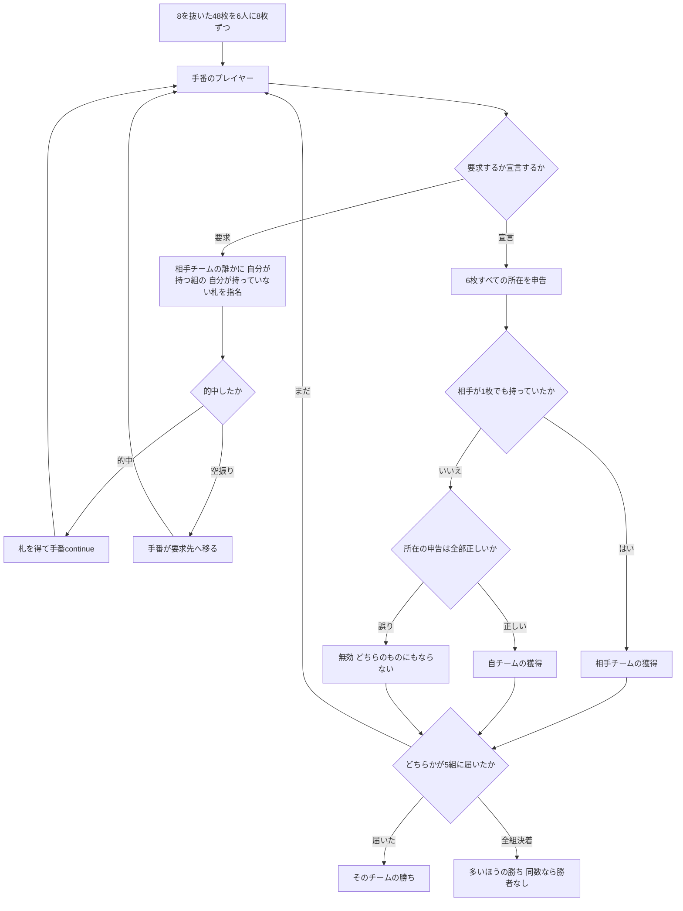

# リテラチャー（CUI版）遊び方

## ゲーム概要

インド亜大陸とカナダの学生コミュニティで根強く遊ばれる**推理型フィッシング**。**8 を抜いた 48 枚**を **6 人 3 対 3** で 8 枚ずつ持ち、**8 組のハーフスート**を奪い合います。**味方の手札も見えません。**どこに何があるかを推理することがゲームそのものです。

出典: [pagat.com: Literature](https://www.pagat.com/quartet/literature.html)

## 起動方法

```sh
go run ./cmd/trumpcards literature
go run ./cmd/trumpcards --lang en literature   # 英語表示
```

## ルール

### デッキとハーフスート

52 枚から **8 を 4 枚抜いた 48 枚**です。各スートが 2 組に分かれます。

| 組 | 構成 |
|---|---|
| 低位 | 2 3 4 5 6 7 |
| 高位 | 9 10 J Q K A |

**8 が抜けているので、低位と高位の境目に札がありません。**4 スート × 2 = **8 組**、各 6 枚で 48 枚ちょうどです。

### 席とチーム

**6 人 3 対 3。席は交互**で、各自の両隣は必ず相手チームです。味方に要求できない規則があるので、席順は飾りではありません。

### 要求（ask）

手番のプレイヤーは札を 1 枚指名して要求します。**条件は 4 つ。**

1. 要求先は**必ず相手チームの誰か**。**味方には要求できません**
2. **自分がそのハーフスートの別の札を 1 枚以上持っている**こと
3. **自分が持っていない札**であること
4. 要求先に**手札が残っている**こと

**的中すれば札を得て手番が続きます。外れれば手番は要求先に移ります。**

**誰が誰に何を訊いて、通ったかどうかは全員が見ています。**これが推理の材料です。

### 宣言（claim）— 結末は 3 通り

自チームで 1 組そろったと思ったら、**6 枚すべての所在を申告**して宣言します。

| 状況 | 結果 |
|---|---|
| 自チームが 6 枚とも持ち、所在も全部正しい | **自チームの獲得** |
| 自チームが 6 枚とも持つが、**所在の申告を間違えた** | **無効。どちらのチームも取りません** |
| **相手チームが 1 枚でも持っていた** | **相手チームの獲得** |

**「揃っているのは分かるが、誰が持っているか自信がない」ときに宣言を我慢する動機**がここにあります。自チーム内で言い間違えただけなら相手には渡りませんが、その組は失われます。

### 勝利条件

**8 組の過半数、つまり 5 組**を取ったチームの勝ちです。

**4 組では決着しません。**相手も 4 組取り得るからです。また無効になった組はどちらのものにもならないので、**両チームの獲得数の合計が 8 になるとは限りません。**全組が決着して 5 組に届く側がいなければ、多いほうの勝ちです。同数なら勝者なしです。

### 手札が尽きたとき

自分の手番中に手札が無くなったら、**まだ手札のある味方に手番を渡します。**手札の尽きたプレイヤーには要求できません。

## ゲームの流れ

ゲームの進行は `internal/domain/Literature.go` のフェーズ機械そのものです。各ノードは同ファイルの `LiteraturePhase` 定数、矢印ラベルはその遷移を行うメソッド名です。



## コマンド一覧

| コマンド | 短縮形 | 説明 |
|----------|--------|------|
| `ask <席> <1-4> <1-13>` | `a` | 札を要求する（**1=♠ 2=♣ 3=♥ 4=♦**） |
| `claim <組> <席×6>` | `c` | ハーフスートを宣言する（**6 枚ぶんの所在**を並べる。**この時点では確定しません**） |
| `yes` | `y` | 読み上げられた宣言を確定する |
| `log` | `l` | 棋譜を表示する |
| `reset` | `r` | ゲームごとリセットする |
| `quit` | `q` | 終了する |
| `help` | `?` | コマンド一覧を表示 |

## 画面の見方

```
チーム0: 2組 / チーム1: 1組 / 無効: 1組 / 未決: 4組（勝利には5組）
【8組の過半数=5組】で勝ちです。4組では相手も4組になり得るので決着しません。
  [0] ♠低位(2-7): チーム0
  [1] ♠高位(9-A): 【無効】
  ...
席0 あなた(T0) <- 手番: 8枚  ♠2 ♥9 ...
席1 CPU 1(T1): 7枚  非公開 7枚
直近の要求（全員に公開されています）:
  席0 → 席1: ♠3 … 的中
  席1 → 席0: ♥9 … 空振り
----------
要求の条件: 【相手チームにのみ】／自分がその組を1枚以上持つ／【自分が持っていない札】／相手に手札が残っている
```

- **帰属の一覧**で「無効」が区別されます。**どちらのものにもなっていない**という意味です
- **直近の要求**は全員に公開されている情報です。ここから相手の手札を絞り込みます
- **自分以外の手札は枚数しか見えません。**味方も含めてです

## 遊び方のコツ

- **空振りにも情報があります。**「席 1 は ♥ 高位を持っていない」と分かります
- **相手が訊いた札は、その相手が持っていないことが確定します。**訊けるのは自分が持っていない札だけだからです
- **味方が要求して通った札は、その味方が持っています。**宣言の所在はここから組み立てます
- **宣言は 2 段階です。**`c` を打つと「組N → 2→席0, 3→席2, ...」と読み上げられるだけで、**`y` を打つか同じ内容をもう一度打つまで確定しません**。他のコマンドを打つと待ちは消えます
- **宣言を急がないでください。**所在を 1 つ言い間違えるだけで、揃っていても組が消えます
- **4 組では勝てません。**5 組目までの道筋を考えて宣言する組を選んでください
