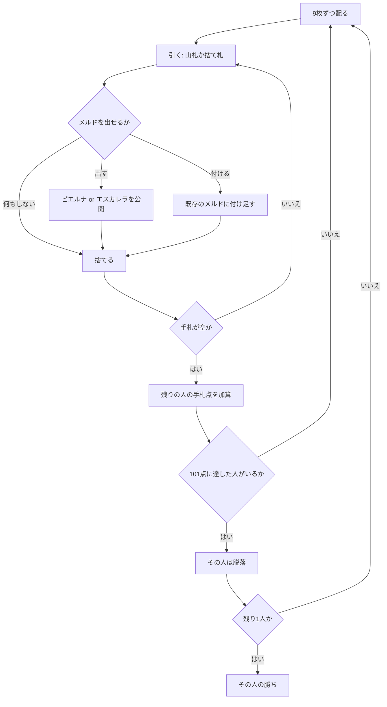

# ロバ（CUI版）遊び方

## ゲーム概要

アルゼンチンのラミー。**2 組 + ジョーカー 4 枚の 108 枚**を使い、手札を出し切って相手に失点を残します。**101 点に達した人から脱落**し、最後まで残った人が勝ちです。

実装は [pagat.com の Loba](https://www.pagat.com/rummy/loba.html) の **de Menos**（マイナス式）に従います。

## 起動方法

```sh
go run ./cmd/trumpcards loba
go run ./cmd/trumpcards --lang en loba   # 英語表示
```

## ルール

- **デッキ**: **108 枚**（52 枚 × 2 組 + ジョーカー 4 枚）。同じ札が 2 枚ずつあります
- **人数**: 4 人（原典は 2〜5 人）
- **配札**: 各自 **9 枚**。1 枚を表にして捨て札の起点にし、残りが山札

### 手番

1. **引く** — 山札から 1 枚、または捨て札の一番上を取る
2. **出す・付ける**（任意）— メルドを出す、既存のメルドに付ける
3. **捨てる** — 1 枚捨てて手番終了

### メルドは 2 種類

| 種類 | 条件 |
|---|---|
| **ピエルナ** | 同じランク 3 枚以上。ただし**異なる 3 スート**でなければなりません。2 組デッキなので同じスートが 2 枚揃いますが、それではメルドになりません |
| **エスカレラ** | 同じスートの 3 枚以上の並び。**ジョーカーは 1 枚まで**。A は上（Q-K-A）か下（A-2-3）の一方だけで、K-A-2 のように跨げません |

### ジョーカー

- **ワイルドではありません。**エスカレラにしか置けず、ピエルナには入れられません
- 1 つのエスカレラに **1 枚まで**
- **通常は捨てられません**（手札がジョーカー 1 枚だけのときだけ例外）
- 手札に残すと **10 点**の失点です

### 付け札（レイオフ）

- **自分が一度メルドを出したあと**に限り、付けられます
- **他家のメルドにも付けられます**（de Menos の規則）
- ピエルナに付けられるのは**元の 3 スート**の札だけです。4 つ目のスートは「異なる 3 スート」の枠を壊します

### 精算

- 手札を出し切った人がそのラウンドの勝者。残りの人は**手札の点**を失点として加算します
- **数札は額面、ジョーカー・K・Q・J・A は 10 点**
- **一度も場に出さずに一気に上がると −10**（失点が減ります）
- **101 点以上**になった人はその場で**脱落**します
- 最後に残った 1 人が勝ちです

## ゲームの流れ



## コマンド一覧

| コマンド | 説明 |
|---------|------|
| `ds` | 山札から 1 枚引く |
| `dd` | 捨て札の一番上を取る |
| `m <i,j,k>` | 手札の `i,j,k` をメルドとして出す（カンマ区切り） |
| `o <i> <m>` | 手札 `i` をメルド `m` に付ける |
| `d <i>` | 手札 `i` を捨てる |
| `n` | 次のラウンドへ進む |
| `h` | ヒントを表示する |
| `l` / `log` | 棋譜を表示する |
| `r` | ゲームごとリセットする |
| `q` | 終了する |

## 画面の見方

```
ラウンド1 · 山札70枚 · 101点で脱落
ピエルナ=同ランク・異なる3スート／エスカレラ=同スートの並び（ジョーカーは1枚まで、ピエルナ不可）
捨て札: HEART 9
[0] ピエルナ（席1）: SPADE 7 HEART 7 CLOVER 7
あなた: 失点0 手札9枚
  [0]SPADE 1 [1]HEART 11 [2]CLOVER 5 ...
CPU 1: 失点0 手札6枚
CPU 2: 失点12 手札9枚
```

- **メルドの規則は毎回表示されます。**「異なる 3 スート」と「ジョーカーはエスカレラだけ」が最も間違えやすい 2 点です
- **失点は全員ぶん公開**されます。101 で脱落するので、誰があと何点なのかが最大の判断材料です
- 場のメルドには番号が振られ、`o <i> <m>` の `m` に使います
- CPU の**手札**は枚数のみ表示されます

## 遊び方のコツ

- **ピエルナは 3 スートが要ります。**同じスートの 2 枚目は「4 枚目の札」としては使えても、組を作る 3 枚には数えられません
- **ジョーカーは重い荷物です。**エスカレラにしか置けず捨てられないので、抱えたまま相手に上がられると 10 点そのまま食らいます
- **一気に上がると −10。**メルドを小出しにせず、揃うまで待てるなら待つ価値があります
- 逆に、相手が **101 に近い**ときは早く上がって押し込むほうが効きます
- 捨てるときは、**どこにも繋がらない札**から。同ランク別スートや同スートの近いランクは残しておくと次のメルドに育ちます
