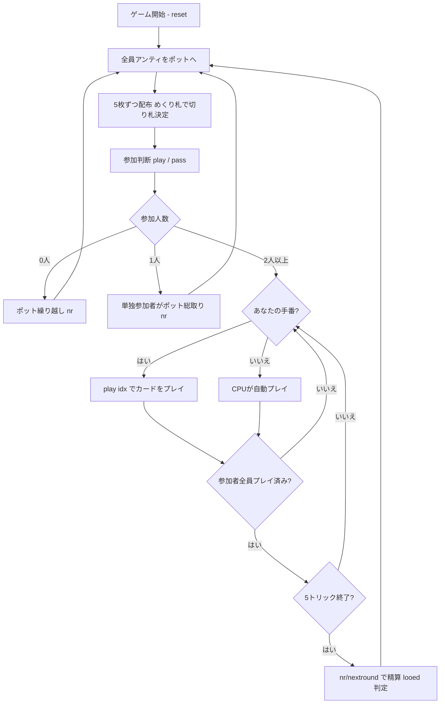

# ルー（CUI版）遊び方

## ゲーム概要

Loo（ルー / Lanterloo）は、18〜19世紀のイングランドで流行した**ポット系ギャンブル・トリックテイキングゲーム**です。本実装は 5 枚手札の Five-card Loo を 4 人（あなた＋CPU3人）でプレイします。各ディールで全員が一定額（アンティ、既定 **3**）を**繰り越し式のポット**へ支払い、山札のめくり札（turn-up）のスートが**切り札**になります。各プレイヤーは手札を見て**参加（play）か降り（pass）**かを決めます。参加者は **5 トリック**を**マストフォロー・マストヘッド**で戦い、1 トリックにつきポットの **1/5** を獲得します。参加したのに 1 トリックも取れなかったプレイヤーは **"looed"** となり、ペナルティを次ディールのポットへ支払います。目標点レースはなく、チップを積み上げていくディール反復方式です。

## 起動方法

```sh
go run ./cmd/trumpcards loo
go run ./cmd/trumpcards --lang en loo  # 英語モード
```

## ルール

### デッキと配布

- **デッキ**: 標準52枚（A〜2 × 4スート）。
- **プレイヤー**: 4人（プレイヤー0 = あなた、プレイヤー1〜3 = CPU）。各自がチップを持ちます。
- **配布**: 各プレイヤー5枚。配り終えた後、山札の1枚をめくって切り札を決めます。

### アンティとポット

- 各ディール開始時、全員が **アンティ（既定 3）** をポットへ支払います。
- ポットは**繰り越し式**です。looed のペナルティや誰も参加しなかったディールのポットは次のディールに持ち越されます。

### 参加判断（play / pass）

- ディーラーの左隣（forehand）から順に、各プレイヤーは**参加（play）**か**降り（pass）**かを決めます。
- 参加者だけが 5 トリックを戦います。降りたプレイヤーはそのディールを見送ります。
- 参加者が **1人だけ**なら、その人はプレイせずにポットを総取りします。**誰も参加しなければ**ポットは次ディールへ繰り越されます。

### フォロー義務・マストヘッド

- リードスートを持っていれば**必ず従い（must-follow）**、さらに現在勝っている札を**上回れるなら上回る義務**があります（マストヘッド）。
- リードスートを持たない場合、**切り札を持っていれば切り札を出さなければなりません**（これもヘッドできるならヘッド）。
- 切り札も持たない場合のみ、任意の札を捨てられます。
- 切り札が出たトリックは最も強い切り札が取り、切り札が出なければリードスートの最高札が取ります（強さは A > K > … > 2）。

### 精算と looed

- 参加者は獲得トリック数に応じてポットを分配されます（1 トリック = ディール開始時ポット ÷ 5）。
- 参加したのに **0 トリック**のプレイヤーは **looed** となり、ディール開始時のポット相当額をペナルティとして**次ディールのポット**へ支払います。
- 勝敗の目標点はありません。`nr` で精算し、次のディールへ進めてチップを積み上げます。

## ゲームの流れ



## コマンド一覧

| コマンド | 短縮形 | 説明 |
|----------|--------|------|
| `decide <0-1>` | `d` | 参加判断。0=降り（pass）、1=参加（play） |
| `play` | — | 参加する（`d 1` と同じ） |
| `pass` | — | 降りる（`d 0` と同じ） |
| `play <idx>` | `p` | 手札のidx番目のカードを出す |
| `nextround` | `nr` / `n` | 精算して次のディールへ進む |
| `setdifficulty <0-2>` | `sd` | CPU難易度設定（0=Easy, 1=Normal, 2=Hard） |
| `hint` | `h` | 推奨アクションを表示 |
| `log` | `l` | アクションログを表示 |
| `reset` | `r` | 新しいゲームを開始（設定保持） |
| `quit` | `q` | ゲーム終了 |
| `help` | `?` | コマンド一覧を表示 |

## 画面の見方

```
==========
Loo (ルー)
==========
Deal 1  Trick 1/5  Pot 12  Trump = ♥

Players:
  P0 (You)   Status Play   Tricks 0   Chips -3
  P1 (CPU)   Status Pass   Tricks 0   Chips -3
  P2 (CPU)   Status Play   Tricks 0   Chips -3
  P3 (CPU)   Status Pass   Tricks 0   Chips -3
----------
Current trick: P0 -> ♥A   P2 -> ♥K

Your hand: [0]♥A [1]♥3 [2]♠K [3]♣7 [4]♦2
```

- **ディール行**: ディール番号、トリック番号、現在のポット、切り札スート。
- **プレイヤー情報**: 各プレイヤーの参加状態（Play / Pass）、獲得トリック数、累積チップ。**チップが負（赤字）のときは赤で表示されます**（looed の罰金には下限が無いため、残高はマイナスまで落ちます）。
- **現在のトリック**: 場に出ている札とリードプレイヤー。
- **手札**: プレイ可能な札（フォロー・ヘッド義務でフィルタ済み）。
- **精算結果**: 各参加者の獲得トリック・分配額と、looed になったプレイヤー。

## 遊び方のコツ

- **切り札の枚数と高札を見て参加を決める**: 切り札（めくり札のスート）を複数枚、または A や高い切り札を持つときだけ参加しましょう。中途半端な手で参加して 0 トリックだと looed でポット相当を失います。
- **マストヘッドを意識する**: フォローや切り札を出すとき、勝てる札があるなら勝ちに行かなければなりません。手なりで低い札を残せない場面があることを覚えておきましょう。
- **ポットが膨らんだディールは狙い目**: looed の繰り越しでポットが大きいディールは、参加して 1 トリックでも取れれば見返りが大きくなります。
- **降りる勇気**: 弱い手なら潔く pass。参加しなければ looed にはなりません（アンティは支払い済み）。
- **難易度調整**: `sd` コマンドで CPU の強さを変えられます。慣れないうちは 0（Easy）から始めましょう。
