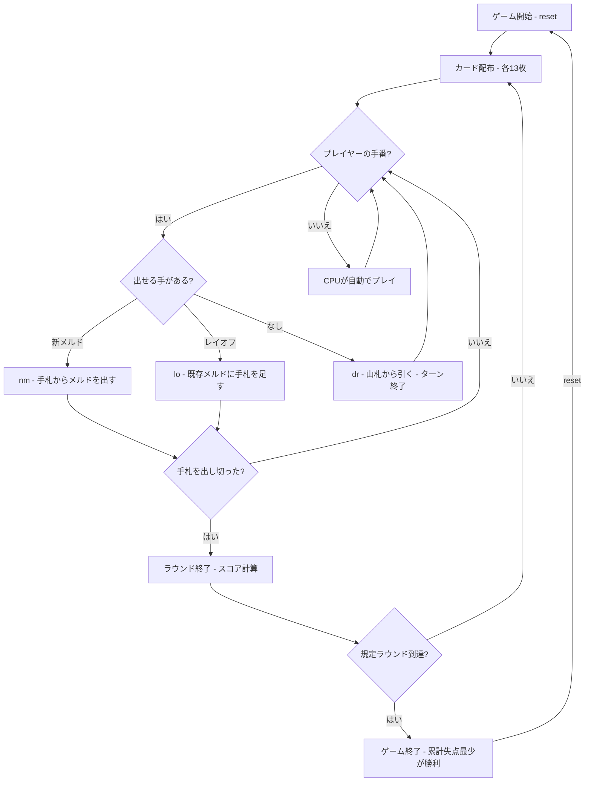

# マキャヴェッリ（CUI版）遊び方

## ゲーム概要

2〜5人（プレイヤー1人 + CPU 1〜4人）で遊ぶイタリア発祥のラミーです。ジョーカーを除く2デッキ（計104枚）を使い、各プレイヤーに13枚ずつ配ります。特徴は、全員で共有する**1つの「場」**にすべてのメルド（セット／シーケンス）を並べ、既存のメルドを自由に組み替えながらプレイできる点です（ボードゲーム「ルミカブ」のトランプ版）。手札を先にすべて出し切ったプレイヤーがそのラウンドの勝者となり、残ったプレイヤーは手札のピップ点（デッドウッド）を失点として加算します。規定ラウンド消化時点で累計失点が最も少ないプレイヤーが勝利します。

## 起動方法

```sh
go run ./cmd/trumpcards machiavelli
go run ./cmd/trumpcards --lang en machiavelli  # 英語モード
```

## ルール

### 基本ルール

- ジョーカーを除く2デッキ（104枚）を使用、2〜5人プレイ
- 各プレイヤーに13枚ずつ配り、残りは山札（ストック）
- 手番では次のいずれかを行う
  - 手札から新しいメルド（3枚以上の有効な組み合わせ）を場に出す
  - 既存の場のメルドに手札を1枚レイオフ（追加）する
  - 出せる手がなければ山札から1枚引く（ターン終了）

### メルド（セットとシーケンス）

- **セット**: 同ランク3〜4枚（異なるスート）
- **シーケンス（連番）**: 同スート3枚以上の連続したカード

### 場の組み替え

- 場はすべてのプレイヤーで共有される
- 自分の手番であれば、既存のメルドを分解・結合し、手札のカードを加えて再構成できる
- ただし、手番終了時に場のすべてのメルドが有効（3枚以上のセット／シーケンス）でなければならない

### デッドウッドと得点

- ラウンド勝者（手札を出し切ったプレイヤー）の失点は0
- 他のプレイヤーは手札に残ったカードのピップ点（A=1点、10/J/Q/K=10点、その他は額面）を失点として加算
- 山札が尽きた場合は引き分けラウンド（各自の手札点を加算）

### ゲーム終了

- 規定ラウンド数（デフォルト3）を消化した時点で、累計失点が最も少ないプレイヤーが勝利

### CPU難易度

- **Easy** (0): ランダムに近いプレイ
- **Normal** (1): 基本的なメルド戦略（デフォルト）
- **Hard** (2): 戦略的なプレイ

## ゲームの流れ



## コマンド一覧

| コマンド | 短縮形 | 説明 |
|----------|--------|------|
| `reset` | `r` | ゲームリセット（設定保持） |
| `draw` | `dr` | 山札から1枚引く（ターン終了） |
| `newmeld <i j k...>` | `nm <i j k...>` | 手札から新しいメルドを作る |
| `layoff <meldIdx handIdx>` | `lo <meldIdx handIdx>` | 既存メルドに手札を1枚足す |
| `rearrange <グループ> / <手札番号>` | `ra <グループ> / <手札番号>` | 場を組み替えながら手札を出す（グループは**組み替え後の場の全体**） |
| `nextround` | `nr` | ラウンドをスコアリングして次のラウンドへ |
| `setplayers <2-5>` | `pc <2-5>` | プレイヤー数設定 |
| `setdifficulty <0-2>` | `sd <0-2>` | CPU難易度設定（0=Easy, 1=Normal, 2=Hard） |
| `setrounds <n>` | `sr <n>` | ラウンド数設定 |
| `log` | `l` | 棋譜表示 |
| `quit` | `q` | ゲーム終了 |
| `help` | `?` | ヘルプ表示 |

### コマンド例

- `dr` → 山札から1枚引く
- `nm 0 1 2` → 手札のインデックス0・1・2でメルドを作る
- `lo 1 4` → 場のメルド1に手札インデックス4のカードを足す
- `ra s5,h5,d5;c7,c8,c9 / 2,4` → 場を「♠5 ♥5 ♦5」と「♣7 ♣8 ♣9」の2メルドに組み替え、手札の 2 と 4 を出す
  - カードは **スート(`s`/`c`/`h`/`d`) + ランク(`1`〜`13` または `A`/`J`/`Q`/`K`)**。グループの区切りは `;`、カードの区切りは `,`
  - **場に残る札はすべて書きます**（保存則: 組み替え後の場 = 元の場 + 出した手札）。手札から最低1枚出す必要があります

## 画面の見方

```
==========
Machiavelli
==========
ラウンド: 2/3  山札: 40枚
場のメルド:
  [0] SPADE 3  SPADE 4  SPADE 5
  [1] HEART 9  SPADE 9  CLOVER 9
----------
[You]: 累積0点 ラウンド0点 13枚
[0]SPADE 3  [1]SPADE 4  [2]SPADE 5  ...
CPU 1: 累積10点 ラウンド0点 13枚
----------
手番: あなた
```

- `ラウンド: N/M`: 現在のラウンド / 規定ラウンド数
- `場のメルド`: 全員共有の場に並んだメルド（インデックス付き）
- `[0]SPADE 3`...: インデックス付きの手札カード

## 遊び方のコツ

- まず手札で作れるメルドを場に出し、手札を減らしましょう
- 既存の場のメルドにレイオフできないか常に確認しましょう（レイオフで手札を1枚減らせます）
- 場を組み替えれば、一見出せないカードも組み込めることがあります
- 出せる手がなければ無理をせず山札から引きましょう
- 高いカード（10/J/Q/K=10点）は失点が大きいので早めに処理しましょう
