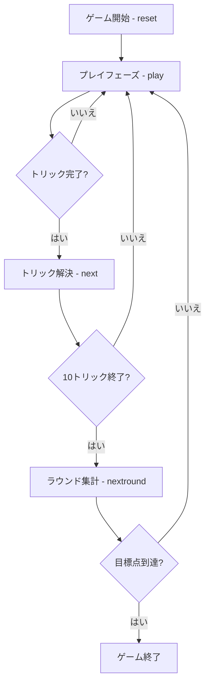

# マドラッソ（CUI版）遊び方

## ゲーム概要

Madrasso（マドラッソ）はイタリア・ヴェネト州でもっとも人気のあるトリックテイキングゲームです。伊式40枚デッキ（8・9・10を除く）を4人（2対2のチーム戦）に10枚ずつ配り切ります。**切り札は配りで決まります** —— 最後に配られた1枚のスートがその手の切り札になり、切り札はどの平札にも勝ちます。カードの強さは **A > 3 > K > Q > J > 7 > 6 > 5 > 4 > 2** で、**点の高い札ほど強い**という並びです（同じ伊式のトレセッテは 3 と 2 が A より強く、逆になります）。カード点は**整数**で数え、過半（61点以上）を取った側がそのディールを取ります。先に目標ディール数（既定4）に到達したチームの勝利です。

## 起動方法

```sh
go run ./cmd/trumpcards madrasso
go run ./cmd/trumpcards --lang en madrasso  # 英語モード
```

## ルール

### チーム

- プレイヤー0（あなた）とプレイヤー2がチームA、プレイヤー1とプレイヤー3がチームB。
- 向かい合うプレイヤー同士が味方です。

### カードの強さ（トリックの勝敗）

**切り札は配りで決まります。** 最後に配られた1枚のスートが切り札です（誰も選びません）。リードスートに従う義務（マストフォロー）があり、追従できないときだけ切り札を切れます。

- 切り札はどの平札にも勝ちます。
- 切り札が出ていなければ、リードスートの最強札が勝ちます。

強い順: **A > 3 > K > Q > J > 7 > 6 > 5 > 4 > 2**

**点の高い札がそのまま強い**並びです。トレセッテは 3 と 2 が A より強いので、同じ伊式でも感覚が逆になります。

### 得点（整数点）

| カード | 得点 |
|--------|------|
| A | 11点 |
| 3 | 10点 |
| K | 4点 |
| Q | 3点 |
| J | 2点 |
| 7・6・5・4・2 | 0点 |
| 最終トリックの勝者 | +1点（ウルティマ・ボーナス） |

1ディールで奪い合うカード点の合計は **120点**（1スートあたり30点 × 4）に、ウルティマの1点を加えた **121点**。**過半（61点以上）を取った側がそのディールを取り、1ディール分を獲得します。** ちょうど半分ずつ（60対60）なら誰も取りません。

### ゲーム終了

いずれかのチームの獲得ディール数が目標（既定4）以上に達し、かつ相手チームを上回ったらゲーム終了。上回ったチームが勝者です。

## ゲームの流れ



## コマンド一覧

| コマンド | 短縮形 | 説明 |
|----------|--------|------|
| `reset` | `r` | 新しいゲームを開始（設定保持） |
| `play <i>` | `p` | 手札のi番目のカードを出す |
| `next` | `n` | 次のトリックへ |
| `nextround` | `nr` | ラウンドを集計して次のラウンドへ |
| `setdifficulty <0-2>` | `sd` | CPU難易度設定（0=Easy, 1=Normal, 2=Hard） |
| `settarget <n>` | `st` | 目標点設定（既定21） |
| `hint` | `h` | ヒントを表示 |
| `log` | `l` | 棋譜を表示 |
| `quit` | `q` | ゲーム終了 |
| `help` | `?` | コマンド一覧を表示 |

## 画面の見方

```
==========
Madrasso (マドラッソ)
==========
ラウンド: 1  トリック: 1
チームA: 0点 (今R 0/3)   チームB: 0点 (今R 0/3)
You [チームA]: 10枚 0トリック
[0]♠3* [1]♠A* [2]♦K [3]♥7 ...
CPU 1 [チームB]: 10枚 0トリック
...
----------
手番: You
play <idx>・・・カードを出す（リードスートに従う義務あり）
```

- 1行目: ラウンド・トリック番号
- 2行目: 各チームの獲得ディール数と、現ディールで取ったカード点
- 各プレイヤー行: 所属チーム・手札枚数・獲得トリック数
- `[n]` 付きの行: あなたの手札（インデックス付き）
- **末尾に `*` が付くカード**: いま出せるカード（マストフォローを満たすもの）。あなたの手番でのみ表示されます。CallBreak / 29 / シュナプセンと同じ表記です

## 遊び方のコツ

- 3・2・A は強いカードですが、A・2・3 は得点札でもあります。取られないよう注意しつつ、勝てるトリックで活用しましょう。
- 味方（向かいのプレイヤー）がそのトリックで勝っているときは、A や絵札などの得点札を出して味方に点を渡すのが定石です。
- 相手が勝っていて得点札が場に出ているなら、勝てる札で取りに行きましょう。取れないなら低い札でダックして温存します。
- 最終トリックには +1点 のボーナス（ウルティマ）があります。60対60で並ぶ局面では、この1点がディールの取り合いを決めます。
