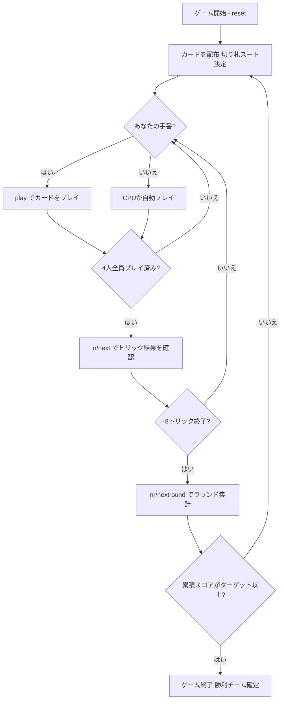

# マニーユ（CUI版）遊び方

## ゲーム概要

Manille（マニーユ）はベルギー・フランスを中心にヨーロッパで広く親しまれているトリックテイキングゲームです。32枚のデッキを4人（2チーム制、席0&2 対 席1&3）でプレイします。切り札スートは配布時に決まり、マスト・フォロー＋切り札温存免除ルールの下で8トリックを争います。最大の特徴は**逆順ランク**で、10（マニーユ）が最強のカードです。カード点数を複数ラウンドにわたって累積し、先にターゲット（デフォルト101点）に達したチームが勝ちます。

## 起動方法

```sh
go run ./cmd/trumpcards manille
go run ./cmd/trumpcards --lang en manille  # 英語モード
```

## ルール

### デッキと配布

- **デッキ**: 32枚（7,8,9,10,J,Q,K,A × 4スート）
- **プレイヤー**: 4人（プレイヤー0 = あなた、プレイヤー1〜3 = CPU）
- **チーム**: 席0&2（あなたのチーム）対 席1&3
- **配布**: 各プレイヤー8枚
- **切り札**: 最後に配られたカードのスートが切り札スートとなる

### カードの強さ（マニーユ逆順ランキング）

**全スート共通**（強い順）:

| 強さ順 | カード | 備考 |
|--------|--------|------|
| 1 | **10（マニーユ）** | このゲーム最強のカード |
| 2 | A（マニヨン） | エース |
| 3 | K（キング） | |
| 4 | Q（クイーン） | |
| 5 | J（ジャック） | |
| 6 | 9 | |
| 7 | 8 | |
| 8 | 7（最弱） | |

切り札スートはすべての非切り札スートのカードに勝ちます。切り札内・非切り札内ではともに上記の順序が適用されます。

### カード点数

| カード | 点数 |
|--------|------|
| 10（マニーユ） | 5点 |
| A（マニヨン） | 4点 |
| K（キング） | 3点 |
| Q（クイーン） | 2点 |
| J（ジャック） | 1点 |
| 9 | 0点 |
| 8 | 0点 |
| 7 | 0点 |

4スート合計 = **60点**

### マスト・フォロー＋切り札温存免除

Manilleのフォロー義務:

1. **リードスートあり**: リードされたスートのカードを持っている場合は必ず出さなければならない
2. **リードスートなし（ボイド）、パートナーが勝っていない**: 手札に切り札があれば必ず切り札を出さなければならない
3. **リードスートなし（ボイド）、パートナーがすでにそのトリックを勝っている**: 切り札を温存してよく、任意のカードを捨て札として出せる
4. オーバートランプ義務はない

### 得点計算と勝利条件

各ラウンド終了時に計算:

- **チームスコア** = そのラウンドで獲得したカード点数の合計
- スコアはラウンドをまたいで累積される
- 先にターゲット（デフォルト **101点**）に達したチームがマッチ勝利

（メルドなし、最終トリックボーナスなし）

## ゲームの流れ



## コマンド一覧

| コマンド | 短縮形 | 説明 |
|----------|--------|------|
| `play <idx>` | — | 手札のidx番目のカードを出す |
| `next` | `n` | 次のトリックへ進む（トリック終了後） |
| `nextround` | `nr` | 次のラウンドへ進む（8トリック終了後） |
| `setdifficulty <0-2>` | `sd <0-2>` | CPU難易度設定（0=Easy, 1=Normal, 2=Hard） |
| `log` | `l` | アクションログを表示 |
| `reset` | `r` | 新しいゲームを開始（設定保持） |
| `quit` | `q` | ゲーム終了 |
| `help` | `?` | コマンド一覧を表示 |

## 画面の見方

```
==========
Manille (マニーユ)
==========
ラウンド: 1  トリック: 1
チームスコア: あなた=0 相手=0
切り札: ♥
You: 8枚 0トリック [チームA]
[0]A♠ [1]10♠ [2]K♥ [3]J♠ [4]Q♣ [5]9♦ [6]8♦ [7]7♣
CPU 1: 8枚  CPU 2: 8枚  CPU 3: 8枚
----------
フェーズ: PLAY
あなたの手番です。カードを出してください。
play <idx>
```

- **切り札行**: 現在の切り札スート
- **チームスコア行**: 各チームの累積スコア（カード点数の合算）
- **`[n]`付き行**: あなたの手札（インデックス付き）
- **トリック表示**: 現在場に出ているカードと出したプレイヤー
- **フェーズ表示**: 現在のフェーズ（PLAY）

## 遊び方のコツ

- **10（マニーユ）が最強**: 10はすべてのカードに勝ちます（切り札の10はさらにすべての非切り札に勝ちます）。マニーユをいつ使うかが最重要の判断です。
- **パートナーが勝っているトリックでは切り札を温存**: パートナーがすでにリードしているトリックでは、切り札を出す義務がありません。切り札を後の勝負のために温存しましょう。
- **カード点数の高いカードを狙う**: 10（5点）、A（4点）、K（3点）の3種類が特に高得点。相手のマニーユ（10）をAやKでは取れないため、切り札か自分のマニーユが必要です。
- **ボイドスートを作る**: 特定のスートを早めに使い切ることで、そのスートがリードされた時に切り札を出せるようになります。チームで協力してボイドを作りましょう。
- **チームプレイ**: 席0&2が同じチームです。パートナーがマニーユや高得点カードで勝ちそうな場合は、弱いカードでサポートしましょう。
- **101点目標の長期戦**: Manilleは複数ラウンド続く長期戦です。序盤からスコアの累積を意識し、ラウンドごとに獲得点数を最大化する戦略を立てましょう。
- **A（マニヨン）の価値**: Aは2番目に強く4点の価値があります。相手のマニーユ（10）には勝てませんが、他のすべてのカードに勝つため、非常に重要なカードです。
