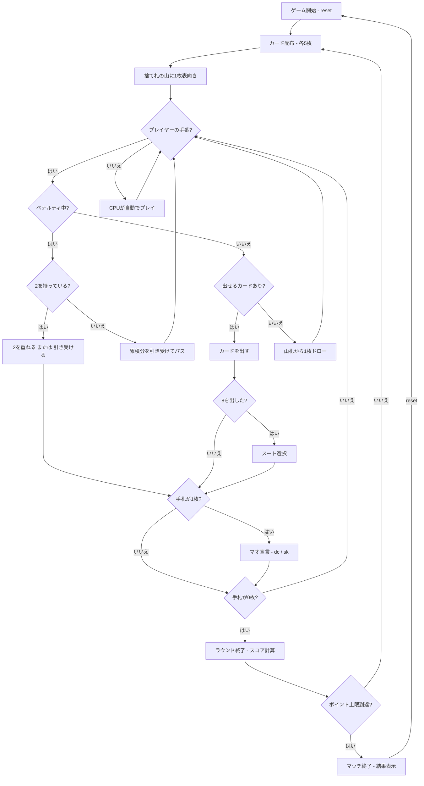

# マオ（CUI版）遊び方

## ゲーム概要

4人（プレイヤー1人 + CPU 3人）で遊ぶ、クレイジーエイトに「秘密のルール」を仕込んだ伝説のパーティゲームです。捨て札のトップとスートまたはランクが一致するカードを出していき、先に手札を出し切ったプレイヤーがラウンドの勝者です。マジックカード（2=ドローツー、A=スキップ、8=ワイルド）に加え、誰も教えてくれない「秘密のルール」が最大の特徴。ルールを破ると理由を告げられずペナルティを受け、正しく3回守るとようやくあいまいなヒントが解禁されます。

## 起動方法

```sh
go run ./cmd/trumpcards mao
go run ./cmd/trumpcards --lang en mao  # 英語モード
```

## ルール

### 基本ルール

- 52枚のトランプを使用、4人プレイ
- 各プレイヤーに5枚ずつ配り、1枚を表向きにして捨て札の山を開始、残りは山札
- 捨て札のトップとスートまたはランクが一致するカードを出す
- 出せるカードがなければ山札から1枚ドロー。出せればそのまま続行、出せなければパス
- 山札が空になったら捨て札（トップを除く）をリサイクルして山札にする

### マジックカード

- **2（ドローツー）**: 次のプレイヤーは2枚引く。2を重ねて出すとペナルティが累積し（+2枚）、次へ回せる。重ねられない（または出さない）プレイヤーが累積分をまとめて引き受ける
- **A（スキップ）**: 次のプレイヤーの手番を飛ばす
- **8（ワイルド）**: いつでも出せ、出した後に次のスートを指定できる

### 秘密のルール（最大の特徴）

- このゲームには **誰も教えてくれない秘密のルール** があります
- ルールを破ると **理由を告げられずに +1 枚のペナルティ** を受けます
- ルールが要求する「言葉」を発する必要がある場面があります。`declareword`（`dw`）コマンドで唱えましょう（いつ唱えるべきかは自分で推理するしかありません）
- 正しく **3回** ルールを守ると、ようやく **あいまいなヒント** が解禁されます

### マオ宣言

- 手札が残り1枚になったら「マオ！」（`dc`）と宣言する必要がある
- 宣言せずにスキップ（`sk`）すると、ペナルティとして2枚引く

### 得点

- ラウンド終了時、他プレイヤーの手札がスコアとして加算される
- 8=50点、J/Q/K=10点、A=1点、その他=額面

### ゲーム終了

- ポイント上限（デフォルト200点）に達したプレイヤーが出たらマッチ終了

### CPU難易度

- **Easy** (0): ランダムにカードを出す（宣言を忘れることがある）
- **Normal** (1): 基本的な戦略（デフォルト）
- **Hard** (2): 戦略的なプレイ（8の温存等）

## ゲームの流れ



## コマンド一覧

| コマンド | 短縮形 | 説明 |
|----------|--------|------|
| `reset` | `r` | ゲームリセット（設定保持） |
| `play <idx>` | `p <idx>` | カードをプレイ（インデックス指定） |
| `draw` | `d` | 山札から1枚ドロー（ペナルティ中は累積分を引き受ける） |
| `suit <1-4>` | `s <1-4>` | スート選択（8を出した後）: 1=♠, 2=♣, 3=♥, 4=♦ |
| `declare` | `dc` | 「マオ！」と宣言する（残り1枚） |
| `skipdeclare` | `sk` | 宣言せずペナルティを受ける |
| `declareword <word>` | `dw <word>` | 言葉を唱える（秘密のルールが要求するかも。いつ唱えるかは推理） |
| `nextround` | `nr` | ラウンドをスコアリングして次のラウンドへ |
| `setdifficulty <0-2>` | `sd <0-2>` | CPU難易度設定（0=Easy, 1=Normal, 2=Hard） |
| `setlimit <n>` | `sl <n>` | ポイント上限設定 |
| `log` | `l` | 棋譜表示 |
| `quit` | `q` | ゲーム終了 |
| `help` | `?` | ヘルプ表示 |

### コマンド例

- `p 2` → インデックス2のカードを出す
- `d` → 山札から1枚ドロー（ペナルティ中は累積分を引き受ける）
- `s 3` → スートを♥に設定（8を出した後）
- `dw mao` → 「mao」という言葉を唱える
- `dc` → 「マオ！」と宣言

## 画面の見方

```
==========
Mao (マオ)
==========
ラウンド: 1  山札: 27枚  方向: →
捨て札: HEART 7
ドローペナルティ累積: 2枚 (2を重ねるか、引き受けてください)
ルール遵守: 1/3
You: 累計0点 ラウンド0点 5枚
[0]SPADE 3  [1]CLOVER 2  [2]HEART Q  [3]DIAMOND 5  [4]SPADE A
CPU 1: 累計0点 ラウンド0点 5枚
CPU 2: 累計0点 ラウンド0点 4枚
CPU 3: 累計0点 ラウンド0点 6枚
----------
手番: You
play <idx>・・・カードを出す  draw・・・ドロー  dw <word>・・・発言
==========
```

- `ラウンド: N`: 現在のラウンド番号
- `山札: N枚`: 山札の残り枚数
- `方向: →/←`: 現在のプレイ進行方向
- `捨て札`: 捨て札の山の一番上のカード
- `ドローペナルティ累積`: 累積中のドローツー枚数（0枚なら非表示）
- `ルール遵守: N/3`: 秘密のルールを正しく守った回数（3回でヒント解禁）
- `[0]SPADE 3`...: インデックス付きの手札カード
- `手番`: 現在の手番プレイヤー

## 遊び方のコツ

- まずは普通に遊びながら、ペナルティが出る場面を観察して「秘密のルール」を推理しましょう
- 何か言うべきだと感じたら `dw <word>` で言葉を唱えてみましょう。正解なら遵守回数が増えます
- 2は手元に温存し、ペナルティを受けそうなときに重ねて相手へ回しましょう
- A（スキップ）は、出し切りそうな相手の手番を飛ばす妨害に有効です
- 8（ワイルド）は切り札として温存し、出せるカードがない時に使いましょう
- 残り1枚になったら「マオ！」宣言（`dc`）を忘れずに。忘れるとペナルティで2枚増えます
