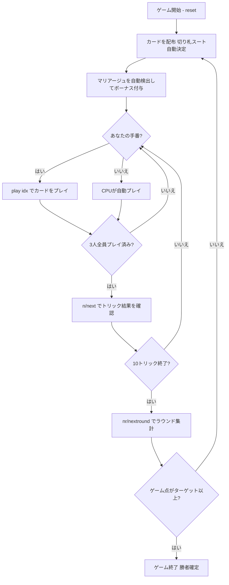

# マリアーシュ（CUI版）遊び方

## ゲーム概要

Mariáš（マリアーシュ）はチェコ・スロバキアで広く親しまれているトリックテイキングゲームです。32枚のドイツ式スートデッキを3人でプレイします。各ラウンドごとに1人の**ソロイスト**（前手 = ディーラーの左隣、毎ラウンド交代）が2人の**ディフェンダー**と対戦します。ソロイストの合計点（カード点 + マリアージュ + 最終トリックボーナス）がディフェンダー合計を上回ればソロイスト勝利、先にターゲット（デフォルト10点）に達したプレイヤーがマッチ勝利です。

## 起動方法

```sh
go run ./cmd/trumpcards marias
go run ./cmd/trumpcards --lang en marias  # 英語モード
```

## ルール

### デッキと配布

- **デッキ**: 32枚（7,8,9,10,J,Q,K,A × 4スート）
- **プレイヤー**: 3人（プレイヤー0 = あなた、プレイヤー1〜2 = CPU）
- **配布**: 各プレイヤー10枚（残り2枚はタロン——簡易実装のため使用しない）
- **切り札**: ソロイストの最長スートが自動的に切り札スートになる（入札フェーズなし）

### 役割

| 役割 | 人数 | 内容 |
|------|------|------|
| **ソロイスト** | 1人 | ディーラーの左隣の前手。毎ラウンド1席ずつ右に交代 |
| **ディフェンダー** | 2人 | ソロイスト以外の2プレイヤー |

### カードの強さ

**切り札スート・非切り札スートともに同じランク順**（強い順）:

| 強さ順 | カード |
|--------|--------|
| 1 | A（エース） |
| 2 | 10 |
| 3 | K（キング） |
| 4 | Q（クイーン） |
| 5 | J（ジャック） |
| 6 | 9 |
| 7 | 8 |
| 8 | 7（最弱） |

切り札スートはすべての非切り札スートのカードに勝ちます。

### カード点数

| カード | 点数 |
|--------|------|
| A（エース） | 11点 |
| 10 | 10点 |
| K（キング） | 4点 |
| Q（クイーン） | 3点 |
| J（ジャック） | 2点 |
| 9 / 8 / 7 | 0点 |

4スート合計 = **120点**

### マリアージュ（婚礼）

配布時に同一スートのK（キング）とQ（クイーン）を両方持っている場合、そのスートのマリアージュが自動的に適用されます（簡易実装のためプレイ中の宣言は不要）。

| スート | ボーナス点数 |
|--------|------------|
| 切り札スートのマリアージュ | **40点** |
| 非切り札スートのマリアージュ | **20点** |

### フォロー義務

1. **リードスートあり**: リードされたスートのカードを持っている場合は必ず出さなければならない
2. **リードスートなし（ボイド）**: 手札に切り札があれば必ず切り札を出さなければならない
3. **切り札もなし**: 任意のカードを捨て札として出せる
4. オーバートランプ義務はない

### 最終トリックボーナス

10枚目（最終）のトリックを取ったプレイヤーには **+10点** のボーナスが入ります。

### 得点計算と勝利条件

**ラウンド結果**:

- ソロイストの合計 = ソロイストが獲得したカード点 + ソロイストのマリアージュ + 最終トリックボーナス（取った場合）
- ディフェンダーの合計 = 2人のディフェンダーが獲得したカード点・マリアージュ・最終トリックボーナスの合算

| 結果 | 獲得ゲーム点 |
|------|------------|
| ソロイストの合計 > ディフェンダーの合計 | ソロイストが **+2点** |
| ソロイストの合計 ≤ ディフェンダーの合計 | 各ディフェンダーが **+2点** |

**マッチ勝利**: 先にターゲット（デフォルト **10** ゲーム点）に達したプレイヤーが勝利。

## ゲームの流れ



## コマンド一覧

| コマンド | 短縮形 | 説明 |
|----------|--------|------|
| `play <idx>` | — | 手札のidx番目のカードを出す |
| `next` | `n` | 次のトリックへ進む（トリック終了後） |
| `nextround` | `nr` | 次のラウンドへ進む（10トリック終了後） |
| `setdifficulty <0-2>` | `sd <0-2>` | CPU難易度設定（0=Easy, 1=Normal, 2=Hard） |
| `log` | `l` | アクションログを表示 |
| `reset` | `r` | 新しいゲームを開始（設定保持） |
| `quit` | `q` | ゲーム終了 |
| `help` | `?` | コマンド一覧を表示 |

## 画面の見方

```
==========
Marias (マリアーシュ)
==========
ラウンド: 1  トリック: 1
ゲーム点: あなた=0  CPU1=0  CPU2=0
切り札: ♥  ソロイスト: あなた
You: 10枚 [ソロイスト]
[0]A♠ [1]10♠ [2]K♥ [3]Q♥ [4]J♠ [5]9♦ [6]8♦ [7]7♣ [8]A♣ [9]K♣
CPU1: 10枚 [ディフェンダー]  CPU2: 10枚 [ディフェンダー]
マリアージュ: ♥ 40点（あなた）
結婚成立: 40点獲得
----------
フェーズ: PLAY
あなたの手番です。カードを出してください。
play <idx>
```

- **切り札行**: 現在の切り札スートとソロイスト表示
- **ゲーム点行**: 各プレイヤーの累積ゲーム点
- **`[n]`付き行**: あなたの手札（インデックス付き）
- **マリアージュ行**: 配布時に自動検出されたマリアージュとボーナス点。あなたの手番では「結婚成立: N点獲得」としてプレイ中も表示されます
- **ラウンド終了の点数**: カード点にマリアージュ点を加えた合計（勝敗判定と同じ足し方）
- **フェーズ表示**: 現在のフェーズ（PLAY）

## 遊び方のコツ

- **ソロイストは攻め、ディフェンダーは守れ**: ソロイストはカード点とマリアージュを積み上げて合計をディフェンダーの合計より高くするのが目標。ディフェンダーは2人で協力してソロイストの合計を下回らせましょう。
- **切り札管理が鍵**: 切り札はどのスートにも勝ちます。ソロイストなら切り札スートが最長スートになるため、積極的に活用できます。ディフェンダーは切り札の消費を相手に強いることで有利になります。
- **A（11点）と10（10点）の争奪**: カード点の大部分はAと10が占めます（各スート21点、計84点/120点中）。これらを確実に取るかブロックするかがラウンド結果を左右します。
- **マリアージュは見逃せない**: 切り札マリアージュ（40点）は非常に大きく、それだけでラウンドを有利にします。ソロイストとして切り札マリアージュを持てたなら、守りを固めつつ安全にプレイできます。
- **最終トリックボーナスを意識する**: 10トリック目には+10点のボーナスがあります。接戦のラウンドでは最終トリックを取れるかどうかが勝負を分けることがあります。
- **フォロー義務を把握**: ボイド時は切り札が必須です。特定のスートのカードを早めに使い切ることで、そのスートがリードされた際に切り札を出すチャンスを作れます。
- **ディフェンダー同士で連携**: ディフェンダーの2人は点数の高いカードをお互いのトリックに乗せるなど、暗黙の連携が重要です。ソロイストが弱そうなスートをリードして互いの高得点カードを確保しましょう。
