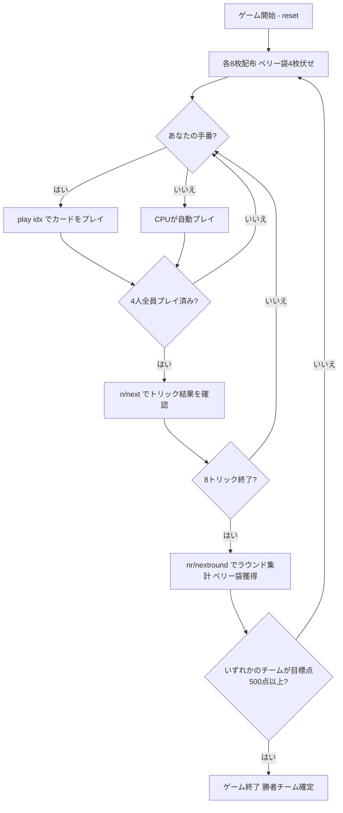

# マルヤプッシ（CUI版）遊び方

## ゲーム概要

Marjapussi（マルヤプッシ）は、フィンランド発祥の伝統的な**4人・2対2チーム戦ポイント・トリックテイキングゲーム**です。36枚のデッキを使用し、席0（あなた）と席2のチーム0、席1と席3のチーム1がペアを組んで対戦します。競り（ビッド）やタロン交換はなく、配札後直ちにプレイフェーズが始まります。リード時に同スートのKとQを所持していれば「マリッジ（結婚）」を宣言でき、切り札の変更と追加点（20点または40点）を獲得できます。第8トリック（最終トリック）を取ったチームが伏せ札「ベリー袋（pussi）」の4枚を獲得します。先に目標得点（デフォルト500点）に到達したチームが勝利となります。

## 起動方法

```sh
go run ./cmd/trumpcards marjapussi
go run ./cmd/trumpcards --lang en marjapussi  # 英語モード
```

## ルール

### プレイヤーとチーム

- **プレイヤー**: 4人（席0: あなた、席1: CPU 1、席2: CPU 2、席3: CPU 3）
- **チーム**: 席0 + 席2（チーム0）対 席1 + 席3（チーム1）の向かい合わせペアによるチーム戦。得点はチーム単位で累積されます。

### デッキと配布

- **デッキ**: 36枚（各スート 6, 7, 8, 9, 10, J, Q, K, A。2〜5は不使用）
- **配布**: 各プレイヤーに8枚ずつ配布されます（合計32枚）。
- **ベリー袋（pussi）**: 残り4枚は裏向きのまま「ベリー袋（pussi）」として中央に伏せられます。

### カードの強さと点数

- **トリックの強さ（強い順）**: A > 10 > K > Q > J > 9 > 8 > 7 > 6
  - 切り札が出ている場合、切り札の中で最強のカードを出したプレイヤーがトリックを獲得します。
  - 切り札が出ていない場合、リードスートの中で最強のカードを出したプレイヤーがトリックを獲得します。
- **カード点数**:
  - A: 11点
  - 10: 10点
  - K: 4点
  - Q: 3点
  - J: 2点
  - 9, 8, 7, 6: 0点
  - デッキ全体（pussi 4枚を含む）の合計カード点数は **120点** です。

### マリッジ（婚礼）＝ 動的切り札

- ラウンド開始時は**切り札なし（未決定）**です。
- リード（トリックの先手）の手番で、同一スートの **K と Q を両方**手札に持っている場合、そのKまたはQをリードすることでマリッジを宣言できます。
- マリッジ点:
  - 宣言したスートが**現在の切り札と同じ**場合: **40点**
  - 宣言したスートが**現在の切り札と異なる（または未決定の）**場合: **20点**（そのスートが新たな切り札になります）

### フォロー義務（裁定）

1. **マストフォロー**: リードされたスートのカードを手札に持っている場合、必ずそのスートを出さなければなりません。
2. **切り札強制**: リードスートを持たない（ボイド）場合、切り札を持っていれば**必ず切り札を出さなければなりません**。
3. 切り札も持っていない場合、または切り札が未決定の間にリードスートを持たない場合は、任意の手札を捨てることができます。
4. オーバートランプ義務（場に出ている切り札より強い切り札を出す義務）はありません。

### ベリー袋（pussi）

- ラウンドの最後のトリック（第8トリック）を獲得したプレイヤーのチームが、中央に伏せられていたベリー袋（pussi）4枚を獲得します。
- pussi に含まれるカードの点数は、そのチームのラウンド獲得カード点に加算されます。

### 得点計算と勝利条件

- 毎ラウンド終了時、各チームは獲得したトリックのカード点＋マリッジ点（および第8トリック勝者チームは pussi のカード点）を加算します。
- 先に累積 **500点**（設定変更可能）に到達したチームがマッチの勝者となります。

### CPU 難易度

| 難易度 | 説明 |
|--------|------|
| 0 (Easy) | 初心者向け。基本的なルールに従ってプレイします。 |
| 1 (Normal) | 標準難易度。マストフォローやマリッジの基本戦略を実行します。 |
| 2 (Hard) | 上級者向け。パートナーとの連携や切り札管理、カウンティングを考慮してプレイします。 |

## ゲームの流れ



## コマンド一覧

| コマンド | 短縮形 | 説明 |
|----------|--------|------|
| `play <idx>` |  | 手札のidx番目のカードを出す（インデックスは0始まり） |
| `next` | `n` | 次のトリックへ進む |
| `nextround` | `nr` | 次のラウンドへ進む |
| `setdifficulty <0-2>` | `sd` | CPU難易度設定（0=Easy, 1=Normal, 2=Hard） |
| `hint` | `h` | ヒントを表示 |
| `log` | `l` | アクションログを表示 |
| `reset` | `r` | 新しいゲームを開始（設定保持） |
| `quit` | `q` | ゲーム終了 |
| `help` | `?` | コマンド一覧を表示 |

## 画面の見方

### 日本語表示

実際に `go run ./cmd/trumpcards marjapussi` を実行した画面の例です（手札はシャッフルにより実行ごとに異なります）。

```
==========
Marjapussi (マルヤプッシ)
==========
ラウンド: 1  トリック: 1  切り札: 未決定
目標: 500点  チーム0: 0点  チーム1: 0点
直近のマリッジ: なし
あなた (チーム0): 8枚  得点: 0  トリック: 0
[0]SPADE 11  [1]CLOVER 12  [2]CLOVER 6  [3]HEART 1  [4]HEART 12  [5]HEART 11  [6]HEART 6  [7]DIAMOND 6
CPU 1 (チーム1): 7枚  得点: 0  トリック: 0
CPU 2 (チーム0): 7枚  得点: 0  トリック: 0
CPU 3 (チーム1): 7枚  得点: 0  トリック: 0
----------
トリック: CPU 1=SPADE 7, CPU 2=SPADE 10, CPU 3=SPADE 8
手番: あなた
play <idx>・・・カードを出す（強さ A>10>K>Q>J>9>8>7>6／マストフォロー、ボイド時は切り札強制）
マリッジ: 同スートの K と Q を持ちリードすると切り札になり、現在の切り札なら40点、違えば20点（新しい切り札になる）
==========
```

### 英語表示 (`--lang en`)

実際に `go run ./cmd/trumpcards --lang en marjapussi` を実行した画面の例です。

```
==========
Marjapussi
==========
Round: 1  Trick: 1  Trump: None
Target: 500  Team 0: 0  Team 1: 0
Last marriage: None
You (Team 0): 8 cards  Score: 0  Tricks: 0
[0]SPADE 10  [1]SPADE 13  [2]SPADE 7  [3]CLOVER 1  [4]HEART 9  [5]DIAMOND 10  [6]DIAMOND 9  [7]DIAMOND 7
CPU 1 (Team 1): 7 cards  Score: 0  Tricks: 0
CPU 2 (Team 0): 7 cards  Score: 0  Tricks: 0
CPU 3 (Team 1): 7 cards  Score: 0  Tricks: 0
----------
Trick: CPU 1=CLOVER 6, CPU 2=CLOVER 9, CPU 3=CLOVER 10
Turn: You
play <idx> ... play a card (A>10>K>Q>J>9>8>7>6; must follow suit, then must trump if void)
Marriage: hold both the K and Q of the same suit and lead one of them to set trump (40 pts if current trump, 20 pts if new trump)
==========
```

- **ラウンド / トリック / 切り札**: 現在のラウンド数、トリック数、確定した切り札スート（未決定の場合は「未決定」/「None」）を表示します。
- **目標 / チーム得点**: 勝利目標得点（500点）と各チームの累積得点を表示します。
- **直近のマリッジ**: 最後に宣言されたマリッジの内容を表示します。
- **プレイヤー行**: プレイヤー名、所属チーム、手札枚数、累積得点、獲得トリック数を表示します。
- **`[0]...` 行**: あなたの手札を0始まりのインデックス付きで表示します。
- **`----------` の下**: 現在のトリックに出されたカード、手番、操作ガイドを表示します。

## 遊び方のコツ

- **マリッジのタイミングを見極める**: KとQを両方持っている場合、リード時に出すことでマリッジを宣言できます。自チームに有利なスートを切り札に指定しましょう。
- **パートナー（CPU 2）との協力**: チーム0（あなたとCPU 2）の合計得点が重要です。パートナーが勝てそうなトリックでは無理に高い札を出さず、相手チームのトリック奪取を阻止しましょう。
- **最終トリック（第8トリック）のベリー袋を狙う**: 最終トリックを取ったチームが pussi 4枚のカード点を総取りできます。Aや10、切り札を最後まで温存して最終トリックを確保するのが勝利への鍵です。
