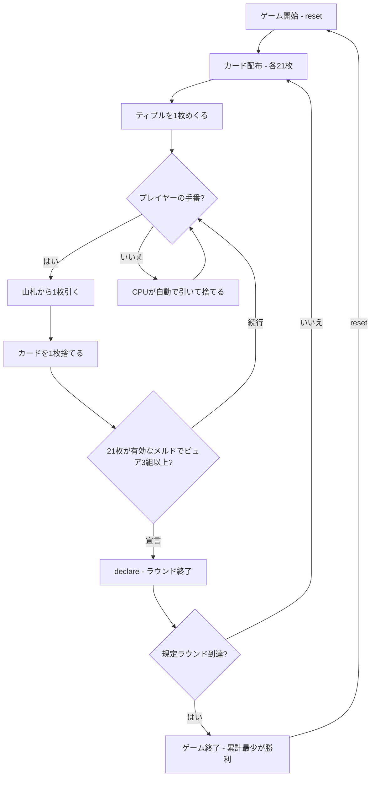

# マリッジ（CUI版）遊び方

## ゲーム概要

2〜5人（プレイヤー1人 + CPU 1〜4人）で遊ぶ、ネパール／北インドの21枚制ラミーです。標準52枚を3組と印刷ジョーカー6枚（計162枚）を使い、各プレイヤー21枚でメルドを作って宣言します。デフォルト3ラウンドで、累計点が最も少ないプレイヤーが勝利します。

## 起動方法

```sh
go run ./cmd/trumpcards marriage
go run ./cmd/trumpcards --lang en marriage  # 英語モード
```

## ルール

### 基本ルール

- 標準52枚×3組 + 印刷ジョーカー6枚（162枚）、2〜5人で遊びます
- 各プレイヤーに21枚を配り、配り終えた後に1枚を表向きにめくります。これがティプルです
- 手番は1枚引いて1枚捨て、手札を常に21枚に戻します
- 山札が尽きた場合、そのラウンドは宣言なしで終了します

### ワイルドカード

- ティプルと同ランク、1つ上のランク、1つ下のランク（Kの次はA、Aの前はK）は、スートを問わずワイルドです
- 印刷ジョーカーもワイルドです

### マール

| 呼び名 | 定義 | マール点 |
|---|---|---:|
| ティプル (tiplu) | ティプルと同ランク同スート | 3 |
| ポプル (poplu) | ティプルと同スートで1つ上のランク | 2 |
| ジプル (jhiplu) | ティプルと同スートで1つ下のランク | 2 |
| アルター (alter) | ティプルと同ランクの別スート | 1 |
| 印刷ジョーカー | — | 1 |

このマール表と「ピュアシーケンス3組以上」は、このリポジトリのハウスルールです。史実上の唯一の遊び方を示すものではありません。

### メルドと宣言

- セットは同ランク3〜4枚、スートはすべて異なり、ワイルドは1枚までです
- シーケンスは同スートの連続3枚以上です。ワイルドなしがピュア、1枚使用がインピュアです
- 21枚すべてが有効なメルドを構成し、かつピュアシーケンスが3組以上あるときだけ宣言できます

### 得点

- 成功した宣言者は0点、失敗した宣言者は80点です
- その他のプレイヤーはメルドに入らないデッドウッドを合計します。Aと10/J/Q/Kは10点、2〜9は数字どおり、ワイルドは0点で、上限は80点です
- ピュアシーケンスが3組以上あるプレイヤーだけ、手札のマール点合計をそのラウンドの点から差し引きます。点は負になることがあります

## ゲームの流れ



## コマンド一覧

| コマンド | 短縮形 | 説明 |
|---|---|---|
| `reset` | `r` | ゲームリセット（設定保持） |
| `drawstock` | `ds` | 山札から1枚引く |
| `drawdiscard` | `dd` | 捨て札から1枚引く |
| `discard <idx>` | `d <idx>` | カードを捨てる |
| `declare` | `de` | 手札を宣言する |
| `nextround` | `nr` | ラウンドを終了して次へ進む |
| `setplayers <2-5>` | `pc <2-5>` | プレイヤー数を設定 |
| `setdifficulty <0-2>` | `sd <0-2>` | CPU難易度を設定 |
| `setrounds <n>` | `sr <n>` | ラウンド数を設定 |
| `log` | `l` | 棋譜を表示 |
| `quit` | `q` | ゲームを終了 |
| `help` | `?` | ヘルプを表示 |

## 画面の見方

```
==========
Marriage (マリッジ)
==========
ラウンド: 1/3  山札: 45枚
ワイルドジョーカー: HEART 7  マール: tiplu=3 poplu=2 jhiplu=2 alter=1
あなたの手札: 21枚
[0]HEART 5  [1]HEART 6  [2]HEART 8  ...
手番: あなた (ドロー → ディスカード)
==========
```

## 遊び方のコツ

- まずワイルドを使わない同スートの連続3枚以上を3組確保しましょう
- ティプルのスートとランクを確認し、マール点の高いカードを活用しましょう
- ワイルドはセットやシーケンスの不足を埋めるために温存しましょう
- 宣言前に21枚すべてがメルドになり、ピュアシーケンスが3組あるか確認しましょう
