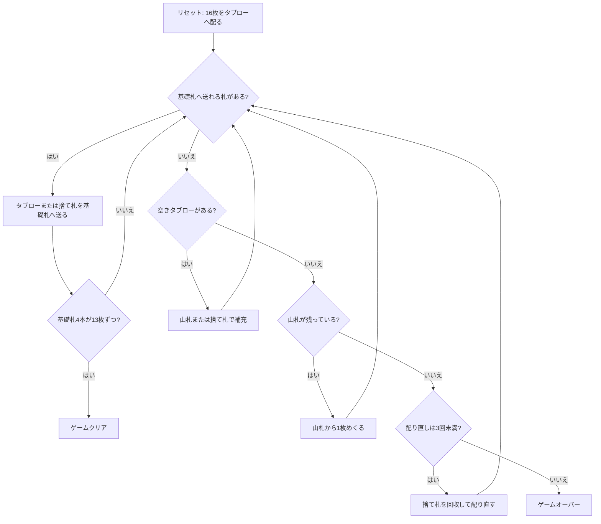

# マトリモニー（CUI版）遊び方

## ゲーム概要

2 組 104 枚を使う 1 人用ペイシェンスです。16 枚のタブローから札を基礎札へ送り、4 本の基礎札を13枚ずつ（計52枚）にすればクリアです。

## 起動方法

```sh
go run ./cmd/trumpcards matrimony
go run ./cmd/trumpcards --lang en matrimony   # 英語
```

## ルール

- 52 枚 2 組（104 枚）を使い、最初に 16 枚をタブローへ 1 枚ずつ配ります。残りが山札です。
- 基礎札は 4 本です。♠Q の 2 枚はそれぞれ降順、♦J の 2 枚はそれぞれ昇順に、**スートに従って**積みます。
  - ♠Q 始まり: Q→J→10→9→…→2→A→K
  - ♦J 始まり: J→Q→K→A→2→…→10
- 同名のもう 1 枚が出てきたら、それも同じスートの基礎札として置きます。基礎札はランクを一周するため、K の次は A（降順では A の次が K）、A の次は 2（昇順）です。
- タブロー上の、次に必要なランクとスートが一致する札を順に基礎札へ送ります。空いたタブローは山札または捨て札で補充できます。
- 山札を使い切ったら、捨て札を回収して配り直します。配り直しは最大 3 回です。
- 4 本の基礎札がすべて 13 枚ずつ（計 52 枚）になればクリアです。

ラップがあるので、Royal Cotillion のように単純な行き止まりはありません。その代わり、K の先に A や 2 の先に 3 が来るため、**次に何が読めるかが分かりにくい**のが特徴です。

## ゲームの流れ



## コマンド一覧

| コマンド | 短縮形 | 説明 |
|----------|--------|------|
| `draw` | `d` | 山札から1枚めくる。空なら捨て札を最大3回まで回収する |
| `m t<slot> f` |  | タブロー枠 `<slot>` (0..15) の札を基礎札へ送る |
| `m w f` |  | 捨て札を基礎札へ送る |
| `m w t<slot>` |  | 捨て札で空きタブロー枠を補充する |
| `m s t<slot>` |  | 山札で空きタブロー枠を補充する |
| `autocomplete` | `ac` | 送れる札を自動で基礎札へ送る |
| `undo` | `u` | 直前の手を取り消す |
| `hint` | `h` | ヒントを表示する |
| `giveup` | `g` | ギブアップする |
| `log` | `l` | アクションログを表示する |
| `reset` | `r` | 最初からやり直す |
| `quit` | `q` | 終了する |
| `help` | `?` | コマンド一覧を表示する |

## 画面の見方

```
基礎札: ♠Q[降順] | ♠Q[降順] | ♦J[昇順] | ♦J[昇順]
山札: 72枚  捨て札: ♥4 (1枚)
----------------
 [枠0] ♠J  [枠1] ♦2  [枠2] (空) ... [枠15] ♣9
----------------
手数: 8  配り直し: 0/3
```

- 基礎札は開始札と方向を表示します。次に必要な札はスートも一致していなければ置けません。
- `[枠n]` は 1 枚だけ置けるタブロー枠です。空いた枠は山札または捨て札で補充します。
- 「配り直し」は、捨て札を回収して山札に戻した回数です。

## 遊び方のコツ

- 基礎札の進行をスートごとに追い、同じスートの 2 枚をどちらの方向へ送るかを見失わないようにします。
- ラップによって行き止まりは避けられますが、次の必要札が遠くに見えます。すぐ送れる札だけでなく、次の次のランクも意識しましょう。
- タブローを空けると補充の選択肢が増えます。山札をめくる前に、送れる札をできるだけ送ります。
