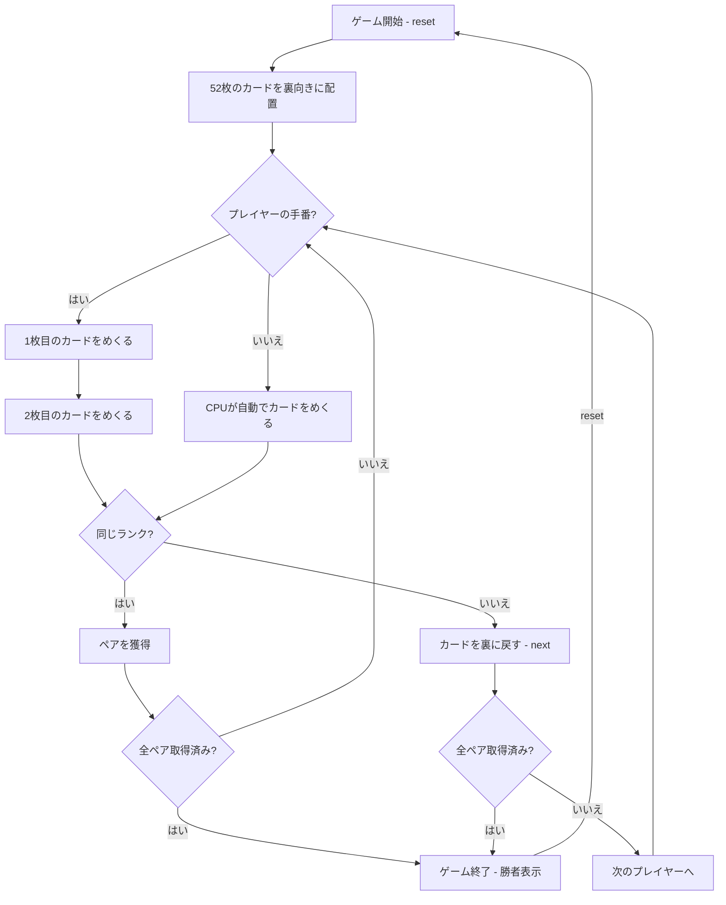

# 神経衰弱（CUI版）遊び方

## ゲーム概要

4人（プレイヤー1人 + CPU 3人）で遊ぶカードゲームです。52枚のカードを裏向きに並べ、2枚ずつめくって同じランクのペアを揃えます。全26ペアが取られた時点で最もペア数の多いプレイヤーが勝者です。

## 起動方法

```sh
go run ./cmd/trumpcards memory
go run ./cmd/trumpcards --lang en memory  # 英語モード
```

## ルール

### 基本ルール

- 52枚のトランプ（ジョーカーなし）を裏向きにボード上に並べる
- プレイヤーは順番に2枚のカードをめくる
- めくった2枚が同じランクならペアとして獲得し、もう1ターン続行
- 異なるランクなら2枚を裏に戻し、次のプレイヤーに交代

### ゲーム終了

- 全26ペアが取られた時点でゲーム終了
- 最もペア数の多いプレイヤーが勝者

### CPU難易度

- **Easy** (0): ランダムにカードをめくる
- **Normal** (1): 部分的にカードの位置を記憶する（デフォルト）
- **Hard** (2): 完全にカードの位置を記憶する

## ゲームの流れ



## コマンド一覧

| コマンド | 短縮形 | 説明 |
|----------|--------|------|
| `reset` | `r` | 新しいゲームを開始 |
| `flip <pos>` | `f <pos>` | 指定位置のカードをめくる |
| `next` | `n` | 結果確認後に次へ進む |
| `setdifficulty <0-2>` | `sd <0-2>` | CPU難易度を設定（0=Easy, 1=Normal, 2=Hard） |
| `log` | `l` | アクションログ（棋譜）を表示 |
| `quit` | `q` | ゲーム終了 |
| `help` | `?` | コマンド一覧を表示 |

### コマンド例

- `f 5` → 位置5のカードをめくる
- `flip 12` → 位置12のカードをめくる
- `sd 2` → CPU難易度をHardに設定

## 画面の見方

```
==========
Memory (神経衰弱)
==========
残りペア: 20 / 26
----------
[You]: 3ペア
CPU 1: 2ペア
CPU 2: 1ペア
CPU 3: 0ペア
----------
ボード:
[ 0]??  [ 1]??  [ 2]??  [ 3]♠2  [ 4]??  [ 5]??  [ 6]--
[ 7]??  [ 8]??  [ 9]??  [10]??  [11]??  [12]??  [13]--
...
手番: あなた
f <pos>・・・カードをめくる
==========
```

- `残りペア: N / 26`: ボード上に残っているペア数
- `[You]: Nペア`: プレイヤーの獲得ペア数
- `[ 0]??`: 裏向きのカード（位置0）
- `[ 3]♠2`: 表向きのカード（位置3、スペードの2）
- `[ 6]--`: 取られたカード（位置6）

## 遊び方のコツ

- めくられたカードの位置とランクを覚えておきましょう
- CPUがめくったカードも注意深く観察すると、ペアの位置を特定しやすくなります
- 序盤は情報収集を重視し、まだ見ていない位置のカードを優先的にめくると効率的です
- 確実にペアだとわかるカードがあれば、優先的にめくりましょう
