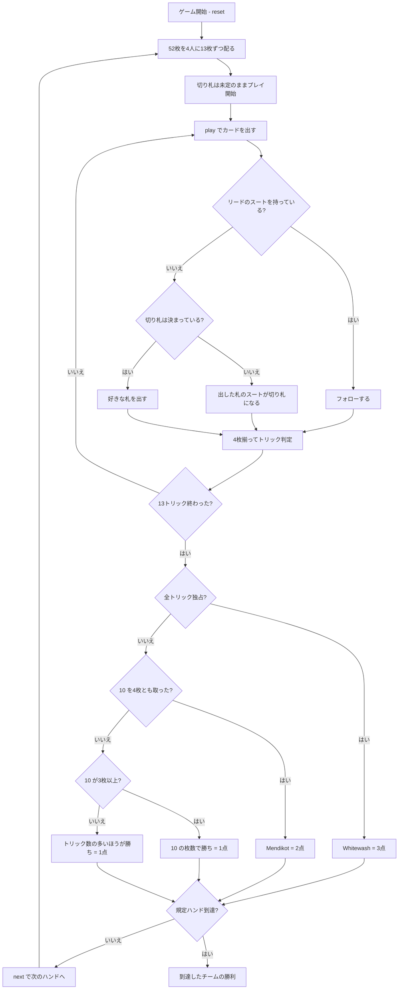

# メンディコット（CUI版）遊び方

## ゲーム概要

インドの家庭で広く遊ばれている切り札トリックテイキング。52枚を4人に13枚ずつ配る**2対2のパートナー戦**で、向かい合う席が味方。**勝敗を決めるのは点数でもトリック数でもなく、4枚の「10」を何枚取ったか**です。3枚取れば即勝ち、2枚ずつならトリックの多いほうが勝ちます。**切り札を選ぶ場面はありません**——最初にフォローできなかった人が出した札のスートが、そのまま切り札になります。

## 起動方法

```sh
go run ./cmd/trumpcards mendikot
go run ./cmd/trumpcards --lang en mendikot  # 英語モード
```

## ルール

### 配りと切り札

1. 52枚を4人に**13枚ずつ**配る（山札は残りません）
2. 切り札は**まだ決まっていません**
3. 誰かがリードのスートを持たず**フォローできなくなった瞬間**、その人が出した札のスートが切り札になります
4. 自分がその状況になったときは、手番の案内の直前に **「この 1 枚のスートが、このハンドの切り札になります」** と警告が出ます（フォローできる手番では出ません）

宣言するのではなく「出してしまう」のがこのゲームの特徴です。切りたいスートを持っていないふりはできません。

### 勝敗（10 の取り合い）

| 状況 | 勝つチーム | ハンド勝ち点 |
|------|-----------|-------------|
| 全13トリックを取った（**Whitewash**） | 取ったチーム | **3** |
| 4枚の10をすべて取った（**Mendikot**） | 取ったチーム | **2** |
| 10 を3枚取った | 取ったチーム | **1** |
| 10 が2枚ずつ | トリック数の多いチーム | **1** |

10 は2枚ずつにしかならないか、3枚以上どちらかに寄るかのどちらかなので、**引き分けのハンドはありません**。先に規定ハンド勝ち点（既定3）を取ったチームの勝ちです。

### 札の強さ

切り札 > リードのスート > その他。同じスートなら A > K > Q > J > 10 > … > 2。**フォロー義務があります**。

**10 は札の強さとしては J より下**である点に注意してください。強くない札が勝敗そのものを決めるので、10 をどう取り、どう取らせないかがこのゲームです。

## ゲームの流れ



## コマンド一覧

| コマンド | 短縮形 | 説明 |
|----------|--------|------|
| `play <idx>` | `p` | 手札の `<idx>` 番目のカードを出す |
| `next` | `n` | 次のハンドを開始する |
| `hint` | `h` | 打つべき札を提示する |
| `giveup` | `g` | 投了する |
| `log` | `l` | 棋譜（アクションログ）を表示する |
| `reset` | `r` | 最初からやり直す |
| `quit` | `q` | 終了する |
| `help` | `?` | コマンド一覧を表示 |

**切り札を宣言するコマンドはありません。** フォローできないときに出した札で決まります。

## 画面の見方

```
==========
Mendikot (メンディコット)
==========
ハンド: 2  トリック: 5/13  (3点先取)
10 の獲得: あなたのチーム=2  相手=1（全4枚）
勝敗: 10 を 3 枚以上取れば勝ち。2 枚ずつならトリックの多いほうが勝ち。4 枚とも取れば Mendikot（2点）、全トリックなら Whitewash（3点）。
トリック: あなたのチーム=3  相手=1
ハンド勝ち点: あなたのチーム=1  相手=0
切り札: ハート（CPU2 がフォローできず決定）
あなた[T0]: 10を2枚 獲得3 手札9枚
  [0]♠2 [1]♠7 [2]♠K [3]♣4 [4]♥A [5]♥K [6]♦10 [7]♦3 [8]♣9
CPU1[T1]: 10を0枚 獲得1 手札9枚
CPU2[T0][切り札決定]: 10を0枚 獲得0 手札9枚
CPU3[T1]: 10を1枚 獲得0 手札9枚
----------
手番: あなた
play <idx>・・・カードを出す
```

- **10 の獲得行**: 勝敗そのもの。**3枚取った時点で勝ちが決まります**
- **トリック行**: 10 が2枚ずつのときだけ効きます
- **`[T0]` / `[T1]`**: チーム番号。**T0 があなたの味方**（向かい合う席）
- **`[切り札決定]`**: フォローできず、その札で切り札を決めてしまった人
- **`[n]`**: `play <n>` で指定する手札の番号

## 遊び方のコツ

- **10 を数える。** 場に出た10がどちらのチームに入ったかだけは必ず追ってください。3枚目が入った瞬間にハンドが決まります
- **10 は J より弱い。** 素直にリードすると相手の J 以上に取られます。**味方が勝っているトリックに乗せる**のが基本形
- **切り札は「出してしまう」もの。** 短いスートを早めに使い切ると、自分の都合のいいタイミングで切り札を決められます
- **逆に、決めさせない手もある。** 全員がフォローできるかぎり切り札は無いままで、A が確実に勝ちます
- **相手が10を持つスートは早めに引き抜く。** A・K でリードして10を落とさせれば、そのまま自陣に入ります
- **2枚ずつで終わりそうならトリックを数える。** 同点決着が無い代わりに、トリック数の1つ差がそのまま勝敗になります
