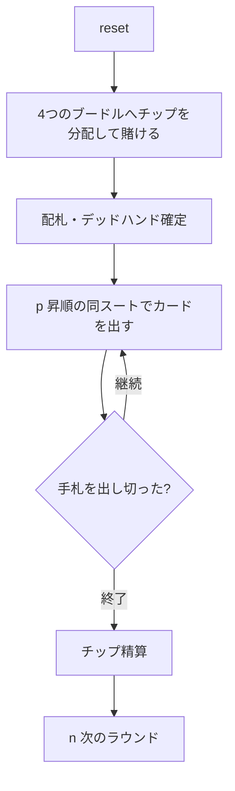

# ミシガン（CUI版）遊び方

## ゲーム概要

ミシガン（Michigan / Newmarket）は、中央に置かれた4枚の「ブードル（boodle）」札（A♥・K♣・Q♦・J♠）にチップを賭けてから、同じスートの昇順シーケンスでカードを出していく「ストップ系」のチップ賭けゲームです。ブードルと一致する札を出すとそのチップを獲得でき、最初に手札を出し切ったプレイヤーがラウンドを終わらせます。規定ラウンドを消化したあと、最もチップの多いプレイヤーが勝者です。

## 起動方法

```sh
go run ./cmd/trumpcards michigan
go run ./cmd/trumpcards --lang en michigan
```

## ルール

### 基本ルール

1. 各ラウンドの開始時、全員がアンティに相当するチップを4つのブードル（A♥・K♣・Q♦・J♠）に分配して賭けます。
2. 残りのカードは各プレイヤーに配られ、余った札は伏せて「デッドハンド」となります。
3. ディーラーの左隣から、最も小さい札で新しいシーケンスをリードします。以降は同じスートの1つ上の札を出していきます（例: ♥3 → ♥4 → ♥5 …）。
4. 次の札が誰の手札にもない（デッドハンドにある、またはキングを超える）と「ストップ」になり、最後に札を出したプレイヤーが新しいシーケンスをリードします。
5. 出した札がブードルと一致した場合、そのブードルに積まれたチップを総取りします（同じブードルは1ラウンドに1回のみ）。
6. 最初に手札をすべて出し切ったプレイヤーがそのラウンドを終わらせます。獲得されなかったブードルのチップは次のラウンドに繰り越されます。

### 停止条件

規定ラウンド数を消化するとゲーム終了。最終的にチップが最も多いプレイヤーが勝者です。

## ゲームの流れ



## コマンド一覧

| コマンド | 短縮形 | 説明 |
|----------|--------|------|
| `bet <h> <c> <d> <s>` | `b` | 4つのブードル（A♥・K♣・Q♦・J♠）へチップを分配して賭ける（合計=アンティ） |
| `play <n>` | `p <n>` | 手札インデックス n のカードを出す |
| `nextround` | `n` / `nr` | 次のラウンドへ |
| `setplayers <n>` | `sp <n>` | プレイヤー数を設定（3-8） |
| `setante <n>` | `sa <n>` | アンティ額を設定 |
| `setchips <n>` | `sc <n>` | 初期チップを設定 |
| `setrounds <n>` | `st <n>` | 実施ラウンド数を設定 |
| `hint` | `h` | ヒントを表示 |
| `log` | `l` | 棋譜を表示 |
| `reset` | `r` | ゲームをリセット（設定は保持） |
| `quit` | `q` | ゲーム終了 |
| `help` | `?` | コマンド一覧を表示 |

## 画面の見方

```
==========
ミシガン（Newmarket・ストップ系）
==========
ラウンド: 1  アンティ: 8
ブードル（賭け札）:
  HEART 1  チップ 6  [未獲得]
  CLOVER 13  チップ 6  [未獲得]
  DIAMOND 12  チップ 6  [未獲得]
  SPADE 11  チップ 6  [未獲得]
デッドハンド（伏せ札）: 0 枚
  （余分に1人分だけ配った札です。誰の手にも入らず、この局では最後まで使われません）
あなた  チップ 200  賭け 0  手札 0  [待機]
CPU 1  チップ 192  賭け 8  手札 0  [待機]
CPU 2  チップ 192  賭け 8  手札 0  [待機]
CPU 3  チップ 192  賭け 8  手札 0  [待機]
----------
ブードルに賭けてください: b <♥> <♣> <♦> <♠>（合計 8）
推奨: ブードル札は手札に無し。予算を均等に配分するのが無難。
b で賭け、p で出す、n で次のラウンド
==========
```

- 1行目 — ラウンド番号とアンティ額（**フェーズは出ません**）
- `ブードル（賭け札）:` — 4枚の賭け札と積まれたチップ・獲得状況
- `デッドハンド（伏せ札）: N 枚` — 伏せ札の枚数。**その意味を説明する行が
  直後に続きます**（誰の手にも入らず、その局では使われない札）
- 各プレイヤー行 — 名前・チップ・このラウンドの賭け・手札枚数・状態
- **`ブードルに賭けてください: b <♥> <♣> <♦> <♠>（合計 8）`**: 入力の形と
  **配分できる合計**がその場に出ます
- **`推奨: ...`**: そのときの賭け方の助言が 1 行出ます
- カード行 — 自分の手札（結果フェーズでは各プレイヤーの残り手札を公開）

## 遊び方のコツ

- ブードル札（A♥・K♣・Q♦・J♠）を手札に持っているなら、それを出せるタイミングでチップを回収しましょう。
- 「ストップ」を自分で起こすと次のシーケンスをリードできます。手札を早く減らす好機になります。
- チップの分配は、獲得できそうなブードルに厚く賭けるのが基本です。
