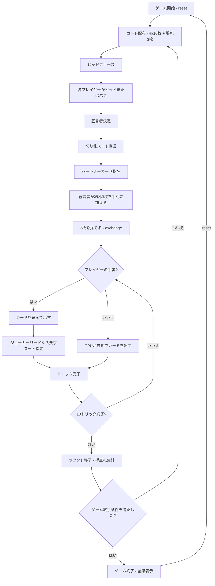

# マイティ（CUI版）遊び方

## ゲーム概要

5人（プレイヤー1人 + CPU 4人）で遊ぶ韓国発祥のトリックテイキング型カードゲームです。52枚+ジョーカー1枚の計53枚を使用し、得点札（A/10/J/Q/K = 計20枚）の獲得数を競います。最高ビッドのプレイヤーが宣言者（Declarer）となり、切り札スートとパートナー指名カードを宣言します。宣言者+秘密パートナー（与党）と残り3人（野党）の隠しチーム戦です。

## 起動方法

```sh
go run ./cmd/trumpcards mighty
go run ./cmd/trumpcards --lang en mighty  # 英語モード
```

## ルール

### 基本ルール

- 53枚のカード（52枚+ジョーカー1枚）を5人に配布（1人10枚、余り3枚は場札／キティ）
- 各ラウンド開始時に得点札の獲得予想数をビッド（最低入札数〜20）
- 最高ビッドのプレイヤーが **宣言者（Declarer）** になる
- 宣言者は **切り札スート**（またはノートランプ）と **パートナーカード** を指名する
- パートナーカードを持つプレイヤーは宣言者の味方（他のプレイヤーには非公開）
- 宣言者は場札3枚を手札に加え、不要な3枚を捨てる
- リードスートに従う（フォロースート）
- トリックの勝者: 切り札があればトリック中の最高切り札、なければリードスートの最高値

### 特殊カード

- **マイティ**: 通常は ♠A、♠が切り札のときは ♦A。あらゆる切り札に勝つ最強カード
- **ジョーカー**: 出されたトリックを基本的に勝つ強力カード
- **ジョーカーコール（♣3、♣が切り札のときは ♠3）**: リードで出ると、ジョーカー所持者は強制的にジョーカーを出さねばならない

### 得点札（ポイントカード）

以下のカードが得点札としてカウントされます（合計20枚）：
- A × 4枚
- 10 × 4枚
- J × 4枚
- Q × 4枚
- K × 4枚

### 得点

- **与党（宣言者+パートナー）の勝利**: 与党が獲得した得点札数 >= ビッド数
- **野党の勝利**: 与党が獲得した得点札数 < ビッド数
- ノートランプ宣言時はビッドが追加点で評価されます

### ゲーム終了

- 目標スコアに到達したプレイヤーが出た場合にゲーム終了

### CPU難易度

- **Easy** (0): ランダムにカードを出す
- **Normal** (1): 基本的なトリック戦略（デフォルト）
- **Hard** (2): 戦略的なプレイ

## ゲームの流れ



## コマンド一覧

| コマンド | 短縮形 | 説明 |
|----------|--------|------|
| `reset` | `r` | 新しいゲームを開始 |
| `bid <n> [nt]` | `b <n> [nt]` | ビッドを宣言（0=パス、最低入札数〜20、末尾 `nt` でノートランプ） |

> `nt` を付けると**最低ビッドに設定値ぶんが上乗せ**されます。加算点はビッド手番中に画面へ出るので、打つ前に確認できます。
| `bid 0` |  | パス |
| `trump <t> <p> <v>` | `t <t> <p> <v>` | 切り札スート・パートナースート・パートナー値を宣言 |
| `exchange <i1> <i2> <i3>` | `e <i1> <i2> <i3>` | 場札交換後、手札から3枚を捨てる |
| `play <idx>` | `p <idx>` | カードをプレイ |
| `jokerlead <idx> <suit>` | `jl <idx> <suit>` | ジョーカーをリードして要求スートを指定 |
| `next` | `n` | 次のトリックへ |
| `nextround` | `nr` | 次のラウンドへ |
| `hint` | `h` | 推奨アクションのヒントを表示 |
| `log` | `l` | 棋譜表示 |
| `quit` | `q` | ゲーム終了 |
| `help` | `?` | ヘルプ表示 |

スート指定: `spade` / `s`、 `clover` / `clubs` / `c`、 `heart` / `h`、 `diamond` / `d`、 `joker` / `j`、 `nt`（ノートランプ）

### コマンド例

- `b 14` → 得点札14枚をビッド
- `b 16 nt` → 16枚ノートランプでビッド
- `b 0` または `pass` → パス
- `t spade heart 1` → スペード切り札、♥A をパートナーカードに指名
- `t nt spade 13` → ノートランプ、♠K をパートナーカードに指名
- `e 0 3 7` → インデックス 0/3/7 のカードを捨てる
- `p 2` → インデックス2のカードを出す
- `jl 4 heart` → インデックス4のジョーカーをリードし、ハートを要求

## 画面の見方

```
==========
Mighty (マイティ)
==========
ラウンド 2 / トリック 5
切り札: スペード
最高ビッド: 14
パートナーカード: HEART A
----------
[You] (Declarer): pts=5 tricks=2 total=30
  [0]SPADE A  [1]CLOVER 8  [2]HEART K  [3]DIAMOND 3  [4]JOKER
CPU 1: pts=2 tricks=1 total=10
CPU 2: pts=1 tricks=1 total=20
CPU 3: pts=0 tricks=1 total=8
CPU 4: pts=0 tricks=0 total=5
----------
現在のトリック:
  CPU 1: CLOVER 10
  CPU 2: CLOVER K
手番: あなた
p <idx>・・・カードを出す
==========
```

- `ラウンド N / トリック M`: 現在のラウンドとトリック番号
- `切り札`: 宣言された切り札スート（または "No-Trump"）
- `最高ビッド`: 宣言者のビッド数
- `パートナーカード`: 指名されたパートナーカード（公開状態のみ表示）
- `[You] (Declarer): pts=N tricks=N total=N`: あなたの得点札数・トリック数・累計スコア。役割（Declarer/Partner）付き
- `[0]SPADE A`...: インデックス付きの手札カード
- `現在のトリック`: 現在のトリックに出されたカード

## 遊び方のコツ

- マイティ（♠A / ♠切り札時は ♦A）は最強。トリック決め手として温存しましょう
- ジョーカーは強力ですが、ジョーカーコール（♣3 / ♣切り札時は ♠3）に注意
- 宣言者になった場合、切り札スートは自分が多く持つスートを選びましょう
- ノートランプ宣言はマイティとジョーカーの両方を持っているときの強気な選択です
- パートナーカードは、自分が持っていない強いカード（例: 各スートのA）を指名すると効果的です
- 与党／野党の判別は各プレイヤーの出札を観察して推測しましょう
- 迷った時は `h` コマンドでヒントを表示できます
