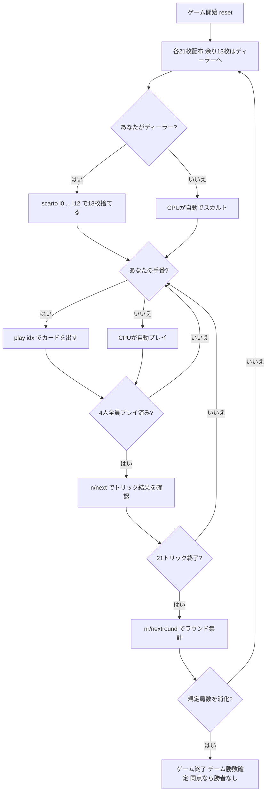

# ミンキアーテ（CUI版）遊び方

## ゲーム概要

Minchiate（ミンキアーテ）は16世紀フィレンツェで生まれた97枚タロー系トリックテイキングゲームです。**対面同士が固定パートナー**となる4人2対2のチーム戦で、あなたは席0でプレイします。入札はありません。

このゲームの最大の特徴は **切札が40枚あること**です。本作の他のタロー系（frenchtarot / scarto は21枚、tarocchini も21枚）の倍近くあり、しかも単なる番号の列ではありません。上位には**黄道十二宮・四大元素・美徳**が並びます。

## 起動方法

```sh
go run ./cmd/trumpcards minchiate
go run ./cmd/trumpcards --lang en minchiate  # 英語モード
```

## ルール

### デッキ（97枚）

| 種別 | 枚数 | 内訳 |
|------|------|------|
| スート札 | 56 | 4スート × 14枚（1〜10, F=ファンテ, C=カヴァッロ, R=レジーナ, Re=レ） |
| 切札（タロッキ） | 40 | 1〜40。上位は星座12・四大元素・美徳を含む |
| マット（Matto / 愚者） | 1 | — |

切札は番号だけでなく**呼び名**でも表示されます。40枚もあると番号だけでは何の札か分からないためです。

### 配札とスカルト

- 各プレイヤーに **21枚**ずつ配ります。
- **97は4で割り切りません。**余った **13枚**はディーラーが受け取り、同じ13枚を伏せて捨てます（**スカルト**）。21×4 + 13 = 97 と過不足なく一致します。
- 伏せた13枚は**ディーラー側チームの獲得札として得点になります**。そのため **切札とマットは捨てられません**。

### トリック・テイキング

- **マストフォロー**: リードされたスートを持っていれば必ず従います。
- **持っていなければ切札を出す義務**があります（タロー系の共通ルール）。
- **マットは例外**で、いつでも出せます。ただし**トリックは取れません**。
- **マットがリードされてもスートは決まりません。**その次に出た札がリードスートを決めます。マットは「取らない・縛らない」札なので、これがリードされた局面は実質まだ誰もリードしていないのと同じです。
- **勝敗**: 切札が出ていれば最強の切札、なければリードスートの最強札が勝ちます。切札40枚はすべて序列が異なるので、同格札はありません。

### 得点計算と勝利条件

| 項目 | 得点 |
|------|------|
| トリック | 1トリックにつき1点（席の属するチームへ） |
| 最終トリックボーナス | 最後のトリックを取ったチームへ3点 |
| スカルト | 伏せた13枚がディーラー側チームへ13点 |

**マッチ勝利**: 規定局数（デフォルト **4局**、ディーラーが一巡するよう**プレイヤー数の倍数**に限られます）を終えた時点で、合計点の多いチームが勝ちです。**同点なら勝者なし**となります。

## ゲームの流れ



## コマンド一覧

| コマンド | 短縮形 | 説明 |
|----------|--------|------|
| `scarto <i0> ... <i12>` | `discard` | 余剰13枚を捨てる（ディーラーのみ・切札とマットは不可） |
| `play <idx>` | — | 手札のidx番目のカードを出す |
| `next` | `n` | 次のトリックへ進む |
| `nextround` | `nr` | 次のラウンドへ進む（21トリック終了後） |
| `setdifficulty <0-2>` | `sd <0-2>` | CPU難易度設定（0=Easy, 1=Normal, 2=Hard・ゲームはリセットされます） |
| `hint` | `h` | ヒントを表示 |
| `log` | `l` | アクションログを表示 |
| `reset` | `r` | 新しいゲームを開始（設定保持） |
| `quit` | `q` | ゲーム終了 |
| `help` | `?` | コマンド一覧を表示 |

入札は存在しないため、`bid` / `pass` コマンドはありません。

## 画面の見方

```
==========
ミンキアーテ コマンド一覧
==========
ラウンド: 1  トリック: 1
得点  チーム0: 0  チーム1: 0
切札は40枚 —— 星座12・四大元素・美徳を含み、上に何枚残っているかが読みどころです
You (チーム0): 21枚  トリック: 0 [親]
[0]SPADE 1  [1]SPADE 7  [2]切札12 Eremita  [3]切札39 Angelo  [4]マット  ...
CPU1 (チーム1): 21枚  トリック: 0
CPU2 (チーム0): 21枚  トリック: 0
CPU3 (チーム1): 21枚  トリック: 0
----------
手番: You
play <idx>・・・カードを出す（リードスートにマストフォロー／持たなければ切札を出す義務。マットはいつでも可）
```

- **得点行**: チーム単位の累計点。個人ではなくチームで競います。
- **切札の行**: 40枚あることを毎フレーム表示します。**「まだ上に何枚残っているか」が最大の読みどころ**です。
- **プレイヤー行**: 所属チーム・手札枚数・このラウンドで取ったトリック数。`[親]` はディーラーです。
- **`[n]`付き行**: あなたの手札。切札は**番号と呼び名の両方**を表示します。

## 遊び方のコツ

- **切札の残り枚数を数える**: 40枚もあるので、21枚のタロー系の感覚だと「もう上は無いはず」と誤算します。自分より上の切札が何枚出たかを追うのが本作最大の技術です。
- **味方のトリックは奪わない**: 対面が既に勝っているトリックに強い札を重ねるのは無駄です。CPUも同じ判断をします。
- **ディーラーのスカルトは13点**: 伏せた13枚はそのままチームの点になります。1トリック1点なので、**スカルトだけで13トリック分**に相当します。捨てられるのは切札とマット以外なので、スート札の中で最も使いにくいものを選びます。
- **マットは逃げ札**: トリックは取れませんが、フォロー義務と切札義務の両方を免れます。出したくない切札を抱えているときの逃げ道です。**リードにも使えます** —— スートを定めないので、次の人に自由な手を渡すことになります。
- **最終トリックは3点**: 通常の3倍の価値があります。終盤に高位の切札を1枚残しておくと確実に取れます。
