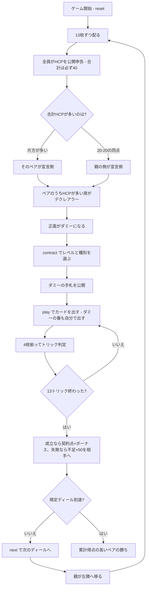

# ミニブリッジ（CUI版）遊び方

## ゲーム概要

コントラクトブリッジの難関である**競りを省いた入門用**の4人ゲーム（2対2）。競りのかわりに**全員が自分のHCP（ハイカードポイント）を公開申告**し、合計の多いペアが宣言側になります。デクレアラーの正面がダミーとなって手札を公開し、デクレアラーが**両方の手札を操作**します。規定ディールを終えた時点で累計得点の高いペアの勝ちです。

## 起動方法

```sh
go run ./cmd/trumpcards minibridge
go run ./cmd/trumpcards --lang en minibridge  # 英語モード
```

## ルール

### 配りとHCPの公開申告

52枚を**13枚ずつ**配ります（4 × 13 = 52 ちょうど）。各自が自分の手札のHCPを数えて申告します。

| 札 | 点 |
|----|----|
| A | 4 |
| K | 3 |
| Q | 2 |
| J | 1 |

**合計は必ず40**です（1スートあたり10点 × 4スート）。この盤面では全員のHCPが常に表示されています。

### デクレアラーの決定

1. **合計HCPの多いペア**が宣言側
2. そのペアのうち、**HCPを多く持っている席**がデクレアラー
3. デクレアラーの**正面がダミー**

**合計が必ず40なので、20-20の同点が起こります**（実測で12回に1回程度）。そのときは**親の側**が宣言側です。ペアが決まっても席が同点のことがあり、そのときは**親から見て先の席**が取ります。

### 契約

デクレアラーがレベル（1〜7）と種別（♠ ♣ ♥ ♦ NT）を選びます。**競りではないので、上回る必要はありません**。契約は「**6 + レベル**」トリックです。

### 得点

契約点は次のとおり。

| 種別 | 1トリックあたり |
|------|----------------|
| ♣ ♦（マイナー） | 20 |
| ♠ ♥（メジャー） | 30 |
| NT | 40（1トリック目）＋ 30（以降） |

- **成立**: 契約点 ＋（契約点が100以上なら **300**、未満なら **50**）＋ レベル6で **500**、レベル7で **1000**。オーバートリックは1トリックあたりの契約点と同率
- **失敗**: 相手ペアに **不足トリック × 50点**

契約点100の境目は、ちょうど **3NT・4♥/♠・5♣/♦** です。

### 札の強さ

切り札（契約の種別）> リードのスート > その他。同じスートなら A > K > Q > J > 10 > … > 2。**フォロー義務があります**。NT契約では切り札がありません。

### 勝敗

規定ディール（既定4、**4の倍数**）を終えた時点で、**累計得点の高いペアの勝ち**です。同点なら引き分け。

## ゲームの流れ



## コマンド一覧

| コマンド | 短縮形 | 説明 |
|----------|--------|------|
| `contract <level> <suit>` | `c` | 契約を選ぶ（level は 1〜7、suit は **0:NT** 1:♠ 2:♣ 3:♥ 4:♦、デクレアラーのみ） |
| `play <idx>` | `p` | 手札の `<idx>` 番目のカードを出す（**ダミーの手番も自分で出します**） |
| `next` | `n` | 次のディールを開始する |
| `hint` | `h` | 選ぶべき契約、打つべき札を提示する |
| `giveup` | `g` | 投了する |
| `log` | `l` | 棋譜（アクションログ）を表示する |
| `reset` | `r` | 最初からやり直す |
| `quit` | `q` | 終了する |
| `help` | `?` | コマンド一覧を表示 |

**HCPを申告するコマンドはありません。** 配った時点で自動的に公開されます。

**`suit` の 0 は「省略」ではなくノートランプです。** 省略すると `Suit is required.` で弾かれます。

## 画面の見方

```
==========
Minibridge (ミニブリッジ)
==========
ディール: 1/4  トリック: 1/13
競りはありません。全員が自分のHCP（A=4 K=3 Q=2 J=1、合計は必ず40）を公開申告し、合計の多いペアのうち多く持つ席がデクレアラーになります。20-20の同点なら親の側、席が同点なら親から先の席です。デクレアラーの正面がダミーで、契約が決まると手札が公開され、デクレアラーが両方を操作します。契約は「6＋レベル」トリック。
契約: 3NT（あなた）／必要 9トリック
累計: あなたのペア 0 点 / 相手ペア 0 点
>あなた[デクレアラー]: チーム0 HCP15 獲得0 手札13枚
  [0]♠A [1]♠K [2]♠4 [3]♣Q [4]♣7 [5]♥A [6]♥9 [7]♥3 [8]♦K [9]♦J [10]♦8 [11]♦5 [12]♣2
 CPU1: チーム1 HCP8 獲得0 手札13枚
 CPU2[ダミー]: チーム0 HCP10 獲得0 手札13枚
 CPU3: チーム1 HCP7 獲得0 手札13枚
ダミーの手札: [0]♠Q [1]♠9 [2]♣A [3]♣K ...
----------
手番: あなた
play <idx>・・・カードを出す
```

- **HCP行**: 各席が申告したハイカードポイント。**4席を足すと必ず40**になります。競りが無いこのゲームでは、これが判断の唯一の材料です
- **`[デクレアラー]` / `[ダミー]`**: 宣言側の2席。ダミーの手札は契約が決まると公開されます
- **契約行**: `3NT（あなた）／必要 9トリック`。**「3NT」だけでは何トリック要るか分からない**ので必要数を併記します
- **ダミーの手札**: デクレアラーはここからも出します。`play <idx>` の番号はこの行の番号です
- **累計**: ペアごとの合計。**勝敗はこれで決まります**

## 遊び方のコツ

- **HCPは全部見えている。** 相手ペアの合計も分かるので、契約の大きさを決める材料が揃っています
- **ペア合計25点前後がゲーム契約の目安。** 3NT（9トリック）や4♥/♠（10トリック）が狙えます。20点台前半なら小さく止めるほうが得です
- **失敗の失点は不足 × 50点。** 3トリック足りないと150点で、partscore の成立ぶん（契約点+50）を軽く超えます。届かない契約は選ばないこと
- **NTは1トリック目が40点。** 3NTでちょうど100点＝ゲーム成立なので、長いスートが無いときの近道です
- **マイナーは遠い。** ♣♦ は1トリック20点なので、ゲームにするには5レベル（11トリック）要ります。同じ手ならNTを検討します
- **ダミーは自分の手札の延長。** 公開されたら2つの手札を1つの計画として見ます。切り札の足りないほうから切るなど、単独では取れない手が通ります
