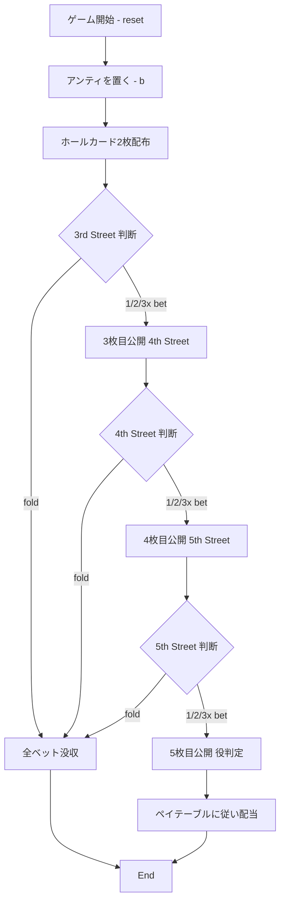

# ミシシッピ・スタッド（CUI版）遊び方

## ゲーム概要

ミシシッピ・スタッドは、プレイヤー対ペイテーブルのカジノポーカーです。2枚のホールカードと3枚のコミュニティカード（3rd / 4th / 5th Street）で作る5枚ハンドの強さに応じて配当が決まります。各ストリートで「1x / 2x / 3x ベット」または「フォールド」を選択し、最終的にできた役のランクで配当が確定します。

## 起動方法

```sh
go run ./cmd/trumpcards mississippistud
go run ./cmd/trumpcards --lang en mississippistud  # 英語モード
```

短縮エイリアス: `ms`, `mstud`

## ルール

### 基本ルール

- プレイヤーはアンティ（基準ベット）を置く。
- ホールカード2枚が配られた後、3rd Street → 4th Street → 5th Street の3段階に分けてコミュニティカードが1枚ずつ公開される。
- 各ストリートの公開前に「1x / 2x / 3x ベット」または「フォールド」を選択する。フォールドした場合はその時点までに置いたベットをすべて没収する。
- 5th Street 公開後に5枚ハンド（ホール2 + コミュニティ3）で役判定し、ペイテーブルに従い配当を支払う。

### ペイテーブル

| 役 | 配当倍率 |
|----|---------|
| ロイヤルフラッシュ | 500:1 |
| ストレートフラッシュ | 100:1 |
| フォーカード | 40:1 |
| フルハウス | 10:1 |
| フラッシュ | 6:1 |
| ストレート | 4:1 |
| スリーカード | 3:1 |
| ツーペア | 2:1 |
| J以上のペア | 1:1 |
| 6〜10のペア | プッシュ（ベット返却） |
| それ以下 | 全ベット没収 |

### ゲーム終了

- ラウンドが終了したら `r` または `reset` で次のラウンドを開始する。
- チップ残高がアンティに足りない場合は新しいラウンドを開始できない。

## ゲームの流れ



## コマンド一覧

| コマンド | 短縮形 | 説明 |
|----------|--------|------|
| `reset` | `r` | 新しいゲームを開始 |
| `bet <amount>` | `b <amount>` | アンティを置く（ANTEフェーズのみ） |
| `play <1\|2\|3>` | `p <1\|2\|3>` | 1x / 2x / 3x ベット（ストリートフェーズのみ） |
| `fold` | `f` | 降りる（ストリートフェーズのみ） |
| `log` | — | 棋譜を表示 |
| `quit` | `q` | ゲーム終了 |
| `help` | `?` | コマンド一覧を表示 |

## 画面の見方

```
==========
Mississippi Stud
==========
chips: 1000
phase: ANTE
ante: 0
hand:
3rd: 0  4th: 0  5th: 0
total bet: 0
total payout: 0
```

主な表示要素:

- `chips`: 現在のチップ残高
- `phase`: 現在のフェーズ（ANTE / 3RD STREET / 4TH STREET / 5TH STREET / END）
- `ante`: 今ラウンドのアンティ額
- `hand`: ホールカード（公開後）
- `3rd / 4th / 5th`: 各ストリートのベット倍率
- `total bet`: 場にあるベット合計
- `total payout`: 結果フェーズの合計配当

## 遊び方のコツ

- ペア（特に6以上）が手元にあれば3xで攻めても損益期待値はプラスに近づきやすい。
- 強いドロー（オープンエンド・ストレート、フラッシュドロー）がある場合は1xで残るのが基本。
- 5th Street時点でJ以上のペアが確定していないハンドはフォールドが妥当。
- 2枚のホールカードに高カード（J/Q/K/A）が2枚ある場合のみ3rd Streetを1xでコールできる。
