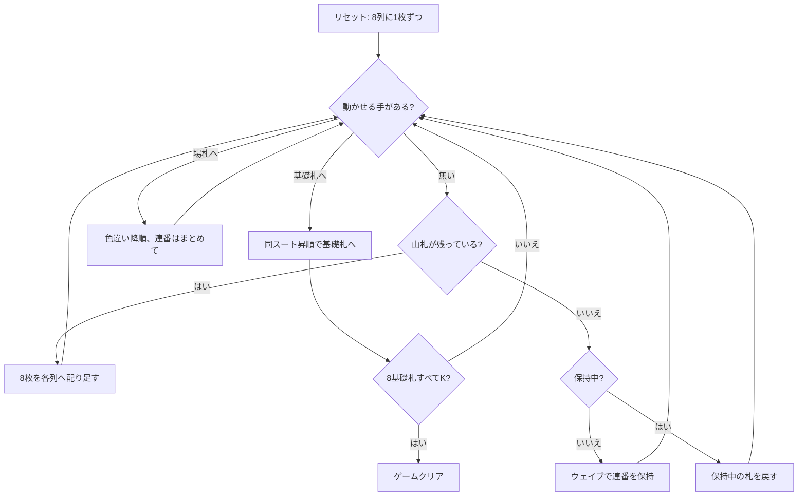

# ミス・ミリガン (Miss Milligan) — CUI マニュアル

## ゲーム概要

2 デッキ 104 枚を使うイギリス発祥のソリティア。最も難しい部類とされる。8 列のタブローに 1 枚ずつ配って始め、手が尽きたら山札から **8 枚を一度に**（各列へ 1 枚ずつ）配り足す。

最大の特徴は救済ルール「**ウェイブ（waiving）**」。山札を使い切ったあとに限り、連番を 1 組だけ脇に持ち上げて保持でき、下に埋まっていた札を動かしてから戻せる。

## 起動方法

```sh
go run ./cmd/trumpcards missmilligan
go run ./cmd/trumpcards --lang en missmilligan   # 英語
```

## ルール

- 52 枚 2 組（104 枚）。最初は 8 列に 1 枚ずつ配り、残り 96 枚が山札
- 基礎札は 8 つ（スートごとに 2 つ）。エースが出たら開き、同じスートで A→K に積む
- タブローは**色違いの降順**。同じ並びの連番はまとめて動かせる
- **空いた列にはキング（またはキング始まりの連番）しか置けない**
- 山札は**8 枚単位**で配り足す。捨て札は無い
- 山札を使い切ると**ウェイブ**が使える。連番を 1 組だけ保持し、戻すまで配り足しも 2 度目のウェイブもできない
- 8 つの基礎札すべてを K まで積めばクリア

> 補足: issue #4407 のルール 5 は「山札から 1 枚ずつめくり…捨て札へ送る」としているが、ミス・ミリガンに捨て札は無く、山札は 8 枚単位で配り足す。また issue が触れていない「空き列はキングのみ」も本来の規則なので実装している。

## ゲームの流れ



## コマンド一覧

| コマンド | 説明 |
|---------|------|
| `d`, `deal` | 山札から各列に 1 枚ずつ配り足す |
| `m t <col> f` | タブロー最上段を基礎札へ |
| `m t <from> t <to> [idx]` | タブロー間で移動（`idx` は連番の先頭、省略時は最上段） |
| `wv <col> [idx]`, `waive` | 連番を脇へ保持する（山札を使い切った後のみ） |
| `m w t <col>` | 保持中の札をタブローへ戻す |
| `m w f` | 保持中の 1 枚を基礎札へ |
| `h`, `hint` | ヒントを表示する |
| `ac`, `autocomplete` | 基礎札へ送れる札がなくなるまで自動で送る |
| `u`, `undo` | 1 手戻す |
| `g`, `giveup` | ギブアップ |
| `l` | 棋譜（アクションログ）を表示する |
| `r`, `reset` | 最初からやり直す |
| `q`, `quit` | 終了する |

## 画面の見方

```
基礎札: SPADE 1 | [空] | [空] | [空] | [空] | [空] | [空] | [空]
山札: 40枚
----------
列0: [0]SPADE 9 [1]HEART 8 [2]CLOVER 7
列1: [0]DIAMOND 11 [1]SPADE 10
...
列7: [0]CLOVER 4
----------
手数: 12
```

- 山札を使い切ると `(ウェイブ可能)` と表示される
- 保持中は `保持中: HEART 8 (戻すまで配り足し不可)` が黄色で出る
- 各列の `[n]` は列内のインデックス。`m t <from> t <to> <idx>` と `wv <col> <idx>` の `<idx>` に対応する

## 遊び方のコツ

- **空き列はキング専用。** キングを持っていないうちに列を空けても使えないので、空ける価値があるのはキングが手元にあるときだけ
- 配り足しは全列に等しく降ってくる。特定の列だけ育てるより、複数の列で受けられる形にしておく
- **ウェイブは 1 回きりの逃げ道ではなく、戻せば何度でも使える**。ただし保持中は配り足しが止まるので、戻す先を確保してから持ち上げる
- エースは早く上げる。基礎札が 8 つあるので、序盤の 1 枚が後半の詰まりを大きく変える
- 詰まったら `undo` で分岐をやり直す
