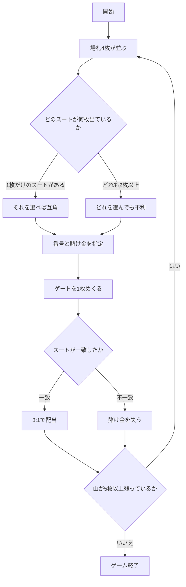

# モンテバンク（CUI版）遊び方

## ゲーム概要

モンテバンク（スパニッシュ・モンテ）は、19 世紀のスペインとメキシコで広く遊ばれたバンキングゲームです。西部開拓時代のモンテ卓の元になったゲームでもあります。

**見るのはスートだけで、数字は一切使いません。** 場札 4 枚が表向きに並び、そのうち 1 枚に賭けます。次にめくる 1 枚（ゲート）が賭けた札とスートで一致すれば **3:1**。

**そして、このゲームの勝ち負けは「どれに賭けるか」だけで決まります。** 場札に同じスートが何枚出ているかで勝率が変わるためです。

| 賭けたスートが場札に | 勝率 | 3:1 での期待値 |
|---|---|---|
| **1 枚だけ** | 9/36 = 25.0% | **ちょうど互角** |
| 2 枚 | 8/36 = 22.2% | 11.1% の損 |
| 3 枚 | 7/36 = 19.4% | 22.2% の損 |
| 4 枚 | 6/36 = 16.7% | 33.3% の損 |

**胴元の取り分は、すべてここから出ています。** 1 枚しか出ていないスートを選び続ければ互角で、重複したスートを選ぶたびに削られます。画面は各場札に「互角」「不利」を書き添えるので、それを見て選んでください。

## 起動方法

```sh
go run ./cmd/trumpcards montebank
```

英語で起動する場合:

```sh
go run ./cmd/trumpcards --lang en montebank
```

## ルール

- **ラテン 40 枚デッキ**（8・9・10 を抜いた 40 枚）を使います。1 スート 10 枚です。
- 各ラウンド、場札 4 枚が表向きに並びます。
- そのうち 1 枚を選び、賭け金（10〜500、10 刻み）を置きます。
- ゲートを 1 枚めくります。**賭けた札とスートが一致すれば 3:1**（賭け金も戻るので手元には 4 倍）。一致しなければ賭け金を失います。
- 数字は見ません。同じ数字でもスートが違えば外れです。
- 山が 1 ラウンドぶん（5 枚）に足りなくなるか、賭けられるチップが無くなったら終了です。40 枚なので **8 ラウンド**遊べます。

## ゲームの流れ



## コマンド一覧

| コマンド | 短縮形 | 説明 |
|----------|--------|------|
| `bet <番号> <額>` | `b` | 場札の番号（1〜4）に賭けてゲートをめくる |
| `next` | - | 次のラウンドへ |
| `hint` | - | 助言を表示する |
| `log` | - | 棋譜を表示する |
| `reset` | `r` | ゲームをやり直す |
| `quit` | `q` | ゲームを終了する |
| `help` | - | ヘルプを表示する |

## 画面の見方

```
フェーズ: BET
ラウンド: 3（チップ: 1150 / 山の残り: 30）
----------
 [1] ♠A  ← 同じスートが2枚（不利）（山残り11枚）
 [2] ♠7  ← 同じスートが2枚（不利）（山残り11枚）
 [3] ♥3  ← このスートは1枚だけ（互角）（山残り12枚）
 [4] ♣K  ← このスートは1枚だけ（互角）（山残り12枚）
```

- **フェーズ**: `BET`（賭け）→ `RESULT`（決着）→ `GAME END`（終了）
- **場札の行**: 番号・札・そのスートが場札に何枚出ているか・**山に何枚残っているか**。当たりやすさはこの 2 つの数字で決まります。`*` が付いているのが賭けた札です
- **「互角」**: そのスートは場札に 1 枚だけ。3:1 でちょうど互角の賭けです
- **「不利」**: 同じスートが 2 枚以上出ています。選ぶと必ず損になります
- **山の残り**: 5 枚を切ると次のラウンドはありません

決着すると、ゲートの札と勝敗、そのラウンドの収支が表示されます。

## 遊び方のコツ

- **「互角」と書かれた札から選んでください。** それが唯一、胴元に削られない賭けです。
- **4 枚とも「不利」なラウンドがあります。** そのときはどれを選んでも損なので、賭け金を最小にするのが被害を抑える唯一の手です。
- **数字に意味はありません。** A だから強い、K だから当たりやすい、ということは一切ありません。
- 山が減るほど残りスートの偏りは大きくなりますが、**画面が数えているのは場札に出ている枚数だけ**です。捨てられた札まで数えたい場合は棋譜（`log`）を追ってください。
