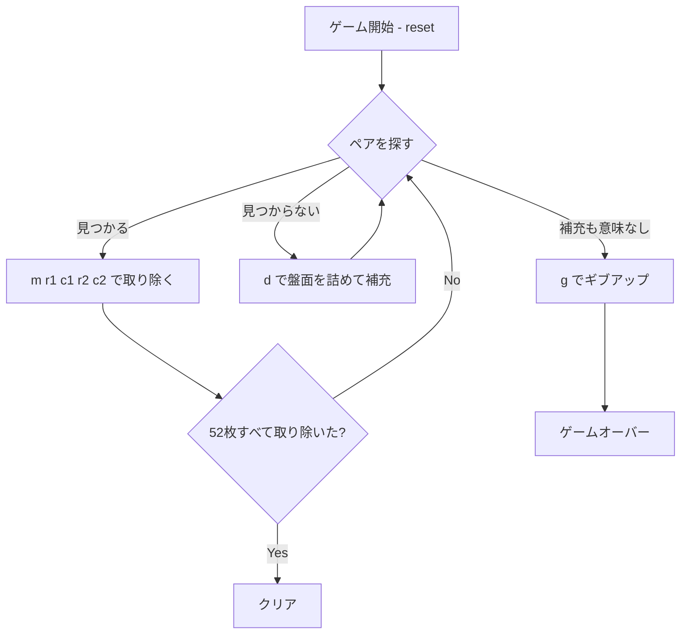

# モンテカルロ・ソリティア（CUI版）遊び方

## ゲーム概要

1人用のグリッド型ソリティアです。52枚のシャッフル済みデッキの先頭25枚を5x5のグリッドに配り、隣接（縦・横・斜め）する同じランクのペアを取り除いていきます。盤面のペアが見つからなくなったら `d`（deal）で盤面を左上に詰め、空いたマスに山札から補充します。山札と盤面の合計52枚すべてを取り除けばクリアです。

## 起動方法

```sh
go run ./cmd/trumpcards montecarlo
go run ./cmd/trumpcards --lang en montecarlo  # 英語モード
```

## ルール

### 基本ルール

- 52枚のトランプ（ジョーカーなし）を使用
- 起動時、先頭25枚が5x5グリッドに配られ、残り27枚が山札となる
- ペアになる条件：
  - 両方のセルにカードがある
  - 同じランク（数字）である
  - 8方向（縦・横・斜め）に隣接している（同じセルは選べない）
- ペアが取り除かれると、両セルが空になる
- `d` を実行すると、残ったカードが行優先で前詰めされ、空いたマスに山札からカードが補充される（山札が無くなるか盤面が満杯になるまで）

### ゲーム終了

- **クリア**: 全52枚を取り除いた状態
- **ゲームオーバー**: 山札が空 + 残りのカードに隣接ペアが無く、補充しても変化が無い状態（手詰まり）

## ゲームの流れ



## コマンド一覧

| コマンド | 短縮形 | 説明 |
|----------|--------|------|
| `remove <r1> <c1> <r2> <c2>` | `m` | 隣接する同ランクのペアを取り除く（例: `m 0 0 0 1`） |
| `deal` | `d` | 盤面を左上に詰めて、山札から空きマスに補充する |
| `undo` | `u` | 直前の操作を1手だけ取り消す |
| `hint` | `h` | 推奨手（ペア除去 or 補充）を表示する |
| `giveup` | `g` | ゲームを放棄する |
| `log` | `l` | 棋譜を表示する |
| `reset` | `r` | 新しいデッキでゲームを最初からやり直す |
| `quit` | `q` | 終了する |
| `help` | `?` | コマンド一覧を表示 |

## 画面の見方

実際の出力例です。配りは毎回シャッフルされるので、カードの並びは実行ごとに変わります。

```
==========
Monte Carlo Solitaire (モンテカルロ・ソリティア)
==========
残り山札: 27  取り除いた枚数: 0/52  補充回数: 0
----------
(0,0) HEART 10 | (0,1) HEART 4 | (0,2) CLOVER 3 | (0,3) DIAMOND 3 | (0,4) HEART 5
(1,0) CLOVER 1 | (1,1) DIAMOND 13 | (1,2) SPADE 2 | (1,3) HEART 1 | (1,4) CLOVER 6
(2,0) DIAMOND 4 | (2,1) DIAMOND 2 | (2,2) CLOVER 4 | (2,3) HEART 13 | (2,4) HEART 2
(3,0) CLOVER 11 | (3,1) HEART 3 | (3,2) SPADE 13 | (3,3) CLOVER 13 | (3,4) HEART 6
(4,0) SPADE 5 | (4,1) HEART 9 | (4,2) CLOVER 2 | (4,3) SPADE 12 | (4,4) SPADE 9
----------
除去可能: 3 組
==========
```

- **1〜3行目**: ゲーム名の見出し
- **残り山札 / 取り除いた枚数 / 補充回数**: 山札の残数、52枚中いくつ取り除いたか、詰め直し（補充）を何回行ったか
- **5×5 の盤面**: `(行,列)` の座標付きでカードが並ぶ。`remove <r1> <c1> <r2> <c2>` の座標はこの表記そのまま
  - 取り除けるのは**同ランクで隣接（縦・横・斜め）する2枚**だけ
- **除去可能**: いま盤面に残っている取り除ける組の数。**0 になったら補充の合図**で、そのときだけ色が変わる（ヒントや手詰まり判定と同じ数え方）
- **空きマス**: 取り除いた場所。補充すると後続のカードが前へ詰められ、山札から補充される
