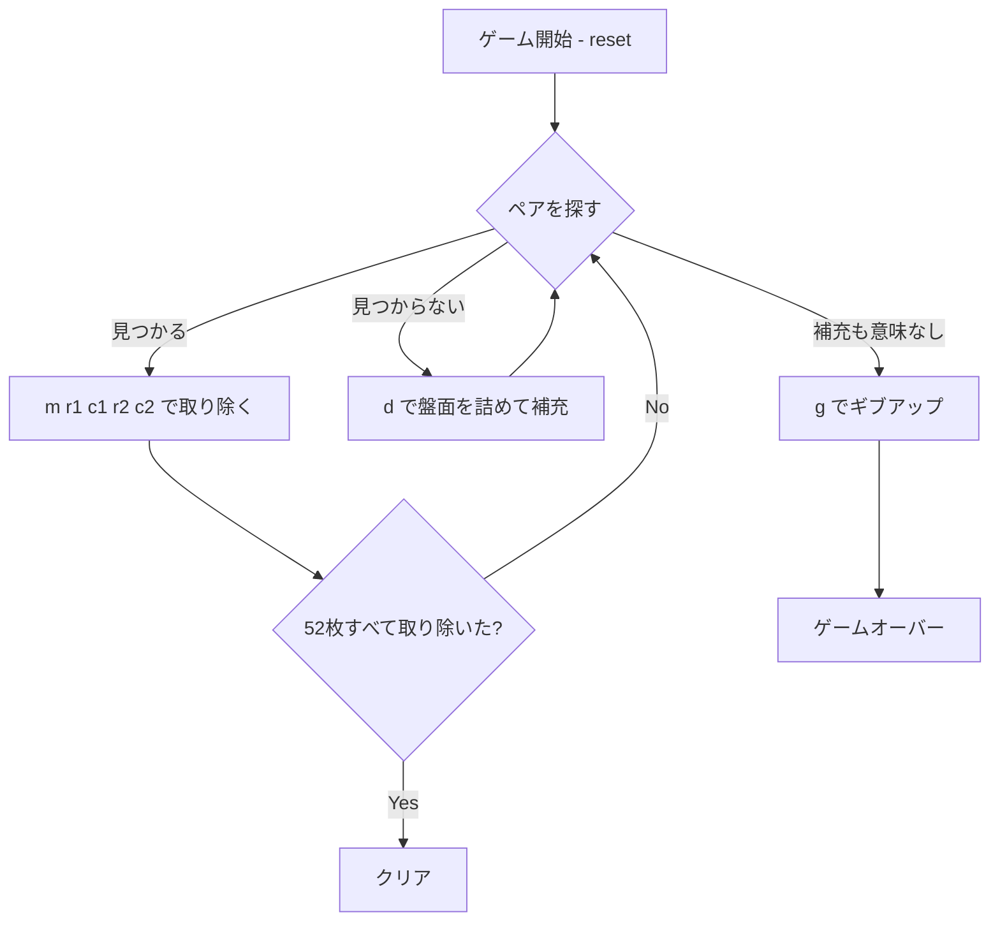

# モンテカルロ・ソリティア（CUI版）遊び方

## ゲーム概要

1人用のグリッド型ソリティアです。52枚のシャッフル済みデッキの先頭25枚を5x5のグリッドに配り、隣接（縦・横・斜め）する同じランクのペアを取り除いていきます。盤面のペアが見つからなくなったら `d`（deal）で盤面を左上に詰め、空いたマスに山札から補充します。山札と盤面の合計52枚すべてを取り除けばクリアです。

## 起動方法

```sh
go run ./cmd/trumpcards montecarlo
go run ./cmd/trumpcards --lang en montecarlo  # 英語モード
```

## ルール

### 基本ルール

- 52枚のトランプ（ジョーカーなし）を使用
- 起動時、先頭25枚が5x5グリッドに配られ、残り27枚が山札となる
- ペアになる条件：
  - 両方のセルにカードがある
  - 同じランク（数字）である
  - 8方向（縦・横・斜め）に隣接している（同じセルは選べない）
- ペアが取り除かれると、両セルが空になる
- `d` を実行すると、残ったカードが行優先で前詰めされ、空いたマスに山札からカードが補充される（山札が無くなるか盤面が満杯になるまで）

### ゲーム終了

- **クリア**: 全52枚を取り除いた状態
- **ゲームオーバー**: 山札が空 + 残りのカードに隣接ペアが無く、補充しても変化が無い状態（手詰まり）

## ゲームの流れ



## コマンド一覧

| コマンド | 説明 |
|----------|------|
| `m <r1> <c1> <r2> <c2>` | 隣接する同ランクのペアを取り除く（例: `m 0 0 0 1`） |
| `d`, `deal` | 盤面を左上に詰めて、山札から空きマスに補充する |
| `u`, `undo` | 直前の操作を1手だけ取り消す |
| `h`, `hint` | 推奨手（ペア除去 or 補充）を表示する |
| `g`, `giveup` | ゲームを放棄する |
| `l`, `log` | 棋譜を表示する |
| `r`, `reset` | 新しいデッキでゲームを最初からやり直す |
| `q`, `quit` | 終了する |
