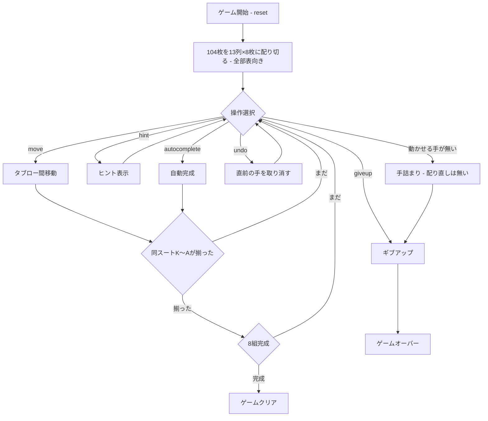

# ミセス・モップ（CUI版）遊び方

## ゲーム概要

1人用のソリティアです。2デッキ（104枚）を **13列×8枚に配り切り、全部表向き**にします。同スート降順のK〜A13枚を作ると自動的に除去され、8組すべて除去すれば勝利です。

**山札はありません。**配り足しも配り直しもできないので、**伏せ札も未知の情報も一切ありません**。解けるかどうかは配られた瞬間に決まっていて、あとは読み切れるかどうかだけです。「開いたスパイダー」と呼べる形で、Charles Jewell の考案。

## 起動方法

```sh
go run ./cmd/trumpcards mrsmop
go run ./cmd/trumpcards --lang en mrsmop  # 英語モード
```

## ルール

### 基本ルール
- 2デッキ104枚を使用
- **13列に8枚ずつ配り切る。全カードが表向き**
- **ストックは無い**（配り足しの操作そのものが存在しない）
- タブロー間でカードを移動する。値が1つ大きいカードの上に置ける（**スート不問**）
- **同スート降順の連続シーケンスのみ**グループ移動可能
- **空列にはどのカード（または並び）でも置ける**
- K〜Aの同スート13枚が1列に揃うと自動的に除去される
- 8組すべて除去でゲームクリア

### 難易度

**4スートが本来の Mrs. Mop** です。1/2スートはクローン元のスパイダーから引き継いだ緩和版で、遊びやすさのために残しています。

- **4スート（既定・本来の形）**: 全4スートの104枚（2デッキ分）
- **2スート（中級）**: スペードとハートの104枚
- **1スート（初級）**: スペードのみの104枚

### 得点
- 開始時: 500点
- 移動: -1点
- スート完成: +100点

## ゲームの流れ



## コマンド一覧

| コマンド | 短縮形 | 説明 |
|----------|--------|------|
| `reset [1\|2\|4]` | `r` | 新しいゲームを開始（スート数指定可・既定は4） |
| `move t <fromCol> <cardIdx> t <toCol>` | `m` | タブロー間でカードを移動 |
| `giveup` | `g` | ギブアップ |
| `hint` | `h` | ヒントを表示 |
| `autocomplete` | `ac` | 自動完成 |
| `undo` | `u` | 直前の操作を取り消す |
| `log` | `l` | 棋譜を表示 |
| `quit` | `q` | ゲーム終了 |
| `help` | `?` | コマンド一覧を表示 |

配るコマンドはありません。104枚を最初に配り切るためです。

## 画面の見方

```
==========
Mrs. Mop (ミセス・モップ)
==========
完成スーツ: 0/8 | スコア: 500
難易度: 4スート（本来の Mrs. Mop は4スート）
----------
列0: [0]♠5 [1]♥K [2]♣3 [3]♦9 [4]♠2 [5]♥7 [6]♣J [7]♦4
列1: [0]♠K [1]♦2 [2]♥8 [3]♣6 [4]♠Q [5]♦J [6]♥3 [7]♣9
...
列12: [0]♦7 [1]♣A [2]♠8 [3]♥5 [4]♦K [5]♣4 [6]♠10 [7]♥2
----------
手数: 0
```

- **列0〜12**: 13列。**全カードが表向き**なので `??` は出ません
- **完成スーツ**: 除去した同スートK〜Aの組数（8組でクリア）
- **難易度**: 使用スート数

## 遊び方のコツ

- **運の要素はゼロです。**配られた盤が解けるかどうかは最初から決まっているので、迷ったら手を進める前に読み切りましょう。取り返しは `undo` しかありません。
- 空列を作ると移動の自由度が大きく上がります。**どのカードでも置ける枠**なので、深い列を崩す足がかりになります。
- 同スートの降順シーケンスを意識して組み立てましょう。**スート不問で置けても、まとめて動かせるのは同スート降順だけ**です。
- 慣れるまでは1スート（初級）から始めるのも手ですが、それは Mrs. Mop 本来の形ではありません。
