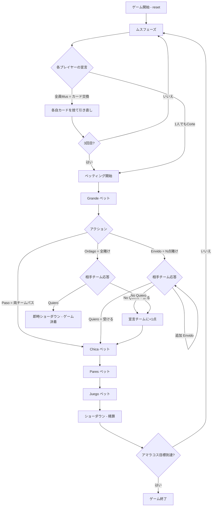

# ムス（CUI版）遊び方

## ゲーム概要

Mus（ムス）はスペイン・バスク地方発祥の4人チーム制ビッディングゲームです。40枚のラテン系デッキ（A,2–7,Sota/Caballo/Rey × 4スート）を2チーム（シート0&2 vs シート1&3）で使用し、各プレイヤー4枚の手札で**Grande・Chica・Pares・Juego**の4つのベッティングラウンドを行います。先に目標アマラコス数（デフォルト40）を獲得したチームの勝利です。

## 起動方法

```sh
go run ./cmd/trumpcards mus
go run ./cmd/trumpcards --lang en mus  # 英語モード
```

## ルール

### デッキと配布

- **デッキ**: 40枚（A,2,3,4,5,6,7,Sota,Caballo,Rey × ♠♣♥♦）
- **プレイヤー**: 4人（シート0 = あなた、シート1〜3 = CPU）
- **チーム**: チーム0 = シート0&2、チーム1 = シート1&3
- **配布**: 各プレイヤー4枚

### ムスフェーズ（カード交換）

各ラウンド開始時、各プレイヤーが順番に手札交換の意思を表明します：

- **Mus（ムス）**: カードを交換したい → 4人全員が同意すれば各自任意の枚数を捨てて引き直し（最大3回繰り返し可）
- **Corte（コルテ）**: 交換なしでベッティング開始 → 1人でも「コルテ」を宣言した時点でベッティング開始

### ベッティングラウンド（4ラウンド順番）

1. **Grande（グランデ）**: 最強の手を競う（Rey > Caballo > Sota > 7 > 6 > 5 > 4 > 3 > 2 > A の順で高い方が勝ち）
2. **Chica（チカ）**: 最弱の手を競う（Aが最低 → 低い方が勝ち）
3. **Pares（パレス）**: 同ランクのカードの組み合わせを競う
4. **Juego（フエゴ）**: 合計点数31以上の手を競う（31以上がなければPunto = 30に近い方）

各ベッティングラウンドでのアクション：

| アクション | 説明 |
|-----------|------|
| Paso（パソ） | パス（そのラウンドを流す。両チームがPasoなら+1点自動付与） |
| Envido（エンビード）| N点を賭ける（相手チームが追加で上乗せ可） |
| Ordago（オルダゴ） | 全てを賭ける（受けたら即時最終判定 → ゲーム決着） |
| Quiero（キエロ） | ベットを受ける（ショーダウンまでその賭けを確定） |
| No Quiero（ノキエロ） | ベットを断る（宣言したチームが+1点獲得） |

### ハンドランキング

#### Grande（グランデ）- 高い手が勝ち

カード強さ（高い順）: Rey > Caballo > Sota > 7 > 6 > 5 > 4 > 3 > 2 > A

#### Chica（チカ）- 低い手が勝ち

カード強さ（低い順）: A < 2 < 3 < 4 < 5 < 6 < 7 < Sota < Caballo < Rey

#### Pares（パレス）- 役の強さ

| 役名 | 構成 | 強さ |
|------|------|------|
| Duples（デュープルス） | 2ペア（4枚のうち2種の同ランク） | 最強 |
| Medias（メディアス） | 3枚同ランク（スリーオブアカインド） | 中 |
| Par（パール） | 1ペア | 最弱 |

#### Juego（フエゴ）- 合計点数

カード点数: Sota/Caballo/Rey = 10点, A = 1点, その他 = 額面点

- **31**: 最強（40→39→38→37→36→35→34→33→32→31の順。31が最強、32が次、40が3番目）
- **Punto**: 31未満のとき30に最も近い合計点を競う

### 得点（アマラコス）

| 状況 | 得点 |
|------|------|
| 両チームPasoのラウンド | 勝利チームに+1 |
| No Quiero（相手チームが断る） | Enviidoを宣言したチームに+1 |
| Quiero（ショーダウン勝利） | 賭けポイント分獲得 |
| Ordago受諾 → 勝利 | 全てのアマラコスを獲得してゲーム終了 |

## ゲームの流れ



## コマンド一覧

| コマンド | 短縮形 | 説明 |
|----------|--------|------|
| `mus` | `m` | 全員同意でカード交換開始（ムスフェーズ） |
| `corte` | `c`, `cut` | カード交換をせずにベッティングへ移行（ムスフェーズ） |
| `discard <i> [j...]` | `d <i> [j...]` | 指定インデックスのカードを捨てて引き直す（ムスフェーズ - 交換時） |
| `paso` | — | パスする（ベッティングフェーズ） |
| `envido <n>` | `e <n>` | N点を賭ける（ベッティングフェーズ） |
| `ordago` | — | 全てを賭ける（ベッティングフェーズ） |
| `quiero` | — | 相手のベットを受ける（ベッティングフェーズ） |
| `noquiero` | `nq` | 相手のベットを断る（ベッティングフェーズ） |
| `next` | `n` | 次のフェーズへ進む（ラウンド終了後） |
| `setdifficulty <0-2>` | `sd <0-2>` | CPU難易度設定（0=Easy, 1=Normal, 2=Hard） |
| `log` | `l` | アクションログを表示 |
| `reset` | `r` | 新しいゲームを開始（設定保持） |
| `quit` | `q` | ゲーム終了 |
| `help` | `?` | コマンド一覧を表示 |

## 画面の見方

```
==========
Mus (ムス)
==========
ラウンド: 1
アマラコス: チーム0=0 チーム1=0 (目標: 40)
あなた (チーム0): [0]Rey♠ [1]A♣ [2]7♥ [3]Sota♦
CPU1 (チーム1): 4枚  CPU2 (チーム0): 4枚  CPU3 (チーム1): 4枚
----------
フェーズ: MUS
あなたの手番です。カードを交換しますか？
mus (m) = 交換する / corte (c) = 交換なし
```

```
==========
Mus (ムス)
==========
ラウンド: 1
アマラコス: チーム0=0 チーム1=0 (目標: 40)
あなた (チーム0): [0]Rey♠ [1]A♣ [2]7♥ [3]Sota♦
----------
フェーズ: GRANDE ベッティング
あなたの手番です。
paso / envido <n> / ordago
```

- **アマラコス行**: 各チームの現在の得点と目標点
- **`[n]`付き行**: あなたの手札（インデックス付き）
- **フェーズ表示**: 現在のフェーズ（MUS / GRANDE / CHICA / PARES / JUEGO / SHOWDOWN）
- **チーム表示**: シート0&2がチーム0、シート1&3がチーム1
- ムスサイクル数（最大3回）はベッティング前に表示されます
- Ordago受諾時は即時ショーダウンとなりゲーム全体が決着します

## 遊び方のコツ

- **ムスの判断**: 手札4枚の強さを複数ラウンド（Grande/Chica/Pares/Juego）の視点で評価してから交換判断をしましょう。1つが強くても他が弱いなら交換が有効です。
- **Paresの有無確認**: Pares（同ランク）を持っているかどうかをまず確認しましょう。Paresがないと Pares ラウンドを自動的に棄権します。
- **Envido額の戦略**: 相手チームの弱みを突くために、Enviidoを少額から始めて相手の反応を見るのが有効です。No Quieroを引き出せれば+1点。
- **Ordagoのタイミング**: アマラコスが拮抗している終盤、または手札が圧倒的に強い場合にOrdagoは有効です。相手が拒否しても+1点を獲得できます。
- **Juego vs Punto**: 合計31以上（Juego）の手を持っているとJuegoラウンドに参加できます。31は最強なので狙う価値が高いです。Juntoなら30に近い手が必要です。
- **チームプレイ**: チームメートの動向を意識しましょう。相手チームの片方がEnvidoを強気に上げてきたら、パートナー含めた手の総合力で判断しましょう。
- **マノ（最初の手番）**: そのラウンドの最初のプレイヤー（マノ）は先攻の優位があります。特にGrandeやJuegoでは積極的なEnvidoが有効です。
