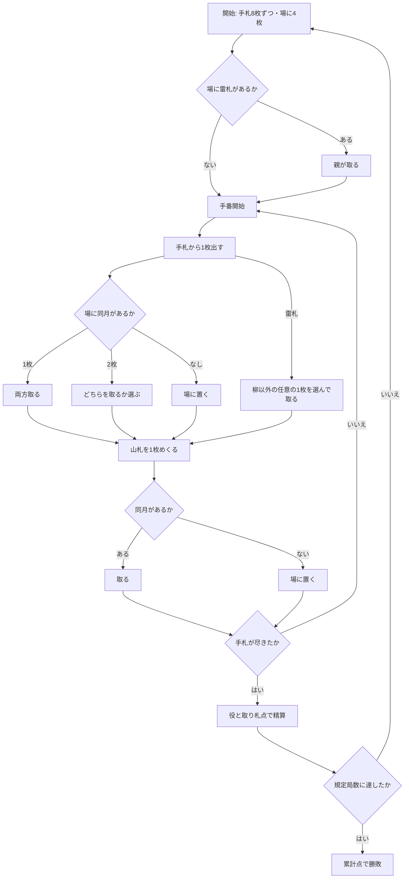

# 虫（CUI版）遊び方

## ゲーム概要

大阪で遊ばれる花札のゲーム。48 枚から**六月（牡丹）と七月（萩）を抜いた 40 枚**で、2 人が場札合わせを行います。

こいこい系に見えますが**花合わせ系**で、**「継続か勝負か」の選択はありません**。手札を全部使い切ってから精算します。

## 起動方法

```sh
go run ./cmd/trumpcards mushi
go run ./cmd/trumpcards --lang en mushi   # 英語表示
```

## ルール

- **デッキ**: 花札 40 枚（六月・七月を除く 10 か月 × 4 枚）
- **配札**: 各自に手札 8 枚、場に 4 枚
- **手番**: 手札から 1 枚出し、場の**同じ月**の札と合わせて両方取ります。合う札が無ければ場に置きます。続いて山札を 1 枚めくり、同様に処理します
- **同月が 2 枚ある場合**は、どちらを取るか選びます（`s <i>`）。3 枚あるときは 4 枚すべてが揃うので選択はありません
- **柳の雷札（11月4番）はワイルド**です。手札から出すと、**柳以外の任意の 1 枚**を取れます。開始時に場に出ていたら親が必ず取ります
- ただし**山札からめくれた雷札はワイルドになりません**。通常の十一月の札として扱われます。めくりは自動処理なので、ここで取る札を選ばせると相手の手番中にこちらの入力待ちになってしまうためです
- **札の点**: 光 20 / 種 10 / 短冊 5 / カス 1（40 枚で合計 230 点）
- **ラウンドの得点**: `自分の役 + 取り札点 − 相手の役 − 115`。115 は総点のちょうど半分なので、これは**折半からどれだけ離れたか**を表します
- 既定で **12 局**行い、累計点の高い方が勝ちです

### 役

| 役 | 点 | 構成 |
|---|---|---|
| 五光 | 30 | 光 5 枚すべて |
| 三光 | 25 | 一月の光・三月の光・**二月の種（梅に鶯）** |
| 桐島 | 10 | 十二月の全 4 枚 |
| 藤島 | 10 | 四月の全 4 枚 |

> **三光は光札 3 枚ではありません。**二月の種を含むのが虫の特徴で、標準的な花札の三光とは別物です。

### 取り残される札

手札 16 枚ぶんのめくりでは山札 20 枚を使い切れないため、**毎局およそ 4 枚が山札に、数枚が場に残ります**。これらは誰の得点にもなりません。

## ゲームの流れ



## コマンド一覧

| コマンド | 説明 |
|---------|------|
| `p <i>` | 手札の `i` 番目を出す |
| `s <i>` | 同月が 2 枚あるとき、取る場札を選ぶ |
| `n` | 次のラウンドへ進む |
| `h` | ヒントを表示する |
| `l` / `log` | 棋譜を表示する |
| `r` | ゲームをリセットする |
| `q` | 終了する |

## 画面の見方

```
第1局 / 全12局 · 山札16枚
場: [0]3月2(短) [1]9月3(カス) [2]11月4(カス)*
あなた: 累計0点 (取り札0点 / 手札8枚)
  取り札: -
  [0]1月1(光) [1]5月3(カス) ...
CPU: 累計0点 (取り札0点 / 手札8枚)
  取り札: -
```

- 札は `月-番号(種別)` で表示されます
- 末尾の `*` は**雷札（ワイルド）**です
- **取り札は双方とも常に公開**されます。相手が何を集めているか見ながら打つゲームだからです
- CPU の**手札**は枚数のみ表示されます

## 遊び方のコツ

- **雷札は温存**しましょう。場に光札が出るまで待てば、20 点の札を確実に取れます
- **取り札は相手にも見えています。**相手が十二月を 3 枚集めていたら、残る 1 枚は渡さないでください（桐島 10 点を防げます）
- 三光を狙うなら**二月の種（梅に鶯）**が要ります。光札だけ集めても届きません
- 得点は折半からの差分なので、**大差で勝つ局**が効きます。取れる点が少ない局は無理をせず、次の局に備えて低い札を捨てるのも手です
